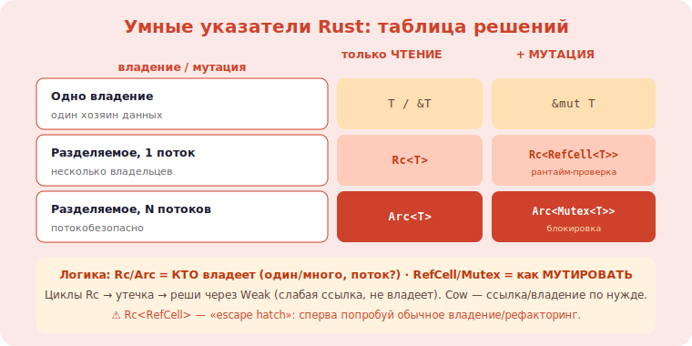

# 3 · Внутренняя изменяемость и smart-pointer паттерны 🖼️⭐⭐

> 🎯 **Цель блока:** понять внутреннюю изменяемость (Cell/RefCell) и паттерны умных указателей
> (Rc/Arc/RefCell/Cow) — как обойти строгие правила заимствования, оставаясь безопасным.

---

## 📖 Проблема: правило «один &mut ИЛИ много &»

```
   borrow checker запрещает: одновременно &mut и любой другой доступ (shared XOR mutable).
   но иногда логически нужно мутировать через РАЗДЕЛЯЕМУЮ ссылку (&self): кэш в структуре,
   счётчик, граф с общими узлами. как?
   ВНУТРЕННЯЯ ИЗМЕНЯЕМОСТЬ (interior mutability) — мутировать данные через &T (не &mut T),
   с проверкой правил в РАНТАЙМЕ вместо компиляции.
```

💡 ⭐⭐ Обычно Rust проверяет заимствование на компиляции (статически). Внутренняя изменяемость
переносит проверку в **рантайм** (RefCell) или гарантирует безопасность иначе (Cell, atomics). Это
«запасной выход» для случаев, которые компилятор не может доказать статически — но всё ещё безопасный.

---

## ⭐ Cell и RefCell

```rust
use std::cell::{Cell, RefCell};

// Cell<T> — для Copy-типов; get/set ЗАМЕНОЙ значения целиком (без ссылок внутрь). без оверхеда.
let c = Cell::new(5);
c.set(10);                       // мутация через &c (не &mut)!
let v = c.get();

// RefCell<T> — для любых типов; даёт &/&mut в РАНТАЙМЕ с проверкой:
let rc = RefCell::new(vec![1,2,3]);
rc.borrow_mut().push(4);         // мутация через &rc; проверка «один mut» в рантайме
let len = rc.borrow().len();
// ⚠️ нарушил правило в рантайме (два borrow_mut) → PANIC (а не ошибка компиляции).
```

💡 ⭐ `Cell` — дёшево, для простых Copy-значений (счётчики, флаги), без ссылок. `RefCell` — для
сложных типов, даёт настоящие `&mut` через рантайм-проверку. Цена `RefCell` — паника при нарушении
(вместо ошибки компиляции) и небольшой оверхед счётчика заимствований. Используй, когда статически
доказать нельзя.

---

## ⭐⭐ Комбинации: Rc<RefCell<T>>, Arc<Mutex<T>>

```
   умные указатели КОМБИНИРУЮТСЯ под задачу:

   Rc<T>            — РАЗДЕЛЯЕМОЕ владение (подсчёт ссылок), ОДНОПОТОЧНО, только ЧТЕНИЕ.
   Rc<RefCell<T>>   — разделяемое владение + изменяемость (однопоточно). граф/дерево с общими
                      изменяемыми узлами. ⚠️ циклы Rc → утечка (нужен Weak).
   Arc<T>           — как Rc, но ПОТОКОБЕЗОПАСНО (atomic счётчик), для многопотока, только чтение.
   Arc<Mutex<T>>    — разделяемое владение + изменяемость МЕЖДУ ПОТОКАМИ (Mutex = блокировка).
                      классика общего изменяемого состояния в многопотоке.
   Arc<RwLock<T>>   — то же, но много читателей / один писатель.
```

🖼️
```
   нужно...                        →  бери
   одно владение, мутация          →  &mut / просто владей
   разделяемое чтение, 1 поток     →  Rc<T>
   разделяемое + мутация, 1 поток  →  Rc<RefCell<T>>
   разделяемое чтение, N потоков   →  Arc<T>
   разделяемое + мутация, N потоков →  Arc<Mutex<T>> (или RwLock)
```



💡 ⭐⭐ Это «таблица решений» Rust для разделяемого/изменяемого состояния. Логика: **Rc/Arc** =
кто ВЛАДЕЕТ (один/много, поток?), **RefCell/Mutex** = как МУТИРОВАТЬ (рантайм-проверка / блокировка).
Комбинируешь под задачу. Понимание этого убирает «как же мне это сделать в Rust?» — выбираешь по
таблице. (Связь: [конкурентность в капстоуне](../../Capstone/02-server/11-concurrency.md).)

---

## 📖 Cow и Weak

```
   Cow<'a, T> (Clone-on-Write) — «или ссылка, или владение»: держит заимствование, пока не нужно
   менять; при мутации КЛОНИРУЕТ. оптимизация: избегаешь копий, когда они не нужны.
   пример: функция, которая ИНОГДА меняет строку — возвращает Cow, копирует только при изменении.

   Weak<T> — «слабая» ссылка (из Rc/Arc), НЕ владеет, не мешает удалению. решает ЦИКЛЫ:
   родитель Rc→ребёнок, ребёнок Weak→родитель → нет цикла сильных ссылок → нет утечки.
```

---

## ⚠️ Ловушки

- ❌ Тянуться к `Rc<RefCell>` сразу — часто можно обойтись владением/рефакторингом (это «escape hatch»).
- ❌ Два `borrow_mut()` у RefCell одновременно → паника в рантайме.
- ❌ Циклы `Rc` → утечка памяти (используй `Weak` для обратных ссылок).
- ❌ `Rc`/`RefCell` в многопотоке (не Send/Sync) → ошибка компиляции; нужны `Arc`/`Mutex`.
- ❌ Излишний `Arc<Mutex>` на горячем пути → контеншн; минимизируй общее состояние.
- ❌ Игнорировать `Cow` там, где он избежал бы лишних копий.

---

## ✅ Задачи

1. **Cell/RefCell.** Структура с внутренним кэшем/счётчиком, мутируемым через `&self` (Cell и RefCell).
2. **Rc<RefCell>.** Построй граф/дерево с общими изменяемыми узлами. Измени узел через несколько владельцев.
3. ⭐ **Цикл и Weak.** Создай цикл `Rc` (утечка), реши через `Weak`. Подтверди отсутствие утечки.
4. ⭐ **Arc<Mutex>.** Раздели изменяемый счётчик между потоками. Корректный итог без гонок.
5. **Cow.** Функция, возвращающая `Cow<str>`, копирующая только при изменении. Проверь, что без изменения нет копии.

---

## ❓ Проверь себя

1. Что такое внутренняя изменяемость и зачем она?
2. Чем `Cell` отличается от `RefCell` (и когда что)?
3. Объясни таблицу Rc/Arc × RefCell/Mutex.
4. Что решают `Weak` и `Cow`?

---

## ✅ Чек-лист

- [ ] Понимаю внутреннюю изменяемость (рантайм-проверка)
- [ ] Использую Cell/RefCell под Copy/сложные типы
- [ ] Выбираю Rc/Arc + RefCell/Mutex по таблице решений
- [ ] Решаю циклы через Weak
- [ ] Применяю Cow для избегания копий

➡️ Следующий: [4 · Async глубоко](04-async-deep.md)
