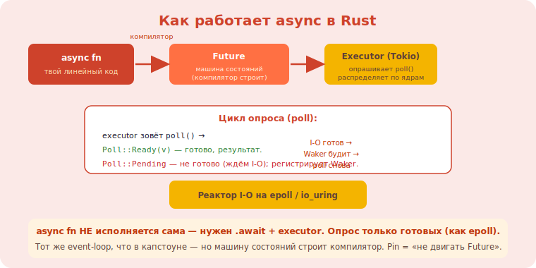

# 4 · Async глубоко: Future, Pin, executor, Tokio 🖼️⭐⭐

> 🎯 **Цель блока:** понять, как async/await **на самом деле работает** в Rust — Future, опрос
> (poll), исполнители (executor), Pin — чтобы не «просто писать async», а понимать его.

---

## 📖 async/await — это машина состояний

```
   когда пишешь:
   async fn fetch() -> Data { let x = read().await; process(x) }

   компилятор превращает async fn в FUTURE — объект-машину состояний:
   • каждый .await — точка приостановки (где можно «застрять», ожидая I-O).
   • Future реализует trait Future с методом poll(): «продвинься, если можешь; иначе скажи Pending».
   async fn НЕ исполняется сама — она возвращает Future, который надо ОПРАШИВАТЬ (poll).
```



💡 ⭐⭐ Ключевое осознание: **`async fn` ничего не делает, пока её Future не опрашивает executor**.
`async` создаёт ленивую машину состояний; `.await` — точки, где она может приостановиться. Это та же
машина состояний, что ты вручную писал в [event loop](../../Capstone/02-server/10-event-loop.md) —
но компилятор строит её за тебя из линейного кода.

---

## ⭐ Future и poll

```rust
trait Future {
    type Output;
    fn poll(self: Pin<&mut Self>, cx: &mut Context) -> Poll<Self::Output>;
}
enum Poll<T> { Ready(T), Pending }
```

```
   poll() пытается продвинуть Future:
   • Poll::Ready(value) — готово, вот результат.
   • Poll::Pending — пока не готово (ждём I-O); Future ЗАРЕГИСТРИРОВАЛ «разбудить меня, когда будет
     готово» через Waker (в Context). executor не опрашивает в цикле зря — ждёт пробуждения.
   модель: executor опрашивает Future → Pending → засыпает → I-O готов → Waker будит → опрашивает снова → Ready.
```

💡 ⭐ Это эффективнее потоков: тысячи Future в одном потоке, опрашиваются только когда есть прогресс
(через Waker), а не блокируют. Та же идея, что [epoll](../../Capstone/02-server/10-event-loop.md):
не жди на каждом, реагируй на готовые. Future = «единица приостанавливаемой работы».

---

## ⭐⭐ Executor / runtime (Tokio)

```
   Rust даёт async/await и trait Future, но НЕ даёт исполнитель (executor) — его предоставляет
   БИБЛИОТЕКА (Tokio, async-std). это сознательный выбор: язык — механизм, runtime — выбираешь.

   EXECUTOR (планировщик задач):
   • держит набор задач (Future верхнего уровня).
   • опрашивает готовые (разбуженные Waker'ом), пока не Ready.
   • многопоточный executor (Tokio) распределяет задачи по ядрам (work-stealing).
   • реактор/драйвер I-O (на epoll/io_uring/kqueue) будит задачи, когда сокет/таймер готов.

   #[tokio::main] async fn main() { ... }   // запускает Tokio-runtime, гоняет твой async-код.
   tokio::spawn(future);                     // отдать задачу executor'у (как поток, но дешевле).
```

💡 ⭐⭐ Полная картина: **твой async-код → Future (машина состояний) → executor опрашивает → реактор
на epoll/io_uring будит по готовности I-O**. Tokio — это executor + реактор + утилиты (таймеры,
каналы, async-сокеты). Понимая это, ты видишь, что async Rust = твой [event-loop сервер](../../Capstone/02-server/10-event-loop.md),
но машину состояний и опрос делает компилятор+runtime, а ты пишешь линейный `async/await`.

---

## 📖 Pin: почему он нужен

```
   PROBLEM: Future-машина состояний может содержать ССЫЛКИ НА СВОИ ЖЕ ПОЛЯ (self-referential):
   локальная переменная и ссылка на неё, обе сохранены между .await. если такой Future ПЕРЕМЕСТИТЬ
   в памяти — внутренняя ссылка станет висячей (указывает на старое место).
   PIN: гарантия «этот объект больше НЕ будет перемещён» → ссылки внутрь остаются валидными.
   poll принимает Pin<&mut Self> — обещание, что Future не сдвинут. отсюда Pin в async.

   на практике .await и Box::pin прячут Pin от тебя; знать нужно для понимания и написания своих Future.
```

💡 ⭐ Pin — самая «загадочная» часть async, но идея проста: некоторые Future нельзя двигать (внутри
ссылки на себя), и `Pin` это гарантирует. Обычно ты не работаешь с Pin напрямую — компилятор и
библиотеки скрывают его. Понимание убирает «почему тут Pin?».

---

## ⚠️ Ловушки

- ❌ Думать, что `async fn` исполняется при вызове (она возвращает ленивый Future; нужен `.await`/executor).
- ❌ Забыть `.await` (Future создан, но не опрошен — «ничего не происходит», предупреждение компилятора).
- ❌ Блокирующая операция (std::thread::sleep, синхронный I-O, тяжёлый расчёт) в async → блокирует
  весь executor-поток (используй async-аналоги / spawn_blocking).
- ❌ Держать `MutexGuard`/не-Send через `.await` в многопоточном runtime → ошибки/дедлоки.
- ❌ Бояться Pin — он обычно скрыт; не лезь в него без нужды.

---

## ✅ Задачи

1. **Lazy Future.** Покажи, что `async fn` без `.await` ничего не делает (предупреждение «unused future»).
2. **Tokio basics.** `#[tokio::main]`, `tokio::spawn` нескольких задач, `join!`/`select!`. Конкурентность без потоков.
3. ⭐ **Свой простой Future.** Реализуй Future, возвращающий Ready сразу / Pending один раз потом Ready.
   Пойми poll/Waker.
4. ⭐ **Блокировка в async.** Воспроизведи проблему (синхронный sleep в async) и реши (tokio::time::sleep / spawn_blocking).
5. **Async-сервер.** Простой TCP/echo на Tokio (async-сокеты). Сравни с [event-loop из капстоуна](../../Capstone/02-server/10-event-loop.md).

---

## ❓ Проверь себя

1. Что компилятор делает с `async fn` (машина состояний/Future)?
2. Как работает poll и Poll::Pending/Ready + Waker?
3. Что такое executor/runtime и почему Tokio отдельно от языка?
4. Зачем нужен Pin?

---

## ✅ Чек-лист

- [ ] Понимаю async fn как ленивую Future-машину состояний
- [ ] Знаю модель poll/Waker (опрос по готовности)
- [ ] Понимаю роль executor/reactor (Tokio) и связь с epoll
- [ ] Представляю, зачем Pin
- [ ] Избегаю блокировок в async

➡️ Следующий: [5 · Unsafe и безопасные абстракции](05-unsafe-abstractions.md)
