# 🦀 Дорожная карта по языку Rust

Путь от «никогда не программировал» (или «знаю C/C++/Python») до «понимаю память Rust как
Senior».

> 💡 **Rust — кульминация темы памяти.** Он решает главную дилемму программирования:
> как получить **безопасность памяти** (как в Python) и **скорость с контролем** (как в C),
> но **без сборщика мусора** и **без ручного управления**. Секрет — **borrow checker**:
> компилятор проверяет правила работы с памятью **на этапе компиляции**. Если программа
> компилируется — в ней гарантированно нет утечек, висячих указателей и гонок данных.

---

## 🧠 Память: четыре мира

| | **C** | **C++** | **Python** | **Rust** |
|--|-------|---------|-----------|----------|
| Кто управляет | ты вручную | ты + RAII | сборщик мусора | **компилятор** |
| Освобождение | `free()` | деструктор | GC «когда-то» | в конце владения |
| Когда ловятся ошибки | в рантайме (краш) | в рантайме | в рантайме | **при компиляции** ✅ |
| Сборщик мусора | нет | нет | да | **нет** |
| Скорость | 🚀 | 🚀 | 🐢 | 🚀 |
| Безопасность памяти | низкая | средняя | высокая | **гарантированная** |

🎯 Главная идея курса: **владение (ownership)**. У каждого значения есть ровно один
владелец; когда владелец уходит — память освобождается автоматически. Компилятор следит за
этим, поэтому ошибки памяти **невозможны** (без `unsafe`). Никакого рантайм-сборщика.

---

## 🗺️ Карта курса

```mermaid
flowchart TD
    Start([🥚 Старт]) --> S0

    subgraph LVL0 [🥚 Уровень 0 — Подготовка]
        S0[00 · Что такое Rust и память]
        S1[01 · Установка rustup и cargo]
        S2[02 · Первая программа]
    end

    subgraph LVL1 [🐣 Уровень 1 — Junior]
        B1[03 · Переменные и изменяемость]
        B2[04 · Типы данных]
        B3[05 · Функции]
        B4[06 · Управление потоком и match]
        B5[07 · Ввод-вывод и строки]
    end

    subgraph LVL2 [🐥 Уровень 2 — ПАМЯТЬ ⭐⭐ ядро]
        M1[08 · Владение Ownership]
        M2[09 · Заимствование и ссылки]
        M3[10 · Правила borrow checker]
        M4[11 · Слайсы, String и str]
        M5[12 · Времена жизни Lifetimes]
    end

    subgraph LVL3 [🐥 Уровень 3 — Middle]
        D1[13 · Структуры и методы]
        D2[14 · Перечисления и Option]
        D3[15 · Обработка ошибок Result]
        D4[16 · Обобщения и трейты]
        D5[17 · Коллекции]
        D6[18 · Замыкания и итераторы]
    end

    subgraph LVL4 [🦅 Уровень 4 — Senior]
        Z1[19 · Умные указатели Box/Rc/RefCell]
        Z2[20 · Бесстрашная многопоточность]
        Z3[21 · Трейты продвинуто]
        Z4[22 · Unsafe и FFI]
        Z5[23 · Производительность]
        Z6[24 · Async, тесты, экосистема]
    end

    S0-->S1-->S2-->B1
    B1-->B2-->B3-->B4-->B5-->M1
    M1-->M2-->M3-->M4-->M5-->D1
    D1-->D2-->D3-->D4-->D5-->D6-->Z1
    Z1-->Z2-->Z3-->Z4-->Z5-->Z6-->Done
    Done([🦅 Senior Rust developer])
```

---

## 📂 Содержание

### 🥚 Уровень 0 — Подготовка
- [00 · Что такое Rust и его модель памяти](00-setup/00-what-is-rust.md)
- [01 · Установка rustup и cargo](00-setup/01-installation.md)
- [02 · Первая программа и cargo](00-setup/02-first-program.md)

### 🐣 Уровень 1 — Junior (основы)
- [03 · Переменные и изменяемость](01-basics/03-variables-mutability.md)
- [04 · Типы данных](01-basics/04-data-types.md)
- [05 · Функции](01-basics/05-functions.md)
- [06 · Управление потоком и match](01-basics/06-control-flow.md)
- [07 · Ввод-вывод и строки](01-basics/07-io-strings.md)
- ✅ [Задачи уровня 1](01-basics/TASKS.md)
- 🚀 [Пет-проект: угадай число](01-basics/PROJECT.md)

### 🐥 Уровень 2 — ПАМЯТЬ ⭐⭐
- [08 · Владение (Ownership)](02-memory/08-ownership.md)
- [09 · Заимствование и ссылки](02-memory/09-borrowing.md)
- [10 · Правила borrow checker](02-memory/10-borrow-checker.md)
- [11 · Слайсы, String и &str](02-memory/11-slices-strings.md)
- [12 · Времена жизни (Lifetimes)](02-memory/12-lifetimes.md)
- ✅ [Задачи уровня 2](02-memory/TASKS.md)
- 🚀 [Пет-проект: свой динамический стек](02-memory/PROJECT.md)

### 🐥 Уровень 3 — Middle
- [13 · Структуры и методы](03-middle/13-structs.md)
- [14 · Перечисления и Option](03-middle/14-enums-option.md)
- [15 · Обработка ошибок (Result)](03-middle/15-error-handling.md)
- [16 · Обобщения и трейты](03-middle/16-generics-traits.md)
- [17 · Коллекции](03-middle/17-collections.md)
- [18 · Замыкания и итераторы](03-middle/18-closures-iterators.md)
- ✅ [Задачи уровня 3](03-middle/TASKS.md)
- 🚀 [Пет-проект: CLI-приложение](03-middle/PROJECT.md)

> 🏛️ В Rust **нет классического наследования**: ООП здесь = структуры + трейты + композиция
> (модули 13, 16). Принципы проектирования объектами — трек [🏛️ ООП](../OOP/README.md).

### 🧩 Раздел — Проекты и API
- [1 · Структура проекта: модули и крейты](03b-projects-api/01-project-structure.md)
- [2 · Проектирование API (pub, трейты, ошибки)](03b-projects-api/02-designing-api.md)
- [3 · Работа с веб-API (reqwest, JSON)](03b-projects-api/03-web-api.md)
- ✅ [Задачи раздела](03b-projects-api/TASKS.md)
- 🚀 [Мини-проект: библиотека-клиент с чистым API](03b-projects-api/PROJECT.md)

### 🦅 Уровень 4 — Senior
- [19 · Умные указатели (Box, Rc, RefCell)](04-senior/19-smart-pointers.md)
- [20 · Бесстрашная многопоточность](04-senior/20-concurrency.md)
- [21 · Трейты продвинуто](04-senior/21-advanced-traits.md)
- [22 · Unsafe и FFI](04-senior/22-unsafe-ffi.md)
- [23 · Производительность](04-senior/23-performance.md)
- [24 · Async, тесты, экосистема](04-senior/24-async-ecosystem.md)
- ✅ [Задачи уровня 4](04-senior/TASKS.md)
- 🚀 [Финальные пет-проекты](04-senior/PROJECT.md)

---

## 🧭 Легенда значков

📖 теория · 🖼️ схема памяти · 🛠️ практика · 💡 мысль · ⚠️ опасность · ✅ задача · 🚀 проект · ❓ самопроверка

> 💡 **Знаешь C/C++?** Скорость и контроль будут знакомы, но владение и borrow checker —
> новый способ мышления. **Знаешь Python?** Синтаксис местами похож, но строгий компилятор
> поначалу удивит. **Совсем новичок?** Rust строг, но его ошибки компилятора очень
> подробные — он буквально учит тебя писать правильно.

Начни здесь 👉 [00 · Что такое Rust и его модель памяти](00-setup/00-what-is-rust.md)
