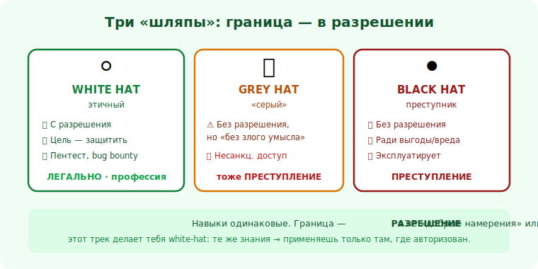

# 00 · Кто такой этичный хакер 🖼️⭐

> 🎯 **Цель блока:** понять, что такое этичный (white-hat) хакинг, чем он отличается от «серого» и
> «чёрного», и почему легальность — не формальность, а граница между профессией и преступлением.

> ⚠️ Этот трек — про white-hat. «Серый»/«чёрный» хакинг (взлом без разрешения) — незаконен, и мы
> ему не учим. Учим понимать атаки, чтобы **защищать** ([модуль 02](02-law-authorization.md)).

---

## 📖 Три «шляпы»

```
   ⚪ WHITE HAT (этичный) — ищет уязвимости С РАЗРЕШЕНИЯ, чтобы их ЗАКРЫЛИ.
      пентестер, bug bounty, security-инженер, защитник. ЛЕГАЛЬНО.

   ⚫ BLACK HAT (преступник) — взламывает ради выгоды/вреда, БЕЗ разрешения. ПРЕСТУПЛЕНИЕ.

   🩶 GREY HAT (серый) — лезет БЕЗ разрешения, но «без злого умысла» (например, «нашёл дыру и
      сообщил»). звучит благородно, но ЮРИДИЧЕСКИ это всё равно несанкционированный доступ —
      то есть ПРЕСТУПЛЕНИЕ. Намерение не делает взлом законным.
```

💡 ⭐ Граница не в навыках (они одинаковые), а в **разрешении**. Тот же скан портов на своей лабе —
обучение; на чужом сервере без спроса — правонарушение. Этот трек делает тебя white-hat: ты
получаешь те же знания, но применяешь их только там, где есть авторизация.

🖼️
```
   одни и те же навыки:
   [ скан, поиск уязвимостей, эксплуатация в лабе ]
            │
     ┌──────┴───────┐
   с разрешением   без разрешения
   ⚪ white-hat      ⚫/🩶 преступление
   = профессия       = статья
```



---

## ⭐ Чем занимается white-hat

```
   • ПЕНТЕСТ — по договору проверяет защиту заказчика, пишет отчёт, помогает закрыть дыры.
   • BUG BOUNTY — ищет уязвимости в рамках публичной программы (есть scope и правила), получает награду.
   • RED TEAM — имитирует атакующих (с авторизацией), чтобы проверить готовность защиты.
   • BLUE TEAM — строит защиту: мониторинг, детект, реагирование, hardening.
   • PURPLE TEAM — связывает red и blue: атака учит защиту, защита проверяет атаку.
   • APPSEC / SECURE DEV — пишет безопасный код и защитные инструменты (большая часть этого трека).
   • SECURITY RESEARCH — изучает уязвимости и публикует ответственно (responsible disclosure).
```

💡 Заметь: больша́я часть работы — **защита и созидание** (код, инструменты, процессы), а не «взлом».
«Атакующая» часть — средство понять, как защищаться, и всегда в авторизованных рамках.

---

## ⭐⭐ «Хорошая защита = понимание атаки»

```
   нельзя защитить то, чьи слабости не понимаешь.
   • пишешь форму логина → должен знать про SQLi/перебор/XSS, чтобы их предотвратить.
   • строишь API → должен понимать IDOR/обход авторизации, чтобы закрыть.
   • защищаешь сеть → должен знать, как её сканируют и атакуют.

   → тот же навык «как это сломать?» нужен, чтобы НАЙТИ дыру и чтобы ЕЁ ЗАКРЫТЬ. Это и есть
     двойственность твоего запроса — но реализованная легально и этично.
```

💡 ⭐⭐ Это ядро трека и ответ на «защита — это и атака тоже»: **да, мышление общее**. Разница — в
направлении и разрешении. Атакующее мышление в руках white-hat = инструмент защиты. В руках без
авторизации = преступление. Мы выбираем первое.

> 🧭 Перекликается с [Senior-мышлением](../../Senior/00-mindset/01-middle-vs-senior.md) («как это
> можно сломать?») и [соц. инженерией](../../SocialEng/README.md) (понять атаку → защититься).

---

## 📖 Почему это нужно любому разработчику

```
   • ты пишешь код, который атакуют РЕАЛЬНО, каждый день (боты сканируют интернет нон-стоп).
   • уязвимость в твоём коде = утечка данных, взлом, ущерб пользователям и бизнесу.
   • «безопасность потом» не работает — дыры закладываются на этапе кода.
   → даже если не идёшь в безопасность как профессию, базовый AppSec — обязателен для Senior.
```

---

## ⚠️ Ловушки

- ❌ Думать, что «серый» хакинг легален, раз «без злого умысла» — это всё равно несанкц. доступ.
- ❌ «Я только проверю чужой сайт на дырку» — без разрешения это правонарушение.
- ❌ Считать, что безопасность — «не моё, есть же безопасники». Дыры пишут разработчики.
- ❌ Романтизировать «взлом». Реальная работа — это защита, код, отчёты, процессы.
- ❌ Учиться на реальных чужих системах вместо лабы/CTF.

---

## ✅ Упражнения на размышление

1. **Шляпы.** Для 4 ситуаций определи цвет шляпы и легальность (скан своей ВМ; скан чужого сайта
   «из любопытства»; bug bounty по программе; «нашёл дыру у компании и написал им без спроса»).
2. **Двойственность.** Возьми знакомую фичу (форма логина). Какие 3 атаки на неё ты должен знать,
   чтобы защитить?
3. **Роль.** Какая из ролей (пентест, blue team, AppSec, research) тебе ближе и почему?

---

## ❓ Проверь себя

1. Чем white / grey / black hat отличаются? Где граница законности?
2. Почему «серый» хакинг тоже незаконен?
3. Что значит «хорошая защита = понимание атаки»?
4. Почему AppSec нужен любому разработчику?

---

## ✅ Чек-лист

- [ ] Понимаю разницу шляп и что граница — в разрешении
- [ ] Знаю, что «серый» взлом незаконен
- [ ] Принимаю принцип «понять атаку, чтобы защитить» — легально
- [ ] Вижу, что безопасность — часть работы разработчика
- [ ] Готов практиковать только в лаборатории/с авторизацией

➡️ Следующий: [01 · Думай как атакующий, действуй как защитник](01-attacker-mindset.md)
