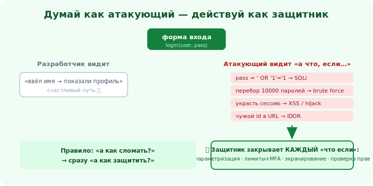

# 01 · Думай как атакующий, действуй как защитник 🖼️⭐⭐

> 🎯 **Цель блока:** освоить «наступательное мышление» как инструмент защиты — привычку спрашивать
> «а как это можно сломать?» и сразу превращать ответ в защиту.

> ⚠️ Мышление атакующего применяем только к своим/авторизованным системам — чтобы их укрепить.

---

## 📖 Разработчик думает «как заставить работать». Атакующий — «как сломать»

```
   РАЗРАБОТЧИК (по умолчанию): "пользователь введёт имя → покажем профиль". Думает о СЧАСТЛИВОМ пути.
   АТАКУЮЩИЙ: "а если ввести не имя, а SQL? а если чужой id? а если 10000 запросов? а если
              отправить не то, что ждёт форма?". Думает о ЗЛОНАМЕРЕННОМ и КРАЙНЕМ.

   уязвимости живут именно ТАМ, где разработчик не подумал «а что, если...».
```

💡 ⭐⭐ Ключевой сдвиг: перестань верить, что вход будет «нормальным». Считай **любой ввод
враждебным**, пока не доказано обратное. Эта привычка — «а как это можно сломать?» — и есть
наступательное мышление, но цель его — **найти дыру раньше атакующего и закрыть**.

🖼️
```
   фича: [ форма входа ]
   разработчик видит:  login(user, pass) → ок
   атакующий видит:    что если pass = ' OR '1'='1 ?  (SQLi)
                       что если перебрать 10000 паролей? (brute force)
                       что если украсть сессию? (XSS/hijack)
                       что если сбросить чужой пароль? (broken auth)
   защитник (ты): закрываешь КАЖДЫЙ из этих "что если" в коде
```



---

## ⭐ Вопросы атакующего мышления

```
   к любой функции/вводу спрашивай:
   • ЧТО, ЕСЛИ ВВОД ВРАЖДЕБНЫЙ? (спецсимволы, код, огромный размер, не тот тип)
   • МОГУ ЛИ ОБОЙТИ ПРОВЕРКУ? (клиентская валидация ≠ защита; что на сервере?)
   • ДОСТУП К ЧУЖОМУ? (поменять id в URL → увижу чужие данные? IDOR)
   • ДОВЕРЯЕМ ЛИ ЛИШНЕМУ? (данным от клиента, заголовкам, чужим сервисам)
   • ЧТО УТЕЧЁТ В ОШИБКЕ/ЛОГАХ? (стектрейсы, секреты, версии)
   • ГРАНИЦЫ: что на стыке систем, кто кому доверяет, где проверка?
```

💡 ⭐ Это та же привычка к **крайним случаям**, что в [Senior-отладке](../../Senior/03-practices/13-debugging-method.md)
и [тестировании], только с фокусом на злонамеренность. Хороший security-инженер — это «параноидальный»
тестировщик, который думает не только «а вдруг сломается», но «а вдруг сломают специально».

---

## ⭐⭐ От атаки сразу к защите

```
   правило трека: каждый «а как сломать?» → немедленно «а как защитить?».

   нашёл: "ввод идёт прямо в SQL-запрос" → защита: параметризованные запросы (модуль 09).
   нашёл: "вывод не экранируется"        → защита: экранирование + CSP (модуль 10).
   нашёл: "id в URL не проверяется"       → защита: проверка прав на сервере (модуль 11).
   нашёл: "пароли в открытом виде"        → защита: bcrypt/argon2 + соль (модуль 17).

   атакующее мышление БЕЗ защитного — бесполезно (или опасно). Связка — сила.
```

💡 ⭐⭐ Не останавливайся на «о, тут дыра». Сразу думай «как её закрыть и как не допустить класс
таких дыр впредь». Это превращает наступательный навык в защитный результат — ровно то, ради чего
он нужен. (И это [ownership](../../Senior/04-leadership/21-ownership.md): не «нашёл проблему», а
«довёл до защиты».)

---

## 📖 Принцип наименьших привилегий и «глубокая защита»

```
   два защитных принципа, рождённых из мышления атакующего:
   • НАИМЕНЬШИЕ ПРИВИЛЕГИИ — у каждого/каждого компонента только нужный минимум прав.
     взломали один кусок → ущерб ограничен (не «доступ ко всему»).
   • ЗАЩИТА В ГЛУБИНУ — несколько рубежей, не один. Пробили валидацию → ловит параметризация →
     ловит WAF → ловит мониторинг. (как в соц. инженерии, модуль 16).
   "предполагай, что тебя взломают" → проектируй так, чтобы взлом одного слоя не значил конец.
```

---

## ⚠️ Ловушки

- ❌ Доверять клиентским проверкам (JS-валидация обходится; защищай на сервере).
- ❌ Считать «нормальный ввод» гарантированным — атакующий пришлёт ненормальный.
- ❌ Останавливаться на поиске дыры, не доводя до защиты.
- ❌ «Security by obscurity» — надеяться, что «не найдут»; находят сканерами за минуты.
- ❌ Один рубеж защиты (надо несколько) и избыточные привилегии.
- ❌ Применять наступательное мышление к чужим системам без разрешения.

---

## ✅ Упражнения

1. **«А как сломать?»** Возьми свою функцию с пользовательским вводом. Выпиши 5 «что, если ввод
   враждебный?». Для каждого — защита.
2. **IDOR-тест (на своём).** В своём приложении поменяй id в URL на чужой. Видишь чужие данные?
   Это IDOR — как закрыть?
3. **Клиент vs сервер.** Найди валидацию только на клиенте. Что будет, если отправить запрос мимо
   формы? Перенеси проверку на сервер.
4. **Привилегии.** Где в твоём проекте даны лишние права (доступ/токен/роль)? Сократи до минимума.

---

## ❓ Проверь себя

1. Чем мышление атакующего отличается от мышления разработчика?
2. Почему «весь ввод — враждебный, пока не доказано обратное»?
3. Что значит «от атаки сразу к защите»?
4. Что такое наименьшие привилегии и защита в глубину?

---

## ✅ Чек-лист

- [ ] Спрашиваю «а как это можно сломать?» к каждому вводу
- [ ] Считаю любой ввод враждебным до проверки
- [ ] Каждую найденную слабость довожу до защиты
- [ ] Применяю наименьшие привилегии и защиту в глубину
- [ ] Использую это мышление только на своих/авторизованных системах

➡️ Следующий: [02 · Закон и авторизация](02-law-authorization.md)
