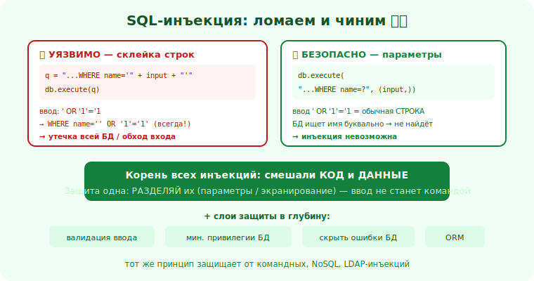

# 09 · Инъекции и SQL-инъекция 🖼️⭐⭐

> 🎯 **Цель блока:** понять механику инъекций (на примере SQLi) и — главное — научиться писать код,
> который к ним невосприимчив. Это одна из самых частых и опасных уязвимостей.

> ⚠️ Эксплуатация — только на своих/учебных мишенях (DVWA, лаба). Цель модуля — защита.

---

## 📖 Суть инъекции: данные стали кодом

```
   ИНЪЕКЦИЯ — когда недоверенный ВВОД попадает туда, где интерпретируется как КОД/команда.
   приложение смешивает «свой код» и «данные пользователя» в одну строку → ввод меняет смысл команды.
   бывает в SQL (SQLi), командах ОС, LDAP, NoSQL, шаблонах и т.д. Принцип и защита — общие.
```

💡 ⭐⭐ Корень всех инъекций один: **смешивание кода и данных**. Защита тоже одна: **разделять их** —
данные передавать отдельно от кода, чтобы ввод никогда не мог «стать командой». Поймёшь это на SQLi —
поймёшь все инъекции.

---

## ⭐ Как возникает SQLi (уязвимый код)

```python
# ❌ УЯЗВИМО: ввод склеивается в текст запроса
username = request.get("username")
query = "SELECT * FROM users WHERE name = '" + username + "'"
db.execute(query)
```

```
   нормальный ввод:  username = "anna"
   запрос:           SELECT * FROM users WHERE name = 'anna'   ✅

   вредоносный ввод: username = ' OR '1'='1
   запрос:           SELECT * FROM users WHERE name = '' OR '1'='1'   ← всегда истина!
   → вернёт ВСЕХ пользователей. А более хитрый ввод может читать/менять/удалять данные.
```

🖼️
```
   [ код запроса ] + [ ВВОД пользователя ]  →  склеены в строку
                              ↓ ввод содержит ' OR '1'='1
   граница «код | данные» СТЁРТА → ввод изменил логику запроса = инъекция
```



💡 Последствия SQLi серьёзны: утечка всей БД (пароли, персональные данные), обход входа, изменение/
удаление данных. Это регулярно приводит к крупным утечкам.

---

## ⭐⭐ Защита: параметризованные запросы (главное)

```python
# ✅ БЕЗОПАСНО: параметризованный запрос — данные передаются ОТДЕЛЬНО от кода
username = request.get("username")
db.execute("SELECT * FROM users WHERE name = ?", (username,))
#                                            ↑ плейсхолдер   ↑ данные отдельно
```

```
   теперь ввод ' OR '1'='1 воспринимается как ОБЫЧНАЯ СТРОКА-значение, а не как код.
   БД ищет пользователя с именем буквально "' OR '1'='1" → не находит. Инъекция невозможна.
```

💡 ⭐⭐ **Параметризованные запросы (prepared statements)** — золотой стандарт защиты от SQLi. Код
запроса фиксирован, данные передаются отдельным каналом, и СУБД никогда не путает одно с другим.
Это не «экранирование вручную» (хрупко, забывается), а архитектурное разделение кода и данных.
Используй их **всегда** — даже там, где «ввод вроде безопасный».

```
   ДОПОЛНИТЕЛЬНЫЕ слои (защита в глубину):
   ✅ ORM с параметрами (большинство ORM параметризуют сами — но не давай им «сырые» куски).
   ✅ ВАЛИДАЦИЯ ввода (ожидаешь число — проверь, что число; модуль 16).
   ✅ НАИМЕНЬШИЕ ПРИВИЛЕГИИ у пользователя БД (приложению не нужен DROP/админ-доступ).
   ✅ не показывай ошибки БД пользователю (утечка структуры → подсказка атакующему).
```

---

## 📖 Другие инъекции — тот же принцип

```
   • КОМАНДНАЯ ИНЪЕКЦИЯ (OS command): ввод в системную команду →
     ❌ os.system("ping " + host)   →  ✅ передавай аргументы списком, без shell: subprocess.run(["ping", host])
   • NoSQL-инъекция: ввод в запрос-объект → валидируй типы, не доверяй структуре от клиента.
   • LDAP / XPath / шаблоны: то же — разделяй код и данные, используй безопасные API.
   ОБЩЕЕ ПРАВИЛО: не строй команды/запросы склейкой строк с вводом. Используй параметризацию/
   безопасные API, которые разделяют код и данные.
```

> 🧭 Это [граница доверия из модели угроз (модуль 04)](../01-recon/04-threat-modeling.md): ввод
> пересекает границу «недоверенное → исполняемое», и тут нужна строгая защита.

---

## ⚠️ Ловушки

- ❌ Склеивать ввод в запрос/команду строками (корень SQLi и командных инъекций).
- ❌ «Экранировать вручную» вместо параметризации (легко забыть/ошибиться).
- ❌ Доверять «внутреннему»/«своему» вводу — источник может быть скомпрометирован.
- ❌ Давать приложению админ-права на БД (больше ущерб при инъекции).
- ❌ Показывать ошибки БД пользователю (утечка структуры).
- ❌ Полагаться только на клиентскую валидацию (обходится).

---

## ✅ Упражнения (в лабе/на своём)

1. **Поломай и почини (DVWA/Juice Shop).** В учебном приложении найди SQLi-точку, пойми механику,
   затем (в своём коде) перепиши уязвимый запрос на параметризованный.
2. **Найди в своём коде.** Поищи места, где ввод склеивается в запрос/команду. Переведи на
   параметры/безопасные API.
3. **Командная инъекция.** Найди вызов системной команды со склейкой ввода. Перепиши через
   передачу аргументов списком без shell.
4. **Привилегии БД.** Проверь: какие права у пользователя БД твоего приложения? Можно ли сократить?

---

## ❓ Проверь себя

1. В чём корень любой инъекции?
2. Как возникает SQLi на склейке строк?
3. Почему параметризованные запросы защищают?
4. Как тот же принцип защищает от командной инъекции?

---

## ✅ Чек-лист

- [ ] Понимаю инъекцию как смешивание кода и данных
- [ ] Использую параметризованные запросы всегда
- [ ] Не строю команды/запросы склейкой строк с вводом
- [ ] Добавляю слои: валидация, наименьшие привилегии БД, скрытие ошибок
- [ ] Применяю принцип «разделяй код и данные» ко всем инъекциям

➡️ Следующий: [10 · XSS — межсайтовый скриптинг](10-xss.md)
