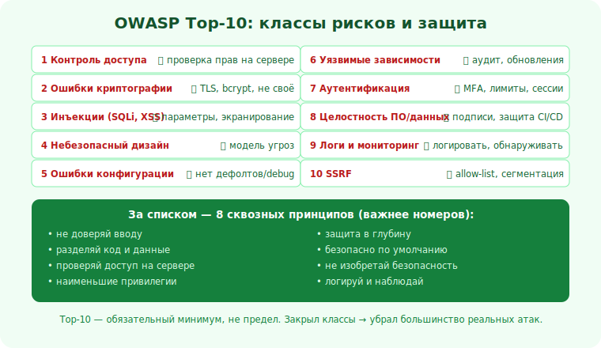

# 14 · OWASP Top-10 целиком 🖼️⭐⭐

> 🎯 **Цель блока:** свести разобранные уязвимости в единую карту — **OWASP Top-10**, отраслевой
> стандарт-список самых критичных веб-рисков, — и закрепить защиту по каждому.

---

## 📖 Что такое OWASP Top-10

```
   OWASP Top-10 — регулярно обновляемый список 10 самых критичных рисков веб-приложений,
   составленный сообществом OWASP. Это «обязательный минимум» AppSec: если закрыл Top-10 —
   убрал большинство реальных дыр. Используется как чек-лист в индустрии.
```

💡 ⭐⭐ Не зубри номера (они меняются между редакциями) — пойми **классы** рисков и защиту от
каждого. Ты уже разобрал большинство в этом уровне; здесь — карта целиком, чтобы держать в голове.

---

## ⭐ Карта рисков и защиты

```
   1. BROKEN ACCESS CONTROL (контроль доступа) — №1.            → модуль 11
      🛡️ серверная проверка прав/владения на каждый доступ, deny by default.

   2. CRYPTOGRAPHIC FAILURES (ошибки крипты)                   → модули 08, 17
      🛡️ TLS везде, правильное хранение паролей, не своя крипта, не слабые алгоритмы.

   3. INJECTION (инъекции: SQLi, командные, XSS*)              → модули 09, 10
      🛡️ параметризация, разделять код и данные, экранировать вывод.

   4. INSECURE DESIGN (небезопасный дизайн)                    → модуль 04
      🛡️ модель угроз, безопасность на этапе проектирования, а не «прикрутить потом».

   5. SECURITY MISCONFIGURATION (конфигурация)                 → модуль 13
      🛡️ убрать дефолты/debug, закрыть лишнее, заголовки, обновления.

   6. VULNERABLE COMPONENTS (уязвимые зависимости)             → модуль 19
      🛡️ аудит и обновление зависимостей, отслеживание уязвимостей.

   7. AUTHENTICATION FAILURES (аутентификация)                 → модуль 07
      🛡️ MFA, лимиты, защита сессий, надёжное восстановление.

   8. SOFTWARE/DATA INTEGRITY (целостность ПО/данных)          → модули 19, 08
      🛡️ проверка целостности, защита CI/CD и цепочки поставок, подписи.

   9. LOGGING/MONITORING FAILURES (логи/мониторинг)            → модуль 21
      🛡️ логировать события безопасности, мониторить, уметь обнаруживать атаки.

   10. SSRF (подделка запроса сервером)                        → модуль 12
       🛡️ allow-list, запрет внутренних адресов, сегментация.
```

🖼️
```
   OWASP Top-10 = карта «где обычно дыры»:
   доступ · крипта · инъекции · дизайн · конфиг · зависимости · аутентификация ·
   целостность · мониторинг · SSRF
   закрыл каждый класс → убрал большинство реальных атак. Это база, не предел.
```



---

## ⭐⭐ Сквозные принципы (важнее списка)

```
   за всеми пунктами стоят ОБЩИЕ принципы — держи их в голове, и список «выводится» сам:
   1. НЕ ДОВЕРЯЙ ВВОДУ — весь вход враждебный, пока не проверен (инъекции, XSS).
   2. РАЗДЕЛЯЙ КОД И ДАННЫЕ — параметризация, экранирование (инъекции).
   3. ПРОВЕРЯЙ ДОСТУП НА СЕРВЕРЕ, deny by default (контроль доступа).
   4. НАИМЕНЬШИЕ ПРИВИЛЕГИИ — минимум прав везде (ограничивает ущерб).
   5. ЗАЩИТА В ГЛУБИНУ — несколько рубежей (один пробьют — другой держит).
   6. БЕЗОПАСНО ПО УМОЛЧАНИЮ — закрыто, пока явно не открыл (конфигурация).
   7. НЕ ИЗОБРЕТАЙ КРИПТУ/БЕЗОПАСНОСТЬ — бери проверенное (крипта, auth).
   8. ЛОГИРУЙ И НАБЛЮДАЙ — чтобы обнаружить и среагировать (мониторинг).
```

💡 ⭐⭐ Эти 8 принципов — «операционная система» AppSec. Любая новая уязвимость, которую ты встретишь
(даже не из списка), почти всегда нарушает один из них, и защита — вернуть принцип. Понимание
принципов сильнее заучивания списка.

---

## 📖 Как пользоваться Top-10 на практике

```
   • как ЧЕК-ЛИСТ при разработке/ревью: «прошёл ли я по каждому классу для этой фичи?»
   • как ПЛАН обучения: разобрать каждый класс на лабе (атака → защита).
   • как ЯЗЫК с командой: «это broken access control» понимают все.
   ⚠️ Top-10 — это МИНИМУМ, не максимум. Реальная безопасность шире (бизнес-логика, и т.д.).
```

---

## ⚠️ Ловушки

- ❌ Зубрить номера вместо понимания классов и защиты.
- ❌ Считать «закрыл Top-10 = абсолютно безопасно» (это минимум, не предел).
- ❌ Думать про безопасность только в конце (insecure design — закладывай с проектирования).
- ❌ Игнорировать «скучные» пункты (конфигурация, зависимости, логи) — там частые реальные дыры.
- ❌ Защищать «по списку наугад», не понимая сквозных принципов.

---

## ✅ Упражнения

1. **Чек-лист по фиче.** Возьми свою фичу и пройди её по 10 классам: где риск, что защищает?
2. **Принципы.** Для каждого из 8 сквозных принципов приведи пример из своего кода, где он
   соблюдён (или нарушен).
3. **Лаба.** В учебном приложении найди по одному примеру 3 разных классов из Top-10, пойми и
   опиши защиту.
4. **Язык команды.** Возьми 3 реальные уязвимости (из новостей/CVE) и определи их класс по Top-10.

---

## ❓ Проверь себя

1. Что такое OWASP Top-10 и как его использовать?
2. Назови 5 классов и защиту от каждого.
3. Какие сквозные принципы стоят за списком?
4. Почему Top-10 — это минимум, а не предел?

---

## ✅ Чек-лист

- [ ] Знаю классы OWASP Top-10 и защиту от каждого
- [ ] Понимаю сквозные принципы (не доверяй вводу, разделяй код/данные, deny by default…)
- [ ] Использую Top-10 как чек-лист при разработке и ревью
- [ ] Закладываю безопасность с проектирования (не «потом»)
- [ ] Помню, что Top-10 — минимум, а не максимум

➡️ Дальше: [✅ Задачи уровня 2](TASKS.md) · [🚀 Проект](PROJECT.md) · затем
[Уровень 3 · Защитное программирование](../03-defensive-code/15-secure-coding.md)
