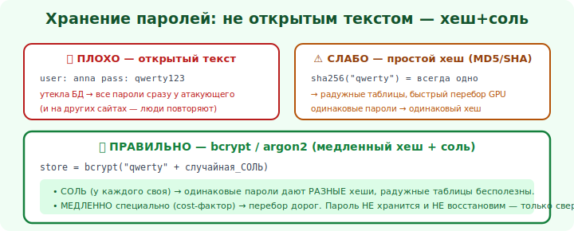

# 17 · Хранение паролей правильно 🖼️⭐⭐

> 🎯 **Цель блока:** научиться хранить пароли так, чтобы даже при утечке БД их нельзя было
> восстановить. Это одна из самых частых и критичных ошибок.

---

## 📖 Почему это критично

```
   БД утекают регулярно (модуль 17 трека соц. инженерии). вопрос не «если», а «когда».
   если пароли хранились неправильно → атакующий получает их и заходит везде, где жертвы
   повторяли пароль (credential stuffing). правильное хранение делает утёкшую БД почти бесполезной.
```



💡 ⭐⭐ Цель: **сервер не должен знать пароль в открытом виде** — ни в БД, ни в логах, ни «где-то».
Храним так, чтобы проверить пароль можно, а восстановить — нельзя.

---

## ⭐ Эволюция (как НЕ надо → как надо)

```
   ❌ ОТКРЫТЫЙ ТЕКСТ — пароль как есть. Утечка = всё пропало. Недопустимо.
   ❌ ОБЫЧНЫЙ ХЕШ (MD5/SHA-256 от пароля) — лучше, но:
      • одинаковые пароли → одинаковые хеши (видно, кто повторяется).
      • БЫСТРЫЙ хеш → перебор миллиардов в секунду; готовые таблицы (rainbow).
      • MD5/SHA1 вообще сломаны.
   ❌ ХЕШ + СОЛЬ обычным быстрым алгоритмом — соль решает одинаковость и таблицы, но быстрый
      перебор всё ещё возможен.
   ✅ СПЕЦИАЛЬНЫЙ МЕДЛЕННЫЙ АЛГОРИТМ ДЛЯ ПАРОЛЕЙ (с солью встроенно): bcrypt / argon2 / scrypt.
```

🖼️
```
   пароль → [ bcrypt/argon2: соль + НАМЕРЕННО медленно, тысячи итераций ] → хеш в БД
   проверка: хешируем введённый пароль тем же алгоритмом → сравниваем хеши.
   утекла БД? перебор каждого пароля медленный (специально) → массовый взлом невыгоден.
```

---

## ⭐⭐ Правильно: bcrypt / argon2 (с примером)

```python
# ✅ ПРАВИЛЬНО: специализированная библиотека для паролей (соль — автоматически)
import bcrypt

# при регистрации: хешируем
def hash_password(password: str) -> bytes:
    return bcrypt.hashpw(password.encode(), bcrypt.gensalt())  # соль внутри, медленно

# при входе: проверяем (НЕ расшифровываем — сравниваем)
def verify_password(password: str, stored_hash: bytes) -> bool:
    return bcrypt.checkpw(password.encode(), stored_hash)

# argon2 (современный выбор, победитель Password Hashing Competition) — аналогично через argon2-cffi
```

```
   ПОЧЕМУ ЭТО РАБОТАЕТ:
   • СОЛЬ (случайная, на каждый пароль) → одинаковые пароли дают разные хеши; rainbow-таблицы бесполезны.
   • НАМЕРЕННАЯ МЕДЛЕННОСТЬ (work factor) → перебор дорогой; можно повышать с ростом железа.
   • ПРОВЕРЕННЫЙ алгоритм → не изобретаешь своё (модуль 08).
```

💡 ⭐⭐ Главное правило: **используй bcrypt / argon2 / scrypt — никогда не MD5/SHA «своими руками»
и никогда открытый текст**. Эти алгоритмы созданы специально для паролей: соль встроена, скорость
настраивается. Библиотека делает всё правильно — не пиши хеширование паролей сам.

---

## ⭐ Сопутствующие правила

```
   ✅ НИКОГДА не логируй пароли (ни в логах, ни в ошибках, ни в аналитике).
   ✅ MFA — даже идеальное хранение не спасёт от слабого/утёкшего пароля; второй фактор спасёт.
   ✅ ПОЛИТИКА ПАРОЛЕЙ: длина важнее «спецсимволов»; проверяй по базам утёкших; не заставляй
      менять без причины (ведёт к слабым предсказуемым паролям).
   ✅ СБРОС пароля — случайный одноразовый токен с истечением (не «секретные вопросы»).
   ✅ при входе — лимиты попыток/задержки (против перебора, модуль 07).
   ✅ сравнение — встроенной функцией библиотеки (она constant-time против тайминг-атак).
```

> 🧭 Это [build vs buy / не изобретай крипту](08-crypto-basics.md) в чистом виде + связь с
> [гигиеной паролей пользователя](../../SocialEng/04-defense/18-personal-hygiene.md) (уникальные
> пароли + MFA с другой стороны — у самого пользователя).

---

## ⚠️ Ловушки

- ❌ Хранить пароли в открытом виде — катастрофа при утечке.
- ❌ MD5/SHA «своими руками» (быстрые, сломанные) для паролей.
- ❌ Хеш без соли (одинаковые пароли видны, rainbow-таблицы).
- ❌ Своё хеширование/«досаливание» вместо bcrypt/argon2.
- ❌ Логировать пароли или слать их по почте.
- ❌ «Секретные вопросы» / слабые токены для восстановления.

---

## ✅ Упражнения

1. **Аудит.** Проверь, как хранятся пароли в твоём проекте. Открытый текст/быстрый хеш? Переведи
   на bcrypt/argon2.
2. **Реализация.** Напиши функции hash/verify пароля через bcrypt или argon2. Проверь, что
   одинаковые пароли дают разные хеши.
3. **Логи.** Убедись, что пароль нигде не логируется (вход, ошибки, аналитика).
4. **Сброс.** Если есть сброс пароля — на случайных одноразовых токенах с истечением? Усиль.

---

## ❓ Проверь себя

1. Почему сервер не должен знать пароль в открытом виде?
2. Чем bcrypt/argon2 лучше обычного SHA-256?
3. Что даёт соль и что — «намеренная медленность»?
4. Почему нельзя писать хеширование паролей самому?

---

## ✅ Чек-лист

- [ ] Храню пароли через bcrypt/argon2/scrypt (с солью, медленно)
- [ ] Никогда не храню/логирую пароли в открытом виде
- [ ] Не использую MD5/SHA своими руками для паролей
- [ ] Дополняю MFA и лимитами попыток
- [ ] Сброс — на случайных одноразовых токенах с истечением

➡️ Следующий: [18 · Криптография для разработчика](18-crypto-for-devs.md)
