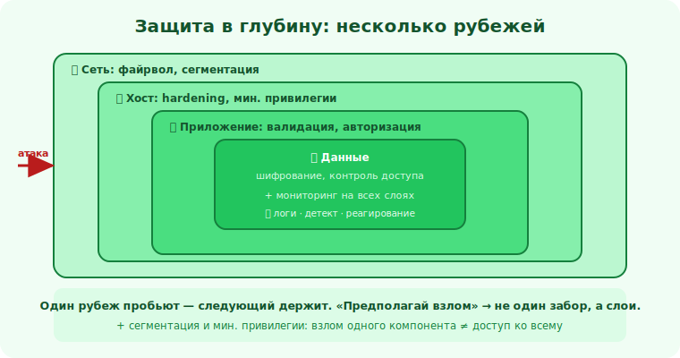

# 22 · Hardening систем 🖼️⭐

> 🎯 **Цель блока:** освоить hardening — систематическое укрепление систем сокращением того, что
> можно атаковать, и усилением того, что осталось.

---

## 📖 Hardening = убрать лишнее + укрепить нужное

```
   HARDENING (укрепление) — приведение системы в безопасное состояние:
   1. УБРАТЬ ЛИШНЕЕ — закрыть/удалить всё ненужное (поверхность атаки ↓).
   2. УКРЕПИТЬ НУЖНОЕ — настроить оставшееся безопасно.
   3. ОГРАНИЧИТЬ — наименьшие привилегии, сегментация (ущерб при взломе ↓).
   принцип: «безопасно по умолчанию» — система закрыта, открыто только осознанно нужное.
```

💡 ⭐ Hardening — это [минимизация поверхности атаки (модуль 04)](04-threat-modeling.md) на практике
+ безопасная конфигурация (модуль 13), применённые ко всем уровням: ОС, сеть, приложение,
контейнеры. То, чего нет/закрыто, нельзя атаковать.

---

## ⭐ Чек-лист hardening по уровням

```
   ОС / СЕРВЕР:
   ✅ обновления безопасности (автоматически/регулярно).
   ✅ убрать ненужные сервисы/пакеты; закрыть ненужные порты (файрвол: deny by default).
   ✅ наименьшие привилегии: не работать под root; отдельные пользователи для сервисов.
   ✅ SSH: ключи вместо паролей, отключить root-логин, лимиты, нестандартное где уместно.
   ✅ права файлов (особенно секреты: 600); шифрование диска для чувствительного.

   СЕТЬ:
   ✅ файрвол: разрешено только нужное; БД/внутреннее — не наружу.
   ✅ СЕГМЕНТАЦИЯ: раздели зоны (веб / приложение / БД) — взлом одной не даёт всё.
   ✅ TLS везде; закрыть незашифрованные протоколы.

   ПРИЛОЖЕНИЕ:
   ✅ всё из Уровней 2–3 (валидация, авторизация, заголовки, секреты вне кода).
   ✅ выключить debug; убрать тестовые/демо эндпоинты и аккаунты; скрыть версии.

   КОНТЕЙНЕРЫ (если есть):
   ✅ минимальные образы; не root внутри; только нужные права/возможности; сканировать образы.
```

🖼️
```
   ДО hardening:  [много сервисов][открытые порты][root везде][debug][дефолты] → большая мишень
   ПОСЛЕ:         [только нужное][файрвол][мин. права][сегментация][обновлено] → малая мишень
   меньше открытого + меньше прав = меньше что атаковать и меньше ущерб при взломе.
```



---

## ⭐⭐ Сегментация и наименьшие привилегии — ограничь ущерб

```
   даже если взломали один компонент — он НЕ должен открыть всё:
   • СЕГМЕНТАЦИЯ: веб-сервер скомпрометирован, но он НЕ имеет прямого доступа к БД с данными —
     только через ограниченный API. Взлом локализован.
   • НАИМЕНЬШИЕ ПРИВИЛЕГИИ: сервис/контейнер/аккаунт имеет ровно нужные права. Взломали —
     получили мало, а не «ключи от всего».
   → «предполагай взлом» → проектируй так, чтобы один взлом не стал тотальным.
```

💡 ⭐⭐ Это сдвиг от «не пустить» к «ограничить, если пустили». Большие утечки часто = один взлом +
плоская сеть/избыточные права → атакующий дошёл до всего. Сегментация и минимум прев превращают
катастрофу в локальный инцидент. (Та же идея, что [защита в глубину](../00-foundations/01-attacker-mindset.md).)

---

## 📖 Используй стандарты, не изобретай

```
   не придумывай hardening с нуля — есть проверенные руководства (benchmarks):
   • CIS Benchmarks (для ОС, БД, контейнеров и т.д.) — конкретные настройки.
   • рекомендации вендоров, OWASP-чек-листы для приложений.
   • инструменты автопроверки соответствия (твой аудитор из модуля 20 — мини-вариант).
   применяй применимое к своему контексту (не всё нужно везде — это trade-off).
```

---

## ⚠️ Ловушки

- ❌ Оставлять «на потом» ненужные сервисы/порты/аккаунты (поверхность атаки).
- ❌ Работать под root / давать избыточные права сервисам.
- ❌ Плоская сеть без сегментации (взлом одного = доступ ко всему).
- ❌ Debug/дефолты/тестовое в проде.
- ❌ Изобретать hardening вместо проверенных benchmarks.
- ❌ Сделать hardening один раз и забыть (система и угрозы меняются).

---

## ✅ Упражнения (на своём/в лабе)

1. **Поверхность.** Просканируй свою (лабораторную) систему: какие сервисы/порты открыты? Что
   можно убрать/закрыть?
2. **Привилегии.** Под какими правами работают твои сервисы? Где можно сократить (не root)?
3. **Сегментация.** Нарисуй, как разделить веб/приложение/БД, чтобы взлом одного не давал всё.
4. **Benchmark.** Возьми один пункт CIS Benchmark для своей ОС и примени.

---

## ❓ Проверь себя

1. Из чего состоит hardening (убрать/укрепить/ограничить)?
2. Назови по 2 пункта hardening для ОС, сети, приложения.
3. Как сегментация и наименьшие привилегии ограничивают ущерб?
4. Почему стоит использовать benchmarks, а не изобретать?

---

## ✅ Чек-лист

- [ ] Убираю лишнее (сервисы/порты/аккаунты) и закрываю по умолчанию
- [ ] Применяю наименьшие привилегии (не root, минимум прав)
- [ ] Сегментирую сеть, чтобы локализовать взлом
- [ ] Обновляю, выключаю debug/дефолты, ставлю заголовки/TLS
- [ ] Опираюсь на проверенные benchmarks

➡️ Следующий: [23 · Реагирование на инциденты](23-incident-response.md)
