# 🛡️ Трек · Этичный хакинг и защита (AppSec)

> **Чтобы хорошо защищать — нужно понимать, как ломают.** Этот трек учит видеть систему глазами
> атакующего и превращать это понимание в **защиту**: безопасный код, защитные программы,
> укреплённые системы. Навыки двойные — та же мысль «а как это можно сломать?» помогает и найти
> дыру, и закрыть её.

> ⚠️ **Только white-hat (этичный) хакинг.** «Серый» и «чёрный» хакинг — взлом без разрешения —
> **незаконен** во всех странах, даже без злого умысла (см. [модуль 02](00-foundations/02-law-authorization.md)).
> Все наступательные техники здесь изучаются **в легальной среде**: свои виртуалки, CTF, намеренно
> уязвимые приложения, **авторизованный** пентест с письменным разрешением. Цель — **защищать**, а
> не атаковать. Правило трека: **сломал в лаборатории → понял → защитил в реальности.**

---

## 🗺️ Дорожная карта

```mermaid
graph TD
    subgraph L0 [🥚 Уровень 0 — Основы и этика]
        A0[00 · Кто такой этичный хакер]
        A1[01 · Думай как атакующий]
        A2[02 · Закон и авторизация ⚠️]
        A3[03 · Лаборатория: легальная среда]
    end
    subgraph L1 [🐣 Уровень 1 — Разведка и инструменты]
        B0[04 · Модель угроз]
        B1[05 · Командная строка и Linux]
        B2[06 · Разведка и сканирование]
        B3[07 · Аутентификация и авторизация]
        B4[08 · CIA и основы криптографии]
    end
    subgraph L2 [🐥 Уровень 2 — Уязвимости: ломаем и чиним ⭐ ядро]
        C0[09 · Инъекции и SQLi ⭐⭐]
        C1[10 · XSS — межсайтовый скриптинг]
        C2[11 · Контроль доступа и IDOR]
        C3[12 · CSRF и SSRF]
        C4[13 · Небезопасная конфигурация]
        C5[14 · OWASP Top-10 целиком]
    end
    subgraph L3 [🦅 Уровень 3 — Защитное программирование]
        D0[15 · Принципы безопасного кода]
        D1[16 · Валидация ввода]
        D2[17 · Хранение паролей]
        D3[18 · Криптография для разработчика]
        D4[19 · Секреты и зависимости]
        D5[20 · Пишем защитные инструменты]
    end
    subgraph L4 [🚀 Уровень 4 — Blue team и профессия]
        E0[21 · Мониторинг и детектирование]
        E1[22 · Hardening систем]
        E2[23 · Реагирование на инциденты]
        E3[24 · DevSecOps и безопасный SDLC]
        E4[25 · Пентест и bug bounty легально]
        E5[26 · Развитие и этика]
    end
    L0 --> L1 --> L2 --> L3 --> L4 --> Done([🛡️ Защищаю, понимая атаки])
```

---

## 🎯 Ядро трека — уязвимости с двух сторон

> **Каждую уязвимость смотрим дважды: как её эксплуатируют (в лаборатории) и как от неё
> защититься в коде.** Это и есть «защита = атака»: один и тот же навык понимания дыры нужен,
> чтобы её найти и чтобы её закрыть.

Понимаешь, как работает SQL-инъекция, — пишешь параметризованные запросы. Видишь, как крадут
сессию через XSS, — экранируешь вывод и ставишь правильные заголовки. Знание атаки делает защиту
осознанной, а не «по чек-листу наугад».

---

## 📂 Содержание

### 🥚 Уровень 0 — Основы и этика
- [00 · Кто такой этичный хакер (white/grey/black)](00-foundations/00-ethical-hacker.md)
- [01 · Думай как атакующий, действуй как защитник](00-foundations/01-attacker-mindset.md)
- [02 · Закон и авторизация ⚠️](00-foundations/02-law-authorization.md)
- [03 · Лаборатория: легальная среда для практики](00-foundations/03-lab-setup.md)

### 🐣 Уровень 1 — Разведка и инструменты
- [04 · Модель угроз (threat modeling)](01-recon/04-threat-modeling.md)
- [05 · Командная строка и Linux для безопасности](01-recon/05-cli-linux.md)
- [06 · Разведка и сканирование](01-recon/06-recon-scanning.md)
- [07 · Аутентификация и авторизация](01-recon/07-auth.md)
- [08 · CIA и основы криптографии](01-recon/08-crypto-basics.md)
- ✅ [Задачи уровня 1](01-recon/TASKS.md) · 🚀 [Проект](01-recon/PROJECT.md)

### 🐥 Уровень 2 — Уязвимости: ломаем и чиним ⭐ ядро
- [09 · Инъекции и SQLi ⭐⭐](02-vulnerabilities/09-injection-sqli.md)
- [10 · XSS — межсайтовый скриптинг](02-vulnerabilities/10-xss.md)
- [11 · Контроль доступа и IDOR](02-vulnerabilities/11-access-control.md)
- [12 · CSRF и SSRF](02-vulnerabilities/12-csrf-ssrf.md)
- [13 · Небезопасная конфигурация и секреты](02-vulnerabilities/13-misconfiguration.md)
- [14 · OWASP Top-10 целиком](02-vulnerabilities/14-owasp-top10.md)
- ✅ [Задачи уровня 2](02-vulnerabilities/TASKS.md) · 🚀 [Проект](02-vulnerabilities/PROJECT.md)

### 🦅 Уровень 3 — Защитное программирование
- [15 · Принципы безопасного кода](03-defensive-code/15-secure-coding.md)
- [16 · Валидация и санитизация ввода](03-defensive-code/16-input-validation.md)
- [17 · Хранение паролей правильно](03-defensive-code/17-password-storage.md)
- [18 · Криптография для разработчика](03-defensive-code/18-crypto-for-devs.md)
- [19 · Секреты, зависимости, supply chain](03-defensive-code/19-secrets-dependencies.md)
- [20 · Пишем защитные инструменты](03-defensive-code/20-defensive-tools.md)
- ✅ [Задачи уровня 3](03-defensive-code/TASKS.md) · 🚀 [Проект](03-defensive-code/PROJECT.md)

### 🚀 Уровень 4 — Blue team и профессия
- [21 · Мониторинг, логи, детектирование](04-blue-team/21-monitoring.md)
- [22 · Hardening систем](04-blue-team/22-hardening.md)
- [23 · Реагирование на инциденты](04-blue-team/23-incident-response.md)
- [24 · DevSecOps и безопасный SDLC](04-blue-team/24-devsecops.md)
- [25 · Пентест и bug bounty — легально](04-blue-team/25-pentest-bugbounty.md)
- [26 · Развитие, карьера, этика](04-blue-team/26-career-ethics.md)
- ✅ [Задачи уровня 4](04-blue-team/TASKS.md) · 🚀 [Проект](04-blue-team/PROJECT.md)

---

## 🧭 Как проходить

Каждую атаку **сначала пробуй в лаборатории** (свои ВМ, [DVWA](00-foundations/03-lab-setup.md),
CTF) — чтобы понять механику, — а **потом** реализуй защиту в коде. Связка с остальным курсом
прямая: [сети](../Network/README.md) и [ОС](../OS/README.md) — где живут уязвимости,
[языки](../C/README.md) — где их создают и чинят, [соц. инженерия](../SocialEng/README.md) —
человеческий вектор.

> ⚖️ И ещё раз: знания этого трека — **щит**. Применять наступательное можно только там, где у
> тебя есть **явное разрешение** (своя лаба, CTF, авторизованный пентест). Без этого — преступление.

➡️ Начни с [00 · Кто такой этичный хакер](00-foundations/00-ethical-hacker.md)
