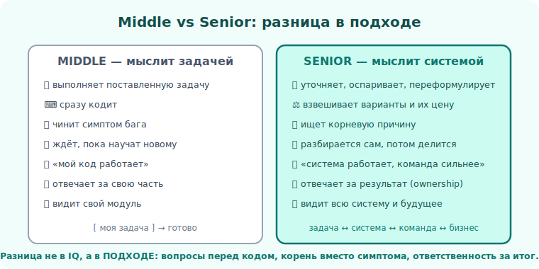

# 01 · Middle vs Senior: реальные отличия 🖼️

> 🎯 **Цель блока:** на конкретных ситуациях увидеть, как Middle и Senior **по-разному
> действуют** в одних и тех же сценариях. Это самый практичный способ понять разницу.

---

## 📖 Одна ситуация — два подхода

### Ситуация 1: «Сделай фичу X»

```
   MIDDLE: открывает редактор, начинает писать.
   SENIOR: сначала задаёт вопросы —
           "Какую проблему пользователя это решает?
            Какие крайние случаи? Что если данных нет/много?
            Можно ли проще? Нужно ли это в этом спринте?"
           и только потом пишет (или доказывает, что писать НЕ надо).
```

### Ситуация 2: Баг в проде

```
   MIDDLE: лезет в код, где «кажется» проблема, чинит по симптому.
   SENIOR: сначала воспроизводит, локализует по данным/логам,
           находит КОРНЕВУЮ причину, чинит её, добавляет тест,
           думает "где ещё это может быть?".
```

### Ситуация 3: Незнакомая технология

```
   MIDDLE: "я это не знаю" → ждёт, пока научат, или избегает.
   SENIOR: "я это не знаю ПОКА" → за день въезжает в основы,
           находит документацию, делает прототип, оценивает риски.
```

💡 Разница не в том, что Senior «умнее». Разница в **подходе**: вопросы перед кодом, корень
вместо симптома, самостоятельность вместо ожидания.



---

## ⭐ Таблица отличий

| Аспект | Middle | Senior |
|---|---|---|
| **Задача** | выполняет поставленную | уточняет, оспаривает, переформулирует |
| **Решение** | «как принято» / «как умею» | взвешивает варианты и их цену |
| **Объём видения** | свой модуль | система целиком и её будущее |
| **Ошибки** | чинит симптом | ищет корень + предотвращает класс ошибок |
| **Неизвестное** | ждёт помощи | разбирается сам, потом делится |
| **Код** | «работает» | работает + просто + переживёт изменения |
| **Команда** | отвечает за себя | усиливает других, разблокирует |
| **Коммуникация** | «сделал/не сделал» | контекст, риски, варианты, рекомендация |

🖼️
```
   MIDDLE мыслит ЗАДАЧЕЙ:    [ моя задача ] → готово
   SENIOR мыслит СИСТЕМОЙ:   [ задача ] ↔ [ система ] ↔ [ команда ] ↔ [ бизнес ]
                              видит связи и последствия во все стороны
```

---

## ⭐⭐ Главный маркер: что делает Senior, когда задача неясна

Это лучший детектор уровня. Дай размытую задачу:

```
   MIDDLE: либо ступор ("дайте точное ТЗ"),
           либо делает по первому пониманию (часто не то).

   SENIOR: декомпозирует неясность —
           "вот что понятно, вот что нет, вот мои допущения,
            вот что я уточню у X, вот что начну делать уже сейчас".
           Двигается вперёд при неполных данных, управляя риском.
```

💡 ⭐⭐ Реальная работа почти всегда — это **неполные данные**. Middle ждёт определённости,
Senior действует в условиях неопределённости, явно проговаривая допущения. Об этом — [модуль 12](../02-decisions/12-risk-uncertainty.md).

---

## 📖 Чего НЕ означает «стать Senior»

- ❌ Не означает «перестать кодить» — Senior часто пишет код, просто иначе.
- ❌ Не означает «стать менеджером» — есть путь Staff/Principal без управления людьми.
- ❌ Не означает «всегда быть правым» — наоборот, Senior быстрее признаёт ошибку и меняет курс.

---

## ✅ Упражнения на размышление

1. **Свой кейс.** Вспомни задачу, где ты действовал «как Middle». Как поступил бы Senior? Распиши.
2. **Вопросы вперёд.** На следующей задаче — прежде чем писать код, выпиши 5 уточняющих вопросов.
3. **Корень vs симптом.** Вспомни последний баг, который чинил. Ты чинил симптом или корень?
   Как проверить, что это корень?

---

## ❓ Проверь себя

1. Как Middle и Senior по-разному реагируют на размытую задачу?
2. Почему «искать корневую причину» — senior-поведение?
3. Что значит «мыслить системой, а не задачей»?
4. Обязательно ли Senior становится менеджером?

---

## ✅ Чек-лист

- [ ] Задаю уточняющие вопросы ДО написания кода
- [ ] Ищу корневую причину, а не чиню симптом
- [ ] Разбираюсь в новом сам, не жду «пока научат»
- [ ] Двигаюсь вперёд при неполных данных, проговаривая допущения

➡️ Следующий: [02 · Карта компетенций и как её качать](02-competency-map.md)
