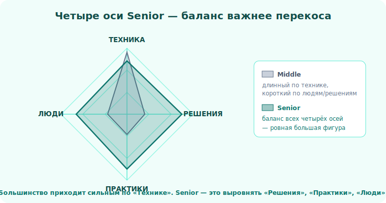

# 02 · Карта компетенций и как её качать 🖼️

> 🎯 **Цель блока:** получить карту senior-компетенций, честно оценить себя по ней и составить
> план роста — чтобы трек был не «чтением», а прокачкой конкретных слабых мест.

---

## 📖 Четыре оси Senior

Senior держится на четырёх осях. Перекос в одну (обычно «технику») — и ты застрял.

```
   1. ТЕХНИКА        — код, системы, инструменты (этому учит весь остальной курс)
   2. РЕШЕНИЯ        — trade-offs, оценка, выбор под условия (Уровень 2 этого трека)
   3. ПРАКТИКИ       — ревью, отладка, рефакторинг, чтение кода (Уровни 1, 3)
   4. ЛЮДИ           — коммуникация, наставничество, влияние, ownership (Уровень 4)
```

🖼️
```
            ТЕХНИКА
               │
   ЛЮДИ ───────┼─────── РЕШЕНИЯ      Senior = баланс всех четырёх.
               │                     Длинная по технике, но короткая
           ПРАКТИКИ                  по «людям» фигура — это Middle.
```

💡 Большинство приходит к этому треку с сильной осью «Техника» (спасибо остальному курсу) и
слабыми тремя. Цель — выровнять фигуру.



---

## ⭐ Карта навыков для самооценки

Оцени себя по каждому от 1 (не умею) до 5 (учу других):

| # | Навык | Ось | Модуль трека |
|---|---|---|---|
| 1 | Пишу простой, читаемый код | Практики | [03](../01-craft/03-clean-code.md) |
| 2 | Делаю и принимаю код-ревью | Практики | [06](../01-craft/06-code-review.md) |
| 3 | Управляю техдолгом осознанно | Решения | [07](../01-craft/07-tech-debt.md) |
| 4 | Мыслю через trade-offs | Решения | [08](../02-decisions/08-tradeoffs.md) |
| 5 | Оцениваю трудозатраты честно | Решения | [09](../02-decisions/09-estimation.md) |
| 6 | Отлаживаю системно | Практики | [13](../03-practices/13-debugging-method.md) |
| 7 | Быстро въезжаю в чужой код | Практики | [14](../03-practices/14-reading-code.md) |
| 8 | Проектирую под изменения | Решения | [15](../03-practices/15-design-for-change.md) |
| 9 | Уточняю требования | Люди | [16](../03-practices/16-requirements.md) |
| 10 | Объясняю сложное просто | Люди | [19](../04-leadership/19-communication.md) |
| 11 | Развиваю джунов | Люди | [20](../04-leadership/20-mentoring.md) |
| 12 | Беру ответственность за результат | Люди | [21](../04-leadership/21-ownership.md) |

💡 ⭐ Где у тебя 1–2 — туда внимание в первую очередь. Сильные технически часто проваливаются на
9–12. Это нормально и **исправимо** — это навыки, а не врождённое.

---

## ⭐⭐ Как качать навыки, которые «не про код»

Технику качают практикой и теорией. А «мягкие» навыки — иначе:

```
   1. ОСОЗНАННОСТЬ — заметь, как поступаешь сейчас (без этого роста нет)
   2. ОБРАЗЕЦ      — найди, у кого получается; наблюдай КАК он делает
   3. МАЛЫЙ ШАГ    — пробуй одну новую вещь за раз на реальной задаче
   4. ОБРАТНАЯ СВЯЗЬ — спрашивай "что я мог сделать лучше?"
   5. РЕФЛЕКСИЯ    — после важного: что сработало, что нет, что в следующий раз
```

💡 ⭐⭐ Ключ — **рефлексия на реальном опыте**. Нельзя стать Senior, читая. Можно — применяя
принципы на своих задачах и честно разбирая, что вышло. Этот трек даёт принципы; практика —
твоя работа/пет-проекты.

---

## 📖 План на трек

```
   1. Пройди Уровень 0 (этот) — система координат.
   2. Качай Уровни 1–4, но НЕ подряд залпом, а параллельно с реальными задачами.
   3. После каждого модуля — примени ОДНУ вещь на этой неделе.
   4. Раз в месяц — пересматривай карту навыков выше (растут ли оценки?).
```

---

## ✅ Упражнения на размышление

1. **Радар.** Нарисуй «паутинку» из 4 осей, отметь себя. Где провал?
2. **Топ-3 слабых.** Из таблицы навыков выбери 3 самых слабых. Это твой фокус на трек.
3. **План.** Для каждого из топ-3 — один маленький шаг, который сделаешь на этой неделе.

---

## ❓ Проверь себя

1. Какие четыре оси держат Senior?
2. Почему сильные технически застревают на Middle?
3. Чем прокачка «мягких» навыков отличается от прокачки техники?
4. Почему рефлексия на реальном опыте важнее чтения?

---

## ✅ Чек-лист

- [ ] Оценил себя по 4 осям и карте навыков
- [ ] Выбрал топ-3 слабых навыка как фокус
- [ ] Понимаю цикл прокачки мягких навыков
- [ ] Планирую применять принципы на реальных задачах, а не только читать

➡️ Дальше: [Уровень 1 · Ремесло кода → 03 · Чистый код](../01-craft/03-clean-code.md)
