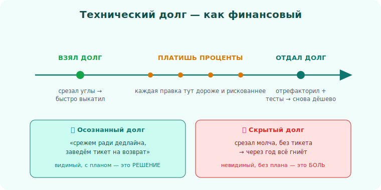

# 07 · Технический долг 🖼️⭐

> 🎯 **Цель блока:** понять техдолг как **осознанный инструмент**, а не просто «плохой код».
> Senior умеет брать долг сознательно и отдавать его вовремя.

---

## 📖 Что такое техдолг

Метафора финансового долга: ты «занимаешь» скорость сейчас (срезаешь углы), но платишь
«проценты» потом (каждое изменение в этом месте дороже).

```
   взял долг:  быстро выкатил, срезав углы (захардкодил, без тестов, скопировал)
   проценты:   каждая правка тут теперь медленнее и рискованнее
   отдал долг:  отрефакторил, покрыл тестами → правки снова дешёвые
```

💡 ⭐ Долг сам по себе **не зло** — как и финансовый. Взять долг, чтобы успеть к важному запуску
— нормально. Зло — это **не отдавать** его и не отслеживать. Невидимый накопленный долг убивает
скорость команды.



---

## ⭐ Виды долга: осознанный vs нет

| | **Осознанный** | **Случайный** |
|---|---|---|
| **Разумный** | «Срежем углы ради дедлайна, заведём тикет на рефакторинг» ✅ | «Теперь-то мы знаем, как надо — отрефакторим» ✅ |
| **Безрассудный** | «Нет времени на проектирование» ❌ | «Какое ещё проектирование?» ❌ (незнание) |

💡 ⭐ Senior берёт долг из **верхнего-левого** квадрата: осознанно, с планом возврата. «Берём
срезку здесь, потому что X важнее срока Y, и вот тикет на исправление». Это решение, а не неряшливость.

🖼️
```
   осознанный долг:   "беру в долг 2 дня скорости, верну через спринт" → записал тикет
   скрытый долг:      срезал углы молча → через год никто не помнит, всё гниёт
   разница — ВИДИМОСТЬ и ПЛАН возврата
```

---

## ⭐⭐ Как управлять долгом

```
   1. ДЕЛАЙ ВИДИМЫМ — заводи тикет/TODO с контекстом: что срезано, почему, чем грозит.
   2. ОЦЕНИВАЙ ПРОЦЕНТЫ — этот долг мешает часто или лежит в тихом углу?
      (долг в горячем, часто меняемом коде — дорогой; в стабильном — терпимый)
   3. ОТДАВАЙ ВОВРЕМЯ — встраивай возврат в работу: «бойскаут» + выделенное время.
   4. АРГУМЕНТИРУЙ БИЗНЕСУ — не "код некрасивый", а "из-за этого фичи выходят на 30%
      медленнее и растут баги". Бизнес понимает СКОРОСТЬ и РИСК, не "красоту".
```

💡 ⭐⭐ Ключ — **разговор с бизнесом на его языке**. «Хочу неделю на рефакторинг, потому что код
уродливый» — отказ. «Эта неделя вернётся через месяц: новые фичи в этом модуле сейчас занимают
втрое дольше и ломаются» — согласие. Долг — это про **скорость и риск**, а это бизнес понимает.

> 🧭 Это применение [trade-offs](../02-decisions/08-tradeoffs.md) и [коммуникации](../04-leadership/19-communication.md):
> перевести техническое в ценность для бизнеса.

---

## 📖 Не весь «некрасивый» код — долг

⚠️ Стабильный код, который работает годами и редко меняется, **не нужно** трогать, даже если он
уродлив. «Проценты» по нему ≈ 0. Рефакторить ради чистоты то, что никто не трогает, — пустая
трата. Долг важен там, где код **активно меняется**.

```
   приоритет возврата долга = частота изменений × боль от текущего состояния
```

---

## ⚠️ Ловушки

- ❌ Брать долг молча, без тикета → он становится невидимым и вечным.
- ❌ Никогда не отдавать → команда тонет, скорость падает до нуля.
- ❌ Аргументировать рефакторинг «красотой» вместо скорости/риска для бизнеса.
- ❌ Чистить стабильный незыблемый код ради чистоты (нет «процентов» — нет смысла).
- ❌ Требовать «остановить всё и переписать» — бизнес не поймёт, и риск огромен.

---

## ✅ Упражнения

1. **Инвентаризация.** Выпиши 5 мест техдолга в своём проекте. Для каждого: что срезано, как
   часто меняется, чем грозит.
2. **Приоритизация.** Отранжируй их по «частота изменений × боль». Что отдавать первым?
3. **Бизнес-аргумент.** Для топ-1 напиши обоснование рефакторинга **на языке бизнеса** (скорость/
   риск/деньги), без слова «красиво».
4. **Осознанный долг.** Вспомни, когда срезал угол. Завёл ли тикет? Если нет — заведи сейчас.

---

## ❓ Проверь себя

1. Почему техдолг — не всегда зло?
2. Чем осознанный долг отличается от скрытого?
3. Как объяснить бизнесу необходимость рефакторинга?
4. Почему не весь уродливый код стоит чинить?

---

## ✅ Чек-лист

- [ ] Беру долг осознанно, с тикетом и планом возврата
- [ ] Делаю долг видимым, а не молчаливым
- [ ] Приоритизирую возврат по частоте изменений × боль
- [ ] Аргументирую рефакторинг скоростью/риском, а не «красотой»
- [ ] Не трогаю стабильный код без причины

➡️ Дальше: [✅ Задачи уровня 1](TASKS.md) · [🚀 Проект](PROJECT.md) · затем
[Уровень 2 · Решения и компромиссы](../02-decisions/08-tradeoffs.md)
