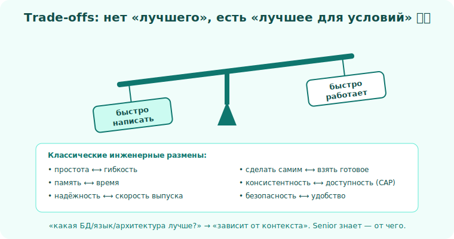

# 08 · Мышление через trade-offs 🖼️⭐⭐

> 🎯 **Цель блока:** освоить главный навык Senior — видеть, что у **любого** решения есть цена,
> и осознанно выбирать «лучшее для этих условий», а не «лучшее вообще».

---

## ⭐⭐ Нет «лучшего» решения — есть «лучшее для условий»

```
   вопрос Junior:  "Как сделать ПРАВИЛЬНО?"
   вопрос Senior:  "Что мы ВЫИГРЫВАЕМ и что ТЕРЯЕМ в каждом варианте —
                    и что важнее ДЛЯ ЭТОЙ задачи?"
```

💡 ⭐⭐ Это ядро всего трека. «Какая база лучше?», «какой язык лучше?», «монолит или
микросервисы?» — у вопроса нет ответа без контекста. Правильный ответ почти всегда: **«зависит
от...»** — и Senior умеет сказать, **от чего** и **какой выбор для каких условий**.

🖼️
```
   КАЖДОЕ решение — это весы:

   быстро написать  ⟷  быстро работает
   просто           ⟷  гибко
   сейчас дёшево    ⟷  потом дёшево менять
   надёжно          ⟷  быстро выпустить

   нельзя максимизировать всё. Выбор = что важнее ЗДЕСЬ.
```



---

## ⭐ Классические инженерные размены

```
   • Скорость разработки  ⟷  Производительность
   • Простота             ⟷  Гибкость/расширяемость
   • Память               ⟷  Время  (привет, алгоритмы!)
   • Связность (быстро)   ⟷  Независимость (масштабируемо)
   • Консистентность      ⟷  Доступность  (CAP-теорема в распределённых)
   • Безопасность         ⟷  Удобство
   • «Сделать самим»      ⟷  «Взять готовое»
   • Покрытие тестами     ⟷  Скорость выката
```

💡 Эти размены ты уже встречал по всему курсу: [время↔память в алгоритмах](../../Algorithms/02-complexity/12-tradeoffs.md),
[контроль↔безопасность в C/Rust](../../Rust/README.md), [гибкость↔простота в ООП](../../OOP/03-design/16-composition-over-inheritance.md).
Senior-мышление — это **обобщение** их на любое решение.

---

## ⭐⭐ Как принимать решение с trade-offs

```
   1. СФОРМУЛИРУЙ варианты (минимум 2, лучше 3). "Только один путь" — почти всегда ложь.
   2. ВЫПИШИ критерии, которые ВАЖНЫ ЗДЕСЬ (скорость? цена? риск? сроки? команда?).
   3. ОЦЕНИ каждый вариант по критериям (хотя бы +/−, можно веса).
   4. УЧТИ КОНТЕКСТ: стартап на инвест-раунде ≠ банк. Прототип ≠ прод на 10 лет.
   5. ВЫБЕРИ и ЗАФИКСИРУЙ почему (см. ADR, модуль 11).
```

🖼️
```
                  | вариант A | вариант B | вариант C
   ───────────────┼───────────┼───────────┼──────────
   скорость старта |    ✅✅    |    ✅     |    ❌
   масштаб         |    ❌     |    ✅     |    ✅✅
   стоимость       |    ✅✅    |    ✅     |    ❌
   риск            |    ✅     |    ✅     |    ⚠️
   ───────────────┴───────────┴───────────┴──────────
   "для стартапа с дедлайном через месяц → A.
    для системы на 5 лет с ростом → B." ← выбор зависит от КОНТЕКСТА
```

---

## 📖 Контекст определяет всё

Один и тот же выбор «монолит vs микросервисы»:

```
   стартап, 3 разработчика, гипотеза не проверена:
       → МОНОЛИТ. Микросервисы убьют скоростью и сложностью то, чего ещё нет.

   зрелый продукт, 100 инженеров, чёткие домены, нагрузка:
       → возможно микросервисы. Независимый деплой команд стоит сложности.
```

💡 Тот, кто говорит «микросервисы всегда лучше» (или «всегда хуже»), — не мыслит как Senior.
Senior спрашивает: **в каком мы контексте?**

---

## ⚠️ Ловушки

- ❌ Искать «правильный» ответ без контекста. Контекст — часть задачи.
- ❌ «Серебряная пуля»: технология/паттерн, который «всегда лучший». Их нет.
- ❌ Cargo cult: «в Google так делают» — у тебя не Google и не их условия.
- ❌ Рассмотреть один вариант и объявить его единственным. Всегда ищи альтернативы.
- ❌ Выбор по моде/хайпу вместо критериев задачи.
- ❌ Игнорировать «скрытую» сторону весов (выбрал гибкость — заплатил сложностью; помни о цене).

---

## ✅ Упражнения на размышление

1. **Весы.** Возьми любое своё недавнее техническое решение. Какие 2 вещи ты разменял? Осознавал
   ли это тогда?
2. **Три варианта.** Для текущей задачи придумай 3 разных подхода. Выпиши плюсы/минусы каждого.
   Раньше ты видел только один?
3. **Контекст-флип.** Возьми решение «монолит vs микросервисы» (или SQL vs NoSQL). Опиши контекст,
   где верен вариант A, и контекст, где верен B.
4. **Развенчай пулю.** Возьми «X всегда лучше» (любимый фреймворк/паттерн). Найди контекст, где X — плохой выбор.

---

## ❓ Проверь себя

1. Почему у «какая технология лучше?» нет ответа без контекста?
2. Назови 4 классических инженерных размена.
3. Как принять решение с trade-offs (шаги)?
4. Почему «серебряных пуль» не существует?

---

## ✅ Чек-лист

- [ ] Вижу цену (что теряю) у каждого решения
- [ ] Рассматриваю 2–3 варианта, а не один
- [ ] Выбираю по критериям и контексту, а не по моде
- [ ] Не верю в «универсально лучшие» технологии
- [ ] Могу объяснить, для каких условий какой вариант верен

➡️ Следующий: [09 · Оценка трудозатрат](09-estimation.md)
