# 🧭 Трек · Мышление Senior-разработчика

> **Senior — это не «много лет» и не «знаю больше технологий».** Это образ мышления: умение
> принимать решения при неполных данных, видеть компромиссы, проектировать под изменения,
> отвечать за результат и делать команду сильнее. Этот трек — про то, что отличает Senior от
> Middle, когда технические знания уже есть.

> ⚠️ Здесь почти нет кода. Здесь — **суждение, практики и образ мышления**. Примеры — это
> сценарии, чек-листы и разборы решений, а не синтаксис.

---

## 🗺️ Дорожная карта

```mermaid
graph TD
    subgraph L0 [🥚 Уровень 0 — Что такое Senior]
        A0[00 · Senior — это мышление, не стаж]
        A1[01 · Middle vs Senior: реальные отличия]
        A2[02 · Карта компетенций и как её качать]
    end
    subgraph L1 [🐣 Уровень 1 — Ремесло кода]
        B0[03 · Чистый код: пишем для людей]
        B1[04 · Именование и простота]
        B2[05 · Рефакторинг малыми шагами]
        B3[06 · Код-ревью: автор и ревьюер]
        B4[07 · Технический долг]
    end
    subgraph L2 [🐥 Уровень 2 — Решения и компромиссы ⭐ ядро]
        C0[08 · Мышление через trade-offs ⭐⭐]
        C1[09 · Оценка трудозатрат ⭐⭐]
        C2[10 · Build vs Buy: когда НЕ писать код]
        C3[11 · ADR — решения с обоснованием]
        C4[12 · Риски и неопределённость]
    end
    subgraph L3 [🦅 Уровень 3 — Инженерные практики]
        D0[13 · Методология отладки]
        D1[14 · Чтение чужого большого кода]
        D2[15 · Проектирование под изменения]
        D3[16 · Работа с требованиями]
        D4[17 · Производительность как выбор]
        D5[18 · Документация и знания]
    end
    subgraph L4 [🚀 Уровень 4 — Senior как роль]
        E0[19 · Коммуникация и ясность]
        E1[20 · Наставничество]
        E2[21 · Ownership и ответственность]
        E3[22 · Влияние без власти]
        E4[23 · Собеседования с двух сторон]
        E5[24 · Развитие, карьера, выгорание]
    end
    L0 --> L1 --> L2 --> L3 --> L4 --> Done([🧭 Мыслю как Senior])
```

---

## 🎯 Ядро трека — компромиссы (trade-offs)

> **Senior знает: «лучшего» решения нет — есть «лучшее для этих условий».** Каждый выбор
> что-то даёт и что-то отнимает. Видеть эти размены и осознанно их делать — главный навык.

Это тот же принцип, что проходит через весь курс: в [памяти](../C/README.md) — скорость против
безопасности, в [ООП](../OOP/README.md) — гибкость против простоты, в [алгоритмах](../Algorithms/README.md)
— время против памяти. Senior-мышление обобщает это на **любые** инженерные решения.

---

## 📂 Содержание

### 🥚 Уровень 0 — Что такое Senior
- [00 · Senior — это мышление, а не стаж](00-mindset/00-what-is-senior.md)
- [01 · Middle vs Senior: реальные отличия](00-mindset/01-middle-vs-senior.md)
- [02 · Карта компетенций и как её качать](00-mindset/02-competency-map.md)

### 🐣 Уровень 1 — Ремесло кода
- [03 · Чистый код: пишем для людей](01-craft/03-clean-code.md)
- [04 · Именование и простота (KISS)](01-craft/04-naming-simplicity.md)
- [05 · Рефакторинг малыми шагами](01-craft/05-refactoring.md)
- [06 · Код-ревью: автор и ревьюер](01-craft/06-code-review.md)
- [07 · Технический долг](01-craft/07-tech-debt.md)
- ✅ [Задачи уровня 1](01-craft/TASKS.md) · 🚀 [Проект](01-craft/PROJECT.md)

### 🐥 Уровень 2 — Решения и компромиссы ⭐ ядро
- [08 · Мышление через trade-offs ⭐⭐](02-decisions/08-tradeoffs.md)
- [09 · Оценка трудозатрат ⭐⭐](02-decisions/09-estimation.md)
- [10 · Build vs Buy: когда НЕ писать код](02-decisions/10-build-vs-buy.md)
- [11 · ADR — решения с обоснованием](02-decisions/11-adr.md)
- [12 · Риски и неопределённость](02-decisions/12-risk-uncertainty.md)
- ✅ [Задачи уровня 2](02-decisions/TASKS.md) · 🚀 [Проект](02-decisions/PROJECT.md)

### 🦅 Уровень 3 — Инженерные практики
- [13 · Методология отладки](03-practices/13-debugging-method.md)
- [14 · Чтение чужого большого кода](03-practices/14-reading-code.md)
- [15 · Проектирование под изменения](03-practices/15-design-for-change.md)
- [16 · Работа с требованиями](03-practices/16-requirements.md)
- [17 · Производительность как осознанный выбор](03-practices/17-performance-mindset.md)
- [18 · Документация и обмен знаниями](03-practices/18-documentation.md)
- ✅ [Задачи уровня 3](03-practices/TASKS.md) · 🚀 [Проект](03-practices/PROJECT.md)

### 🚀 Уровень 4 — Senior как роль
- [19 · Коммуникация и ясность](04-leadership/19-communication.md)
- [20 · Наставничество](04-leadership/20-mentoring.md)
- [21 · Ownership и ответственность](04-leadership/21-ownership.md)
- [22 · Влияние без власти](04-leadership/22-influence.md)
- [23 · Собеседования с двух сторон](04-leadership/23-interviews.md)
- [24 · Развитие, карьера, выгорание](04-leadership/24-growth-career.md)
- ✅ [Задачи уровня 4](04-leadership/TASKS.md) · 🚀 [Проект](04-leadership/PROJECT.md)

---

## 🧭 Как проходить

Этот трек можно читать **параллельно** с любым техническим: пишешь код на Python/Rust — и тут же
применяешь принципы чистого кода, ревью, trade-offs. Лучше всего заходит, когда у тебя уже есть
реальные задачи, на которых можно пробовать.

➡️ Начни с [00 · Senior — это мышление, а не стаж](00-mindset/00-what-is-senior.md)
