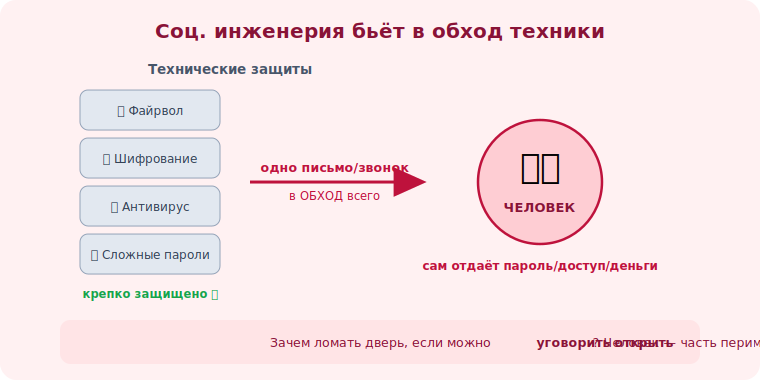

# 00 · Что такое социальная инженерия 🖼️⭐

> 🎯 **Цель блока:** понять, что социальная инженерия — это атака на **человека**, а не на
> технику, и почему распознавание таких атак — базовый навык цифровой безопасности.

> ⚠️ Образовательно-защитный материал. Цель — научиться **распознавать и противостоять**, а не
> применять. Применение против людей без согласия — незаконно (см. [модуль 02](02-ethics-law.md)).

---

## 📖 Взлом человека, а не системы

```
   технический взлом:   ищут уязвимость в КОДЕ/сервере → сложно, дорого, защищено.
   соц. инженерия:      обманывают ЧЕЛОВЕКА → он сам отдаёт пароль/доступ/деньги.
                        зачем ломать дверь, если можно уговорить открыть?
```

💡 ⭐ Большинство реальных взломов начинаются **не** с гениального хака, а с письма «подтвердите
пароль» или звонка «это служба безопасности банка». Самый защищённый сервер бесполезен, если
сотрудник сам введёт логин на поддельной странице. Человек — часть периметра безопасности.

🖼️
```
   [ файрвол ][ шифрование ][ антивирус ][ сложные пароли ]  ← техника защищена
                          ↓
                    [ ЧЕЛОВЕК ]  ← сюда бьёт соц. инженер: одно письмо в обход всего
```



---

## ⭐ Как это обычно выглядит

```
   • письмо «от банка»: "обнаружена подозрительная операция, войдите и подтвердите" → ссылка
     на поддельный сайт, ворует логин.
   • звонок «из техподдержки»: "у вас вирус, установите программу для проверки" → даёт доступ.
   • сообщение «от начальника»: "срочно оплати счёт, я на встрече, потом объясню".
   • USB-флешка «найдена» на парковке с подписью "Зарплаты" → любопытство → заражение.
```

💡 Общее во всех: тебя **торопят**, **пугают** или **давят авторитетом**, чтобы ты действовал
быстро и не думая. Это и есть универсальный красный флаг (подробно — [Уровень 2](../02-psychology/08-influence-principles.md)).

---

## ⭐⭐ Почему это касается каждого

```
   жертва — не только «глупые бабушки». Цель — кто угодно:
   • разработчик (доступ к коду, серверам, секретам)
   • бухгалтер (платежи)
   • любой сотрудник (точка входа в сеть компании)
   • ты лично (банк, госуслуги, соцсети, крипта)
```

💡 ⭐⭐ Технически грамотные люди уязвимы **не меньше** — иногда больше, из-за самоуверенности
(«меня-то не обманут»). Защита — это не «быть умнее», а выработать **привычку проверять** на
определённые триггеры. Этому и учит трек.

---

## 📖 Зачем это знать разработчику

```
   • ты — ценная цель: доступ к репозиториям, продакшену, секретам, данным пользователей.
   • ты строишь системы, которыми пользуются люди → должен закладывать защиту от обмана
     (антифишинг, верификация, понятные предупреждения).
   • безопасность системы = техника + люди. Игнорировать человеческий фактор — оставить дыру.
```

> 🧭 Этот трек — «человеческая» половина безопасности. Техническая (уязвимости кода, OWASP) —
> в треке AppSec. Вместе они дают полную картину защиты.

---

## ⚠️ Ловушки мышления

- ❌ «Меня не обманут, я умный» — самоуверенность делает уязвимее, а не защищённее.
- ❌ «Это проблема только неопытных» — целятся в всех, особенно в тех, у кого есть доступ.
- ❌ «У меня нечего красть» — есть: доступы, контакты, как точка входа дальше.
- ❌ Думать, что защита — это технология. Защита — это привычка проверять.

---

## ✅ Упражнения на размышление

1. **Личный опыт.** Вспомни подозрительное письмо/звонок/SMS, которое получал. Что в нём
   пыталось тебя поторопить или напугать?
2. **Цель.** Какие твои доступы были бы ценны для атакующего (рабочие и личные)? Выпиши.
3. **Наблюдение.** Следующую неделю замечай в сообщениях триггеры «срочно/подтвердите/иначе
   заблокируем». Сколько насчитал?

---

## ❓ Проверь себя

1. Чем социальная инженерия отличается от технического взлома?
2. Почему «самый защищённый сервер» не спасает от соц. инженерии?
3. Почему технически грамотные люди тоже уязвимы?
4. Зачем разработчику знать о соц. инженерии?

---

## ✅ Чек-лист

- [ ] Понимаю, что соц. инженерия — атака на человека, не на технику
- [ ] Вижу общий шаблон: торопят / пугают / давят авторитетом
- [ ] Осознаю, что уязвим каждый, включая технически грамотных
- [ ] Понимаю, почему это важно именно разработчику

➡️ Следующий: [01 · Почему человек — слабое звено](01-human-weakest-link.md)
