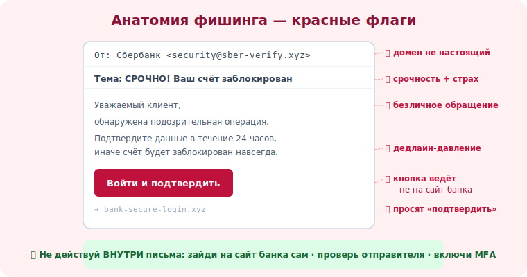

# 03 · Фишинг — обман по почте 🖼️⭐⭐

> 🎯 **Цель блока:** научиться **распознавать** фишинговые письма по их признакам — это самый
> массовый вектор атак и причина большинства взломов.

> ⚠️ Материал на распознавание и защиту. Рассылка фишинга реальным людям незаконна ([модуль 02](../00-intro/02-ethics-law.md)).

---

## 📖 Что такое фишинг

```
   ФИШИНГ — массовая рассылка писем, маскирующихся под доверенный источник (банк, сервис,
   коллега), с целью заставить жертву:
   • ввести логин/пароль на поддельной странице
   • открыть вложение с вредоносом
   • перевести деньги / выдать данные
   название от "fishing" — закидывают «наживку» массово, кто-то клюнет.
```

💡 ⭐ Фишинг работает за счёт **масштаба** (миллионы писем) и **маскировки** под знакомое. Тебе не
нужно быть «целью» — достаточно оказаться в списке. Поэтому распознавание признаков важно каждому.

---

## ⭐⭐ Красные флаги: как узнать фишинг

```
   🚩 ОТПРАВИТЕЛЬ не тот, кем притворяется
      • адрес похож, но не точный: support@paypa1.com, sber-security.ru, @gmail вместо домена банка
      • имя «Банк», а домен левый

   🚩 СРОЧНОСТЬ и УГРОЗА
      • "аккаунт будет заблокирован через 24 часа", "немедленно подтвердите", "обнаружен взлом"
      • цель — чтобы ты действовал не думая (Система 1, модуль 01)

   🚩 ССЫЛКА ведёт не туда
      • текст ссылки и реальный адрес (при наведении) различаются
      • домен не настоящий: вместо bank.com → bank.secure-login.xyz

   🚩 ПРОСЯТ то, что не просят по почте
      • ввести пароль, код из SMS, данные карты, перевести деньги «срочно»
      • легитимные сервисы НЕ просят пароль письмом

   🚩 МЕЛОЧИ
      • безличное «Уважаемый клиент» вместо имени
      • ошибки, кривой перевод, странное форматирование
      • неожиданное вложение (.zip, .exe, документ «с макросами»)
```

🖼️
```
   ⚠️ ПОДОЗРИТЕЛЬНОЕ ПИСЬМО:
   ┌──────────────────────────────────────────────┐
   │ От: Сбербанк <security@sber-verify.xyz>  🚩  │ ← домен не настоящий
   │ Тема: СРОЧНО! Ваш счёт заблокирован       🚩  │ ← срочность+страх
   │                                              │
   │ Уважаемый клиент,                         🚩  │ ← без имени
   │ обнаружена подозрительная операция.          │
   │ Подтвердите данные в течение 24 часов,    🚩  │ ← дедлайн-давление
   │ иначе счёт будет заблокирован.               │
   │ [ Войти и подтвердить ]  → bank-secure.xyz 🚩│ ← ссылка не туда
   └──────────────────────────────────────────────┘
```



---

## ⭐ Как защититься

```
   ✅ ПРОВЕРЬ ОТПРАВИТЕЛЯ — точный адрес, а не отображаемое имя.
   ✅ НЕ КЛИКАЙ по ссылке из письма — зайди на сайт сам, через закладку/ввод адреса вручную.
   ✅ НАВЕДИ на ссылку (не кликая) — посмотри реальный адрес.
   ✅ НИКОГДА не вводи пароль/код, перейдя ПО ССЫЛКЕ из письма.
   ✅ СОМНЕВАЕШЬСЯ — свяжись с организацией по ОФИЦИАЛЬНОМУ каналу (телефон с сайта/карты), не из письма.
   ✅ ВКЛЮЧИ MFA — даже если пароль украли, без второго фактора не войдут (модуль 18).
   ✅ ПОДОЗРИТЕЛЬНОЕ ПИСЬМО на работе — сообщи в IT/безопасность (не удаляй молча).
```

💡 ⭐ Золотое правило: **не действуй ВНУТРИ подозрительного письма**. Нужно проверить счёт? Открой
приложение банка сам. Просят войти? Набери адрес вручную. Письмо — это вход атаки, не доверяй
его ссылкам и кнопкам.

---

## 📖 Виды по нацеленности

```
   • массовый фишинг — «всем подряд», шаблонный (этот модуль).
   • целевой (spear phishing) — под конкретного человека, с деталями о нём (модуль 15).
   • whaling — на «крупную рыбу»: руководителей, тех, кто платит.
   • clone phishing — копия настоящего письма с подменённой ссылкой.
   чем целевее — тем убедительнее и тем меньше «грубых» красных флагов.
```

---

## ⚠️ Ловушки

- ❌ Смотреть только на имя отправителя, а не на реальный адрес.
- ❌ Кликать «чтобы проверить, что там» — клик уже может быть опасен.
- ❌ Доверять, потому что «выглядит как настоящее письмо банка» — логотип легко скопировать.
- ❌ Вводить данные на странице, открытой из письма.
- ❌ Думать, что HTTPS/замочек = безопасно (фишинг-сайты тоже имеют сертификат).
- ❌ Стесняться переспросить/сообщить — лучше «ложная тревога», чем взлом.

---

## ✅ Упражнения на размышление

1. **Разбор.** Найди в своей почте/спаме подозрительное письмо. Отметь все красные флаги по
   списку. Сколько нашёл?
2. **Проверка ссылки.** Возьми любое письмо со ссылкой. Наведи (не кликай) — совпадает ли видимый
   текст с реальным адресом?
3. **Официальный канал.** Для своего банка/основного сервиса найди ОФИЦИАЛЬНЫЙ способ связи
   (телефон/приложение), которым воспользуешься вместо ссылок из писем.
4. ⭐ **Тренажёр.** Пройди публичный обучающий тест на распознавание фишинга (их делают Google и
   др.). Какие письма обманули тебя?

---

## ❓ Проверь себя

1. Что такое фишинг и почему он массовый?
2. Назови 4 красных флага фишингового письма.
3. Почему нельзя вводить данные на странице из письма?
4. Как правильно проверить подозрительное письмо «от банка»?

---

## ✅ Чек-лист

- [ ] Проверяю реальный адрес отправителя, а не имя
- [ ] Не кликаю ссылки и не открываю вложения из подозрительных писем
- [ ] Не ввожу пароли/коды, перейдя по ссылке из письма
- [ ] Проверяю через официальный канал, а не из письма
- [ ] Включил MFA и сообщаю о подозрительных письмах

➡️ Следующий: [04 · Вишинг и смишинг — звонки и SMS](04-vishing-smishing.md)
