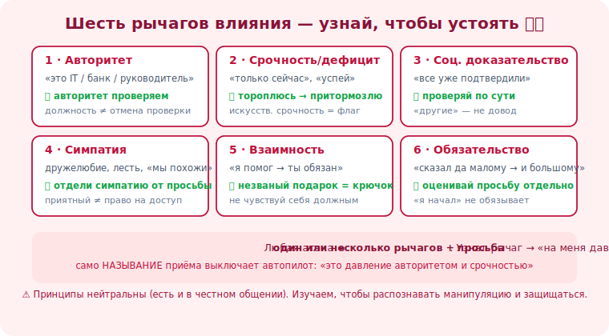

# 08 · Шесть принципов влияния 🖼️⭐⭐

> 🎯 **Цель блока:** разобрать шесть универсальных «рычагов» влияния (по Чалдини), которые
> эксплуатирует соц. инженерия, — чтобы **узнавать** их в атаке и не реагировать автоматически.

> ⚠️ Эти принципы — нейтральный инструмент психологии (их используют в честных продажах, общении).
> Здесь мы изучаем их, чтобы **распознавать манипуляцию и защищаться**, а не применять против людей.

---

## 📖 Почему это ядро трека

```
   атаки бывают разные (письмо, звонок, претекст), но жмут на одни и те же «кнопки».
   узнал кнопку → видишь её в ЛЮБОЙ атаке → не реагируешь на автопилоте.
   защита по принципам сильнее защиты по списку сценариев (сценарии меняются, кнопки — нет).
```

💡 ⭐⭐ Это самый мощный уровень защиты: вместо «запомнить 100 видов атак» ты понимаешь **6
механизмов**, и распознаёшь манипуляцию, даже встретив новый, невиданный сценарий. Чувствуешь
один из этих рычагов в общении с просьбой — включай паузу и проверку.

---

## ⭐⭐ Шесть принципов (и как их используют против тебя)

```
   1. АВТОРИТЕТ — мы подчиняемся «начальству/экспертам/официальным лицам».
      атака: "это служба безопасности / IT / руководитель / полиция".
      🛡️ защита: авторитет ПРОВЕРЯЕМ. Должность не отменяет верификацию.

   2. СРОЧНОСТЬ/ДЕФИЦИТ — «мало времени/осталось/успей» отключает раздумья.
      атака: "только сейчас", "аккаунт заблокируют через час", "осталось 2 места".
      🛡️ защита: искусственная срочность = красный флаг. Тороплюсь → значит, притормозлю.

   3. СОЦИАЛЬНОЕ ДОКАЗАТЕЛЬСТВО — «все так делают / другие уже».
      атака: "все коллеги уже подтвердили", "5000 человек участвуют", фейк-отзывы.
      🛡️ защита: «другие делают» — не довод. Проверяй по сути, а не по толпе.

   4. СИМПАТИЯ — мы говорим «да» тем, кто нравится/похож/льстит.
      атака: дружелюбие, общие интересы, лесть, «мы же земляки/коллеги».
      🛡️ защита: приятность общения ≠ право на доступ/данные. Отдели симпатию от просьбы.

   5. ВЗАИМНОСТЬ — за услугу/подарок чувствуем себя обязанными ответить.
      атака: «помог/подарил» → теперь «всего лишь» сделай для меня X (quid pro quo).
      🛡️ защита: незваный подарок/помощь от незнакомца — это крючок, а не доброта.

   6. ОБЯЗАТЕЛЬСТВО/ПОСЛЕДОВАТЕЛЬНОСТЬ — сказав «да» малому, трудно отказать в большем.
      атака: серия мелких безобидных согласий → подводят к опасному.
      🛡️ защита: каждую просьбу оценивай отдельно; «я уже начал» — не обязывает продолжать.
```

🖼️
```
   ЛЮБАЯ атака = [один или несколько рычагов] + просьба

   "Это руководитель (АВТОРИТЕТ), срочно (СРОЧНОСТЬ) оплати счёт,
    ты же всегда выручаешь (СИМПАТИЯ/ОБЯЗАТЕЛЬСТВО)"
        ↓
   узнаёшь рычаги → "на меня давят по схеме" → пауза → проверка → не поддался
```



---

## ⭐ Как это превратить в защиту

```
   ТРЕНИРУЙ РЕФЛЕКС РАСПОЗНАВАНИЯ:
   когда чувствуешь сильный импульс согласиться/действовать, спроси себя:
   • на какую «кнопку» жмут? (авторитет? срочность? симпатия?)
   • если бы НЕ было этого давления — я бы согласился?
   • что я теряю, если возьму паузу и проверю? (почти всегда — ничего)

   само НАЗЫВАНИЕ приёма обезоруживает его: "так, это давление авторитетом и срочностью" —
   и автопилот выключается, включается анализ.
```

💡 ⭐ Манипуляция сильна, пока невидима. Как только ты её **называешь** («меня торопят, чтобы я не
думал»), она теряет власть — ты переходишь из эмоциональной реакции в осознанный анализ.

---

## 📖 Часто рычаги комбинируют

```
   реальные атаки складывают несколько принципов для усиления:
   "Здравствуйте, это руководитель IT (авторитет). У нас инцидент (страх), нужно срочно (срочность)
    обновить твой доступ, остальные уже сделали (соц. доказательство), ты ведь поможешь? (симпатия)"
   → чем больше рычагов разом, тем сильнее давление и тем важнее распознать схему.
```

---

## ⚠️ Ловушки

- ❌ Подчиняться «авторитету» без проверки (должность/форма — не доказательство).
- ❌ Действовать под «срочностью», не спросив, почему так срочно.
- ❌ Верить «все уже сделали» вместо проверки по сути.
- ❌ Путать симпатию к человеку с обоснованностью его просьбы.
- ❌ Чувствовать себя «обязанным» из-за подарка/услуги.
- ❌ Идти на эскалацию просьб по инерции «я уже начал».

---

## ✅ Упражнения на размышление

1. **Свои кнопки.** Какие из 6 принципов действуют на тебя сильнее? Где твоя уязвимость?
2. **Разбор атаки.** Возьми любой пример из Уровня 1. Какие принципы влияния в нём задействованы?
3. **Назови приём.** Вспомни случай, когда тебя «продавили» (хоть в магазине). Какой рычаг сработал?
4. **Маркетинг.** Замечай рычаги в обычной рекламе/продажах (срочность «только сегодня», соц.
   доказательство «хит продаж»). Тренируй распознавание на безобидном.

---

## ❓ Проверь себя

1. Назови шесть принципов влияния.
2. Почему защита «по принципам» сильнее защиты «по списку атак»?
3. Как «называние приёма» помогает защититься?
4. Почему атаки комбинируют несколько рычагов?

---

## ✅ Чек-лист

- [ ] Знаю 6 принципов влияния и как их используют в атаках
- [ ] Узнаю рычаги в конкретном сообщении/звонке
- [ ] Называю приём про себя, чтобы выключить автопилот
- [ ] Оцениваю просьбу отдельно от давления
- [ ] Знаю свои самые уязвимые «кнопки»

➡️ Следующий: [09 · Срочность, страх, любопытство](09-urgency-fear.md)
