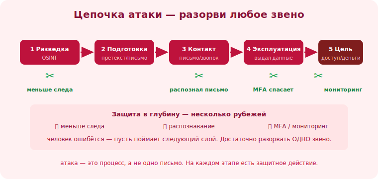

# 16 · Анатомия атаки: цепочка 🖼️⭐

> 🎯 **Цель блока:** увидеть, что серьёзная атака — это **цепочка этапов**, а не одно письмо.
> Понимание цепочки помогает разорвать её на любом звене (защита «в глубину»).

> ⚠️ Материал — для понимания и защиты (где прервать атаку), не инструкция к действию.

---

## 📖 Атака — это процесс, а не одно событие

```
   крупный взлом редко = одно письмо. Обычно ЦЕПОЧКА:

   1. РАЗВЕДКА (OSINT) — собирают данные о цели/организации (модуль 13).
   2. ПОДГОТОВКА — делают убедительный претекст/письмо/поддельный сайт под цель.
   3. КОНТАКТ — первое касание (письмо, звонок, сообщение).
   4. ЭКСПЛУАТАЦИЯ — жертва выдаёт данные/доступ/деньги или запускает вредонос.
   5. ЗАКРЕПЛЕНИЕ — атакующий использует доступ, расширяет его, заметает следы.
   6. ЦЕЛЬ — деньги, данные, доступ к системам, плацдарм для следующей атаки.
```

💡 ⭐ Хорошая новость: цепочку можно разорвать на **любом** этапе. Не дал данных в OSINT (модуль 14)
— разведка беднее. Распознал письмо — нет эксплуатации. Включил MFA — украденный пароль бесполезен.
Заметил аномалию — закрепление сорвано. **Защита в глубину**: несколько барьеров, и атаке нужно
пробить все.

🖼️
```
   [Разведка]→[Подготовка]→[Контакт]→[Эксплуатация]→[Закрепление]→[Цель]
       ✂️          —            ✂️           ✂️            ✂️
   меньше следа   —      распознал письмо  MFA спасает  заметил аномалию
   разорвал ЛЮБОЕ звено → атака не достигла цели
```



---

## ⭐ Пример цепочки (для понимания защиты)

```
   цель: доступ к системам компании через разработчика.
   1. РАЗВЕДКА: находят разработчика (GitHub, проф. сеть), его проект, коллег, email-формат.
      🛡️ защита: меньше публичных рабочих деталей (модуль 14).
   2. ПОДГОТОВКА: делают письмо «от коллеги по проекту X» со ссылкой на поддельный портал логина.
   3. КОНТАКТ: письмо приходит, выглядит как от своих.
      🛡️ защита: проверка отправителя/ссылки (модуль 03), независимая верификация.
   4. ЭКСПЛУАТАЦИЯ: разработчик вводит логин на фейк-портале.
      🛡️ защита: не вводить креды по ссылке из письма; MFA.
   5. ЗАКРЕПЛЕНИЕ: вход в реальные системы украденным логином.
      🛡️ защита: MFA блокирует вход; мониторинг аномальных входов; быстрый сброс при подозрении.
```

💡 ⭐ Обрати внимание: на **каждом** этапе есть защитное действие. Не нужно быть идеальным на всех —
достаточно сработать на одном, и цепочка рвётся. Поэтому многослойная защита (след + распознавание +
MFA + мониторинг + процедуры) так эффективна.

---

## ⭐⭐ Защита «в глубину» (defense in depth)

```
   принцип: НЕ полагаться на один барьер. Человек ошибётся — пусть поймает следующий слой.

   слой 1 (профилактика): меньше цифрового следа → разведка беднее.
   слой 2 (распознавание): обучение, бдительность → ловим контакт/эксплуатацию.
   слой 3 (техника): MFA, фильтры, ограничение прав → украденный пароль бесполезен.
   слой 4 (обнаружение): мониторинг, аномалии → ловим закрепление.
   слой 5 (реакция): план инцидента → быстро гасим ущерб (модуль 22).
```

💡 ⭐⭐ Это та же идея, что в [сетях/ОС](../../OS/04-advanced/22-security.md) и [Senior-рисках](../../Senior/02-decisions/12-risk-uncertainty.md):
не один забор, а несколько рубежей. Соц. инженерия пробивает «человеческий» слой — поэтому
технические слои (MFA!) и обнаружение критичны: они ловят ошибку, когда человек всё же оступился.

---

## 📖 Почему понимать цепочку полезно защитнику

```
   • видишь, где ТВОЁ звено в общей картине (ты — «контакт» и «эксплуатация»).
   • понимаешь, что твоя ошибка — не конец, если есть следующие слои (MFA, мониторинг).
   • в организации — выстраиваешь барьеры на разных этапах, а не один.
   • при инциденте — понимаешь, на каком этапе сорвалось и что чинить.
```

---

## ⚠️ Ловушки

- ❌ Думать, что атака — это «одно письмо», и защищаться только от него.
- ❌ Полагаться на один барьер (только бдительность ИЛИ только MFA).
- ❌ Считать свою ошибку фатальной — следующие слои могут спасти (если они есть).
- ❌ Игнорировать «скучные» слои (мониторинг, ограничение прав) — они ловят то, что прошло.
- ❌ Не иметь плана реакции «если всё же пробили».

---

## ✅ Упражнения на размышление

1. **Своё звено.** В цепочке атаки на тебя/работу — где твоя роль? Какие защитные действия на
   твоём этапе?
2. **Слои.** Какие слои защиты у тебя уже есть (след, распознавание, MFA, мониторинг, план)? Какой
   самый слабый?
3. **Разрыв цепи.** Возьми пример атаки и отметь все точки, где её можно было прервать.
4. **MFA как сеть.** На каких важных аккаунтах у тебя ещё НЕТ MFA (последний барьер при краже
   пароля)? Включи.

---

## ❓ Проверь себя

1. Из каких этапов состоит цепочка атаки?
2. Почему достаточно разорвать одно звено?
3. Что такое защита «в глубину» и почему один барьер недостаточен?
4. Почему технические слои (MFA, мониторинг) важны при соц. инженерии?

---

## ✅ Чек-лист

- [ ] Понимаю атаку как цепочку этапов, а не одно событие
- [ ] Знаю своё звено и защитные действия на нём
- [ ] Выстраиваю несколько слоёв защиты, не один
- [ ] Включил MFA как барьер на случай кражи пароля
- [ ] Понимаю ценность обнаружения и плана реакции

➡️ Следующий: [17 · Утечки данных и их роль](17-data-breaches.md)
