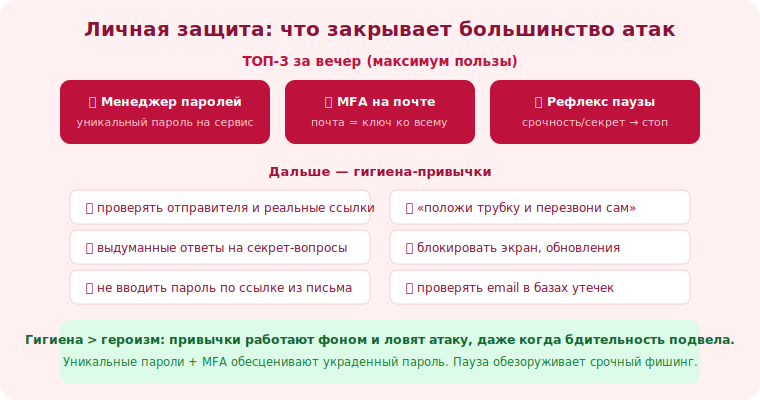

# 18 · Личная гигиена безопасности 🖼️⭐⭐

> 🎯 **Цель блока:** собрать в один практический чек-лист привычки, которые защищают тебя от
> большинства атак соц. инженерии. Это «базовая гигиена» цифровой жизни.

---

## 📖 Гигиена > героизм

```
   защита — не разовый подвиг, а набор ПРИВЫЧЕК, работающих фоном.
   как мыть руки: скучно, но предотвращает большинство «болезней».
   правильно настроенная гигиена ловит атаку, даже когда бдительность подвела.
```

💡 ⭐ Большинство успешных атак используют отсутствие базовой гигиены: повтор паролей, нет MFA,
реальные секрет-ответы, незаблокированный экран. Закрыв базу, ты убираешь себя из «лёгких целей» —
а атакующие, как вода, текут по пути наименьшего сопротивления.

---

## ⭐⭐ Чек-лист личной гигиены

```
   🔐 ПАРОЛИ И ДОСТУП (самое важное):
   ✅ менеджер паролей + УНИКАЛЬНЫЙ сложный пароль на каждый сервис
   ✅ MFA везде, где есть (аутентификатор/ключ надёжнее SMS)
   ✅ выдуманные ответы на секретные вопросы (хранить в менеджере)
   ✅ не вводить пароли, перейдя по ССЫЛКЕ из письма/сообщения

   📧 КОММУНИКАЦИИ:
   ✅ проверять отправителя и реальные адреса ссылок (наведение)
   ✅ «положи трубку и перезвони сам» по официальному каналу
   ✅ не диктовать коды из SMS/CVV никому, ни при каких «проверках»
   ✅ сильная эмоция/срочность от сообщения → пауза, не действие

   💻 УСТРОЙСТВА:
   ✅ блокировать экран, отходя; не оставлять без присмотра
   ✅ обновлять ОС/браузер/приложения (закрывает эксплойты)
   ✅ ставить ПО только из официальных источников; не отключать защиту по просьбе
   ✅ не подключать чужие/найденные носители
   ✅ резервные копии важных данных (страховка от шифровальщиков)

   🛡️ ПРИВАТНОСТЬ:
   ✅ ужесточить настройки соцсетей, минимизировать публичные рабочие детали
   ✅ без геометок реального времени; чистить метаданные фото
   ✅ проверять email в базах утечек, реагировать
```

🖼️
```
   базовая гигиена закрывает «массу»:
   [уникальные пароли] → утечка одного не трогает остальные
   [MFA]               → украденный пароль бесполезен
   [пауза на эмоции]   → срочный фишинг не срабатывает
   [блокировка экрана] → физический доступ обнулён
   простые привычки → большинство атак мимо
```



---

## ⭐ Если делать только три вещи

```
   когда «всё сразу» пугает, начни с ТОП-3 по соотношению польза/усилие:
   1. МЕНЕДЖЕР ПАРОЛЕЙ + уникальные пароли  (убивает credential stuffing).
   2. MFA на почте и важных аккаунтах        (почта = ключ к восстановлению всего остального!).
   3. РЕФЛЕКС ПАУЗЫ на срочность/секреты      (ловит соц.-инж. ядро).
   это закрывает огромную долю риска за один вечер.
```

💡 ⭐ Почему почта в приоритете: через «восстановление пароля» почта открывает почти все твои
аккаунты. Взломали почту → взломали всё. Поэтому уникальный пароль + MFA на почте — критичнее всего.

---

## 📖 Гигиена — это привычка, а не настройка «один раз»

```
   • пароли/MFA — настроил, но поддерживай (новые сервисы, ротация при утечках).
   • обновления — регулярно, не «потом».
   • периодически: проверка утечек, ревизия аккаунтов и приватности.
   • рефлексы (пауза, проверка) — тренируются повторением, а не чтением один раз.
```

> 🧭 Это перекликается с [Senior-устойчивостью](../../Senior/04-leadership/24-growth-career.md):
> регулярная гигиена и устойчивые привычки сильнее разовых рывков.

---

## ⚠️ Ловушки

- ❌ Откладывать «потом» (а атака приходит сегодня).
- ❌ Настроить и забыть — гигиена требует поддержки.
- ❌ Защищать всё, кроме почты (а она — ключ ко всему).
- ❌ Надеяться только на бдительность без технических барьеров (MFA).
- ❌ Считать, что «у меня нечего красть» — есть доступы и точка входа.

---

## ✅ Упражнения

1. **Топ-3 за вечер.** Сделай прямо сейчас: менеджер паролей, MFA на почте, MFA на банке. Сколько
   заняло?
2. **Аудит по чек-листу.** Пройди весь чек-лист гигиены. Отметь, что есть, чего нет. План на
   недостающее.
3. **Почта-приоритет.** Проверь: уникальный ли пароль у почты и включён ли MFA? Если нет — исправь
   первым.
4. **Привычка.** Выбери один рефлекс (блокировка экрана / пауза на срочность) и осознанно тренируй
   неделю.

---

## ❓ Проверь себя

1. Почему гигиена важнее «героической бдительности»?
2. Назови топ-3 действия по пользе/усилию.
3. Почему почта — приоритет №1 для защиты?
4. Почему гигиена — это привычка, а не разовая настройка?

---

## ✅ Чек-лист

- [ ] Менеджер паролей + уникальные пароли
- [ ] MFA на почте и важных аккаунтах
- [ ] Рефлекс паузы на срочность/просьбу секретов
- [ ] Блокировка экрана, обновления, ПО из официальных источников
- [ ] Регулярно поддерживаю гигиену, а не «настроил и забыл»

➡️ Следующий: [19 · Проверка и нулевое доверие](19-verification.md)
