# 🎭 Трек · Социальная инженерия (защита и осведомлённость)

> **Социальная инженерия** — это атака не на компьютер, а на **человека**: обман, чтобы он сам
> выдал данные, доступ или деньги. Это причина большинства реальных взломов — техника защищена,
> а человека «ломают» письмом или звонком. Этот трек учит **распознавать** такие атаки и
> **защищаться** от них — себя, близких и организацию.

> ⚠️ **ВАЖНО — образовательно-защитный трек.** Цель — научить **узнавать манипуляцию и устоять**,
> а не применять её. Использование этих знаний против людей без их явного согласия — **незаконно**
> и неэтично (мошенничество, неавторизованный доступ). Любое практическое тестирование (фишинг-
> симуляции, пентест) допустимо **только с письменным разрешением** владельца системы и людей.
> Здесь нет пошаговых «как обмануть» — есть «как распознать и защититься». Правило трека:
> **узнал приём → устоял → сообщил**.

---

## 🗺️ Дорожная карта

```mermaid
graph TD
    subgraph L0 [🥚 Уровень 0 — Введение и этика]
        A0[00 · Что такое соц. инженерия]
        A1[01 · Почему человек — слабое звено]
        A2[02 · Этика и закон: красные линии]
    end
    subgraph L1 [🐣 Уровень 1 — Векторы атак: как узнать]
        B0[03 · Фишинг — обман по почте]
        B1[04 · Вишинг и смишинг — звонки и SMS]
        B2[05 · Претекстинг — выдуманный сценарий]
        B3[06 · Бейтинг и quid pro quo]
        B4[07 · Физические приёмы и tailgating]
    end
    subgraph L2 [🐥 Уровень 2 — Психология влияния ⭐ ядро]
        C0[08 · 6 принципов влияния ⭐⭐]
        C1[09 · Срочность, страх, любопытство]
        C2[10 · Когнитивные искажения]
        C3[11 · Как строится доверие]
        C4[12 · Манипуляция vs честное убеждение]
    end
    subgraph L3 [🦅 Уровень 3 — Разведка и таргетинг]
        D0[13 · OSINT: что о тебе можно узнать]
        D1[14 · Цифровой след и как его уменьшить]
        D2[15 · Целевой фишинг: spear и whaling]
        D3[16 · Анатомия атаки: цепочка]
        D4[17 · Утечки данных и их роль]
    end
    subgraph L4 [🚀 Уровень 4 — Защита и культура]
        E0[18 · Личная гигиена безопасности]
        E1[19 · Проверка и нулевое доверие]
        E2[20 · Защита организации]
        E3[21 · Авторизованные фишинг-симуляции]
        E4[22 · Если ты попался: реагирование]
        E5[23 · Культура безопасности и развитие]
    end
    L0 --> L1 --> L2 --> L3 --> L4 --> Done([🎭 Узнаю и держу удар])
```

---

## 🎯 Ядро трека — психология влияния

> **Атаки работают не из-за глупости жертвы, а потому что эксплуатируют встроенные механизмы
> психики: доверие к авторитету, желание помочь, страх, спешку.** Понимаешь, на какие «кнопки»
> жмут, — и перестаёшь на них реагировать автоматически.

Поэтому центр трека (Уровень 2) — не сами атаки, а **почему** они срабатывают. Узнал принцип
влияния → распознаёшь его в письме/звонке → не поддаёшься. Это и есть защита.

---

## 📂 Содержание

### 🥚 Уровень 0 — Введение и этика
- [00 · Что такое социальная инженерия](00-intro/00-what-is-se.md)
- [01 · Почему человек — слабое звено](00-intro/01-human-weakest-link.md)
- [02 · Этика и закон: красные линии](00-intro/02-ethics-law.md)

### 🐣 Уровень 1 — Векторы атак: как их узнать
- [03 · Фишинг — обман по почте](01-vectors/03-phishing.md)
- [04 · Вишинг и смишинг — звонки и SMS](01-vectors/04-vishing-smishing.md)
- [05 · Претекстинг — выдуманный сценарий](01-vectors/05-pretexting.md)
- [06 · Бейтинг и quid pro quo](01-vectors/06-baiting.md)
- [07 · Физические приёмы и tailgating](01-vectors/07-physical.md)
- ✅ [Задачи уровня 1](01-vectors/TASKS.md) · 🚀 [Проект](01-vectors/PROJECT.md)

### 🐥 Уровень 2 — Психология влияния ⭐ ядро
- [08 · Шесть принципов влияния ⭐⭐](02-psychology/08-influence-principles.md)
- [09 · Срочность, страх, любопытство](02-psychology/09-urgency-fear.md)
- [10 · Когнитивные искажения](02-psychology/10-cognitive-biases.md)
- [11 · Как строится (ложное) доверие](02-psychology/11-trust.md)
- [12 · Манипуляция vs честное убеждение](02-psychology/12-manipulation-vs-persuasion.md)
- ✅ [Задачи уровня 2](02-psychology/TASKS.md) · 🚀 [Проект](02-psychology/PROJECT.md)

### 🦅 Уровень 3 — Разведка и таргетинг
- [13 · OSINT: что о тебе можно узнать](03-recon/13-osint.md)
- [14 · Цифровой след и как его уменьшить](03-recon/14-digital-footprint.md)
- [15 · Целевой фишинг: spear и whaling](03-recon/15-spear-phishing.md)
- [16 · Анатомия атаки: цепочка](03-recon/16-attack-chain.md)
- [17 · Утечки данных и их роль](03-recon/17-data-breaches.md)
- ✅ [Задачи уровня 3](03-recon/TASKS.md) · 🚀 [Проект](03-recon/PROJECT.md)

### 🚀 Уровень 4 — Защита и культура
- [18 · Личная гигиена безопасности](04-defense/18-personal-hygiene.md)
- [19 · Проверка и нулевое доверие](04-defense/19-verification.md)
- [20 · Защита организации](04-defense/20-organization.md)
- [21 · Авторизованные фишинг-симуляции](04-defense/21-phishing-simulations.md)
- [22 · Если ты попался: реагирование](04-defense/22-incident-response.md)
- [23 · Культура безопасности и развитие](04-defense/23-security-culture.md)
- ✅ [Задачи уровня 4](04-defense/TASKS.md) · 🚀 [Проект](04-defense/PROJECT.md)

---

## 🧭 Как проходить

Читай каждый вектор атаки как **«вот так это выглядит со стороны жертвы — вот красные флаги»**.
Цель не «научиться атаковать», а выработать рефлекс **«стоп, проверю»** на манипулятивные
триггеры. Трек дополняет технический трек по безопасности (AppSec): там защищают код, здесь —
человека.

➡️ Начни с [00 · Что такое социальная инженерия](00-intro/00-what-is-se.md)
