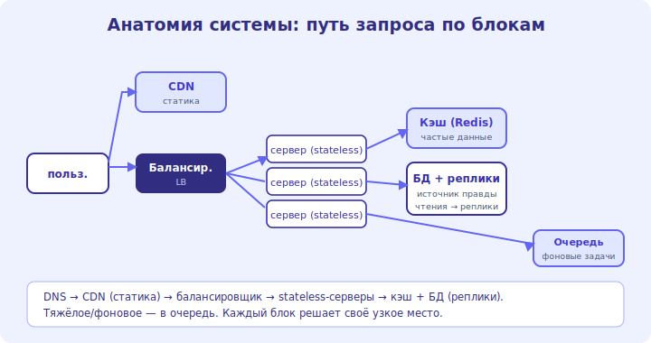

# 03 · Путь запроса: DNS, клиент-сервер 🖼️⭐

> 🎯 **Цель блока:** проследить путь запроса от пользователя до сервера и обратно — фундамент, на
> котором стоят все остальные блоки системного дизайна.

> 🧭 Углубляет [🌐 трек Сетей](../../Network/README.md) под углом дизайна систем.

---

## ⭐ Путь запроса целиком

```
   что происходит, когда пользователь открывает example.com:
   1. DNS — браузер спрашивает «какой IP у example.com?» → получает адрес.
   2. соединение — TCP + TLS (для https) до сервера/балансировщика.
   3. БАЛАНСИРОВЩИК — распределяет запрос на один из серверов (модуль 04).
   4. СЕРВЕР приложения — обрабатывает: бизнес-логика.
   5. данные — сервер идёт в КЭШ (быстро) и/или БД (медленнее).
   6. ответ — назад по цепочке к пользователю.
```

🖼️
```
   пользователь
       │ ① DNS: домен → IP
       ▼
   [ CDN / edge ]  ← статика отдаётся отсюда (близко, модуль 05)
       │ ② запрос
       ▼
   [ Балансировщик ] ──► [ Сервер 1 ][ Сервер 2 ][ Сервер 3 ]   ← масштаб (модуль 04)
                                  │
                          ┌───────┴───────┐
                          ▼               ▼
                       [ Кэш ]         [ База данных ]
                      (быстро)         (источник правды)
```



💡 ⭐ Эта цепочка — **скелет почти любой системы**: DNS → CDN → балансировщик → серверы → кэш/БД.
Каждый следующий модуль трека детализирует один из этих блоков. Держи эту картинку в голове: проектируя
систему, ты решаешь, что добавить/усилить в этой цепочке под свою нагрузку.

---

## ⭐ DNS как точка входа и масштаба

```
   DNS — не только «домен → IP». это ещё инструмент дизайна:
   • один домен → НЕСКОЛЬКО IP (распределение нагрузки на уровне DNS).
   • гео-DNS — отдаёт ближайший к пользователю дата-центр (меньше задержка).
   • DNS перед балансировщиками — первый уровень распределения трафика.
```

💡 ⭐ DNS — первая развилка масштаба: гео-DNS направляет пользователя в ближайший регион, а несколько
A-записей грубо балансируют. Дальше внутри региона работает балансировщик (модуль 04).

---

## 📖 Клиент-сервер и stateless-серверы

```
   • КЛИЕНТ (браузер/приложение) шлёт запросы; СЕРВЕР обрабатывает и отвечает.
   • серверы приложения делают STATELESS (не хранят состояние сессии у себя — модуль 09):
     любой сервер может обработать любой запрос → легко добавлять серверы за балансировщиком.
   • состояние (данные, сессии) выносят в общие хранилища (БД, кэш, Redis).
```

💡 Ключевая идея для масштаба (раскроется в модуле 09): серверы приложения держат **без состояния**,
чтобы за балансировщиком их можно было свободно добавлять/убирать. Всё состояние — в общих БД/кэшах.

---

## ⚠️ Ловушки

- ❌ Не понимать полный путь запроса (тогда не видишь, где узкое место).
- ❌ Забывать про DNS/CDN как уровни распределения и ускорения.
- ❌ Хранить состояние на сервере приложения (мешает горизонтальному масштабу — модуль 09).
- ❌ Ходить в БД за тем, что можно отдать из кэша/CDN (модуль 05).

---

## ✅ Задачи

1. Нарисуй путь запроса для example.com от DNS до БД и обратно (по памяти).
2. Объясни, как гео-DNS уменьшает задержку для пользователей из разных стран.
3. Для знакомого сайта прикинь, какие части ответа статичны (→ CDN), а какие динамичны (→ серверы/БД).
4. ⭐ Почему stateless-серверы упрощают добавление мощностей за балансировщиком?

---

## ❓ Проверь себя

1. Опиши путь запроса от пользователя до сервера и обратно.
2. Как DNS участвует в распределении нагрузки?
3. Что значит stateless-сервер и зачем это для масштаба?

---

## ✅ Чек-лист

- [ ] Знаю полный путь запроса (DNS→CDN→LB→сервер→кэш/БД)
- [ ] Понимаю DNS/гео-DNS как уровень распределения
- [ ] Понимаю смысл stateless-серверов для масштаба

➡️ Следующий: [04 · Балансировщики нагрузки](04-load-balancers.md)
