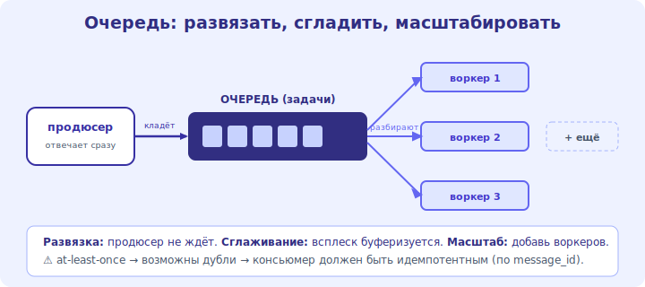

# 07 · Очереди сообщений 🖼️⭐⭐

> 🎯 **Цель блока:** понять очереди сообщений — блок, который делает систему асинхронной, устойчивой к
> всплескам и развязывает компоненты. Один из ключевых инструментов масштаба.

---

## ⭐⭐ Зачем очередь: развязать и сгладить

```
   ПРОБЛЕМА: пользователь загрузил видео → нужно перекодировать (долго, минуты). если делать СИНХРОННО
   в запросе — пользователь ждёт минуты, сервер занят, всплеск загрузок кладёт систему.

   РЕШЕНИЕ — ОЧЕРЕДЬ (message queue): продюсер кладёт ЗАДАЧУ в очередь и сразу отвечает пользователю
   («видео загружено, обрабатывается»). КОНСЬЮМЕРЫ (воркеры) разбирают очередь в своём темпе.

   продюсер ──кладёт задачу──► [ ОЧЕРЕДЬ ] ──разбирают──► [ воркер 1 ][ воркер 2 ][ воркер 3 ]
   (веб-сервер, отвечает сразу)              (обрабатывают асинхронно, можно добавить воркеров)
```



💡 ⭐⭐ Очередь делает три вещи: **развязывает** (продюсер не ждёт консьюмера), **сглаживает всплески**
(пик кладётся в очередь, воркеры разгребают ровно), **масштабирует обработку** (добавил воркеров —
быстрее разбор). Это превращает «тяжёлая работа в запросе» в «положил задачу и забыл».

---

## ⭐ Когда нужна очередь

```
   ✅ ДОЛГИЕ задачи — перекодирование видео, генерация отчётов, рассылка писем/пушей.
   ✅ ВСПЛЕСКИ — поток событий неравномерен (распродажа, вирусный пост) → очередь буферизует.
   ✅ РАЗВЯЗКА сервисов — сервис A шлёт событие, сервис B реагирует, не зная друг о друге напрямую.
   ✅ НАДЁЖНОСТЬ — задача в очереди не потеряется, если воркер упал (разберёт другой/позже).
   ✅ ПЕРИОДИЧЕСКОЕ/фоновое — то, что не обязано происходить в момент запроса.

   ❌ НЕ нужна, когда ответ нужен СРАЗУ и быстро (синхронный путь проще — не усложняй).
```

💡 ⭐ Правило: если работа **долгая, всплесковая или необязательна прямо сейчас** — выноси в очередь
(асинхронно). Если ответ нужен немедленно и дёшев — синхронный путь. Не тащи очередь туда, где хватает
прямого вызова (лишняя сложность).

---

## ⭐⭐ Гарантии доставки и идемпотентность

```
   • AT-LEAST-ONCE (хотя бы раз) — сообщение точно доставится, но МОЖЕТ повториться (дубль). частый режим.
   • AT-MOST-ONCE — максимум раз (может потеряться). редко.
   • EXACTLY-ONCE — ровно раз; сложно/дорого, часто эмулируют через идемпотентность.

   ⚠️ из-за at-least-once консьюмер должен быть ИДЕМПОТЕНТНЫМ — повторная обработка не вредит:
   • «начислить $10» при дубле начислит $20 ❌ → делай «установить баланс = X» или проверяй ID задачи.
   • храни обработанные message_id → дубль игнорируй.
```

💡 ⭐⭐ Главная ловушка очередей — **дубликаты** (большинство систем гарантируют «хотя бы раз»).
Поэтому консьюмер обязан быть **идемпотентным**: повторная обработка той же задачи не должна ломать
данные. Это проектируется заранее (по ID задачи / через «установить», а не «прибавить»).

---

## 📖 Очередь vs стрим, инструменты

```
   • ОЧЕРЕДЬ задач (RabbitMQ, SQS, Redis) — задачу берёт ОДИН воркер, обработал — убрал. для work queue.
   • ЛОГ СОБЫТИЙ / СТРИМ (Apache Kafka) — события пишутся в лог, МНОГО потребителей читают независимо,
     события хранятся (можно перечитать). для событийных архитектур, аналитики, нескольких подписчиков.

   • PUB/SUB — продюсер публикует, много подписчиков получают (рассылка событий).
   выбор: «задачу сделать один раз» → очередь; «событие для многих/переигрываемое» → стрим/лог (Kafka).
```

> 🧭 Очереди — основа [асинхронной/событийной архитектуры](../03-data-comms/14-sync-async.md) (модуль 14)
> и развязки [микросервисов](../03-data-comms/15-microservices-monolith.md) (модуль 15).

---

## ⚠️ Ловушки

- ❌ Делать долгую работу синхронно в запросе (пользователь ждёт, всплеск кладёт систему).
- ❌ Консьюмер не идемпотентен → дубликаты портят данные (двойное списание и т.п.).
- ❌ Тащить очередь туда, где нужен быстрый синхронный ответ (лишняя сложность/задержка).
- ❌ Игнорировать переполнение очереди (воркеры не успевают → растёт задержка/память; нужен мониторинг, автоскейл воркеров).
- ❌ Путать очередь задач (один консьюмер) и лог событий (много потребителей).
- ❌ Терять «мёртвые» сообщения — нужен dead-letter queue для непереработанных.

---

## ✅ Задачи

1. Приведи 3 задачи из реального сервиса, которые стоит вынести в очередь. Почему?
2. Объясни, как очередь сглаживает всплеск нагрузки (на примере распродажи).
3. ⭐ Спроектируй идемпотентного консьюмера для «начислить бонус» (защита от дублей).
4. ⭐ Когда выбрать очередь задач (RabbitMQ), а когда лог событий (Kafka)? Приведи примеры.
5. Что произойдёт, если воркеры не успевают разбирать очередь? Как это заметить и решить?

---

## ❓ Проверь себя

1. Какие три вещи даёт очередь (развязка/сглаживание/масштаб)?
2. Когда нужна очередь, а когда синхронный путь?
3. Что такое at-least-once и зачем идемпотентность?
4. Чем очередь задач отличается от лога событий (Kafka)?

---

## ✅ Чек-лист

- [ ] Выношу долгие/всплесковые/фоновые задачи в очередь
- [ ] Делаю консьюмеров идемпотентными (защита от дублей)
- [ ] Различаю очередь задач и лог событий, выбираю под задачу
- [ ] Мониторю длину очереди, помню про dead-letter

➡️ Следующий: [✅ Задачи уровня 1](TASKS.md) · 🚀 [Проект](PROJECT.md)
