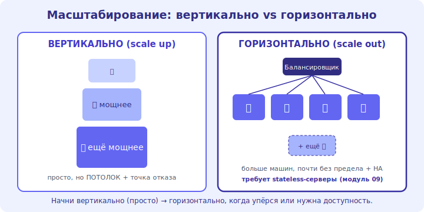

# 08 · Вертикально vs горизонтально ⭐⭐ 🖼️

> 🎯 **Цель блока:** понять два способа масштабирования — «больше одной машины» против «больше машин» —
> и почему горизонтальный путь лежит в основе всех больших систем. Ядро трека.

---

## ⭐⭐ Два пути масштабирования

```
   ВЕРТИКАЛЬНОЕ (scale UP) — сделать ОДНУ машину мощнее (больше CPU/RAM/диск).
   • плюсы: просто (ничего не меняешь в коде), нет распределённых проблем.
   • минусы: есть ПОТОЛОК (физический предел железа), дорого на верхе, единая точка отказа.

   ГОРИЗОНТАЛЬНОЕ (scale OUT) — добавить БОЛЬШЕ машин и распределить нагрузку (за балансировщиком).
   • плюсы: масштабируется почти без предела, отказоустойчивость (одна упала — другие работают), дешевле железо.
   • минусы: сложнее (нужны stateless-серверы, балансировка, общие данные, распределённость).
```

🖼️
```
   ВЕРТИКАЛЬНО:        [ 🖥️ ] → [ 🖥️🖥️ ] → [ 🖥️🖥️🖥️🖥️ ]   мощнее, но один и есть потолок
                       больше CPU/RAM той же машине

   ГОРИЗОНТАЛЬНО:      [ LB ] ──► 🖥️ 🖥️ 🖥️ 🖥️ 🖥️ ...        больше машин, почти без предела
                       добавляй серверы за балансировщик
```



💡 ⭐⭐ Вертикальное — проще, но упирается в потолок и остаётся точкой отказа. **Горизонтальное —
основа больших систем**: добавляешь серверы за балансировщик почти без предела, плюс получаешь
отказоустойчивость. Но оно требует, чтобы серверы были **stateless** (модуль 09) — иначе «какой
сервер обслужит запрос» становится проблемой.

---

## ⭐ Когда какой

```
   начни ВЕРТИКАЛЬНО (просто): пока хватает мощной машины — не усложняй. многие сервисы живут на
   одной-двух мощных машинах + реплика БД. это нормально и дёшево в поддержке.

   переходи ГОРИЗОНТАЛЬНО, когда:
   • одна машина не тянет (упёрся в потолок) ИЛИ
   • нужна высокая доступность (нельзя зависеть от одной машины).

   на практике — гибрид: горизонтально масштабируют серверы приложения (их легко клонировать),
   а БД сначала растят вертикально + реплики, шардят в последнюю очередь (модуль 10).
```

💡 ⭐ Не бросайся сразу в горизонтальный масштаб — это сложность. **Сначала вертикально** (мощнее
машина — часто хватает), горизонтально — когда упёрся или нужна HA. Серверы приложения масштабируй
горизонтально (легко), БД — осторожно и по лестнице (модуль 06).

---

## 📖 Что мешает масштабироваться горизонтально

```
   горизонтальный масштаб работает, только если запросы НЕЗАВИСИМЫ и серверы взаимозаменяемы:
   • СОСТОЯНИЕ НА СЕРВЕРЕ (сессия в памяти) → ломает (модуль 09). выноси состояние в общий стор.
   • ОБЩИЙ РЕСУРС-БУТЫЛОЧНОЕ ГОРЛО (одна БД, общий диск) → серверов много, а упираются в одну БД.
     → масштабируй и узкое место (кэш, реплики, шарды — модуль 10, 12).
   • КООРДИНАЦИЯ между серверами (блокировки, консенсус) → дорого; минимизируй.

   мантра: «stateless + независимые запросы» делают горизонтальный масштаб простым.
```

---

## ⚠️ Ловушки

- ❌ Считать вертикальное масштабирование «несерьёзным» — для многих систем его достаточно.
- ❌ Прыгать в горизонтальный масштаб/распределённость без нужды (огромная сложность).
- ❌ Масштабировать серверы горизонтально, забыв, что все упираются в одну БД (узкое место).
- ❌ Хранить состояние на серверах приложения (ломает горизонтальный масштаб — модуль 09).
- ❌ Игнорировать, что у вертикального есть потолок и это точка отказа.

---

## ✅ Задачи

1. Своими словами: плюсы и минусы вертикального и горизонтального масштабирования.
2. Для сервиса, который вырос вдвое: что попробуешь сначала и почему?
3. ⭐ Почему «stateless + независимые запросы» делают горизонтальный масштаб простым?
4. ⭐ Серверов добавили 10, а быстрее не стало. Где вероятное узкое место и что делать?
5. Приведи пример системы, которой хватит вертикального масштаба, и которой нужен горизонтальный.

---

## ❓ Проверь себя

1. Чем вертикальное масштабирование отличается от горизонтального?
2. Плюсы и минусы каждого?
3. Почему горизонтальное — основа больших систем, но сложнее?
4. Что мешает горизонтальному масштабу?

---

## ✅ Чек-лист

- [ ] Различаю вертикальное и горизонтальное масштабирование
- [ ] Начинаю просто (вертикально), горизонтально — по нужде
- [ ] Понимаю роль stateless и независимых запросов
- [ ] Вижу общее узкое место (БД) за пулом серверов

➡️ Следующий: [09 · Stateless и сессии ⭐⭐](09-stateless-sessions.md)
