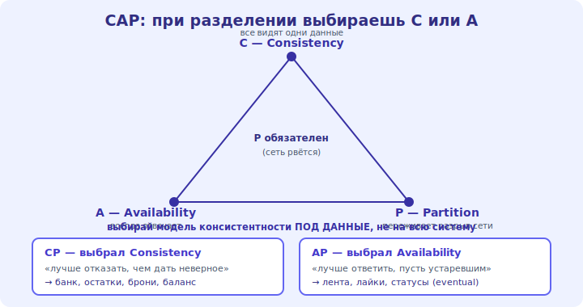

# 11 · Консистентность и CAP 🖼️⭐⭐

> 🎯 **Цель блока:** понять фундаментальный компромисс распределённых систем — CAP-теорему — и выбор
> между сильной и «в конечном счёте» консистентностью. Это определяет поведение системы под сбоями.

> 🧭 Тот же материал есть в [🗄️ БД: CAP](../../Database/04-scale/20-cap.md). Здесь — на уровне всей системы.

---

## ⭐⭐ Теорема CAP

```
   когда данные РАСПРЕДЕЛЕНЫ по узлам, при СЕТЕВОМ РАЗДЕЛЕНИИ (узлы потеряли связь) нельзя иметь всё:
   C — CONSISTENCY (согласованность): все видят ОДНИ И ТЕ ЖЕ данные.
   A — AVAILABILITY (доступность): система отвечает на запросы.
   P — PARTITION TOLERANCE (устойчивость к разделению): работает, даже если связь между узлами рвётся.

   ТЕОРЕМА: при разделении (P) выбираешь МЕЖДУ C и A — не оба.
```

🖼️
```
   узлы потеряли связь (network partition):
   • выбрать C → отказать в ответе, пока не синхронизируешься (теряешь A).  → CP-система
   • выбрать A → ответить, но возможно УСТАРЕВШИМ (теряешь C).             → AP-система
   разделения в реальной сети НЕИЗБЕЖНЫ → P обязателен → реальный выбор: C или A.
```



💡 ⭐⭐ Ключ: **сеть ненадёжна → разделения случаются → P обязателен**, поэтому реальный выбор —
**C или A** при сбое. CP («лучше отказать, чем дать неверное») для денег/остатков; AP («лучше
ответить, пусть устаревшим») для ленты/лайков. CAP объясняет, почему разные хранилища ведут себя
по-разному под сбоями.

---

## ⭐⭐ Strong vs eventual consistency

```
   СИЛЬНАЯ (strong) — записал → СРАЗУ видно всем. дороже (координация узлов), но нужна для критичного.
   • баланс счёта, остаток товара при покупке, бронь места — нельзя «в конце концов».

   В КОНЕЧНОМ СЧЁТЕ (eventual) — узлы сойдутся к одному значению «потом» (не мгновенно).
   • лайки, счётчики просмотров, лента, статусы — терпимо чуть устаревшее, зато быстро/доступно.
   • это модель AP-систем и следствие replication lag (модуль 10).
```

💡 ⭐⭐ Главный практический вывод: **выбирай модель консистентности под ДАННЫЕ, а не на всю систему**.
В одной системе деньги — strong, лайки — eventual. Многие проблемы распределённых систем — это
непонимание, что данные не мгновенно согласованы. Не делай всё strong (дорого/медленно) и не делай
критичное eventual (покажешь неверный баланс).

---

## 📖 За пределами CAP

```
   • PACELC — даже БЕЗ разделения есть выбор Latency vs Consistency (сильная консистентность медленнее).
   • реальность тоньше «CP или AP»: системы НАСТРАИВАЕМЫ (уровень консистентности на конкретный запрос).
   • для большинства приложений: одна реляционная БД (strong) + реплики + кэш — достаточно.
     распределённые БД с eventual — когда реально нужен масштаб за пределы этого.
```

> 🧭 Это [инженерный trade-off под контекст](../../Senior/02-decisions/08-tradeoffs.md): точность против
> доступности/скорости. Senior обязан понимать гарантии своей системы под сбоями.

---

## ⚠️ Ловушки

- ❌ Думать, что можно иметь C+A+P одновременно (при разделении — C или A).
- ❌ Использовать eventual для критичного (баланс, остатки, брони).
- ❌ Делать всё strong (дорого, медленно) там, где терпимо eventual.
- ❌ Не знать, какие гарантии даёт твоё хранилище под сбоями (CP? AP? настраиваемо?).
- ❌ Прыгать в распределённую БД без нужды (одна реляционная + реплики покрывает многое).

---

## ✅ Задачи

1. Сформулируй CAP-теорему своими словами. Почему P практически обязателен?
2. Для 4 систем (банк, лента, корзина, счётчик лайков) — CP или AP? Обоснуй.
3. ⭐ В одном сервисе укажи, какие данные strong, а какие eventual. Почему так?
4. ⭐ Опиши сценарий, где eventual consistency приводит к проблеме, и когда это критично.
5. Узнай, какие гарантии даёт хранилище из твоего проекта под сбоями.

---

## ❓ Проверь себя

1. Что утверждает CAP-теорема и почему выбор обычно между C и A?
2. Чем strong отличается от eventual consistency?
3. Почему модель консистентности выбирают под данные, а не на всю систему?
4. Что добавляет PACELC к картине?

---

## ✅ Чек-лист

- [ ] Понимаю CAP (выбор C или A при разделении)
- [ ] Различаю strong и eventual consistency
- [ ] Выбираю модель консистентности под конкретные данные
- [ ] Знаю гарантии своих хранилищ под сбоями

➡️ Следующий: [12 · Узкие места и их устранение](12-bottlenecks.md)
