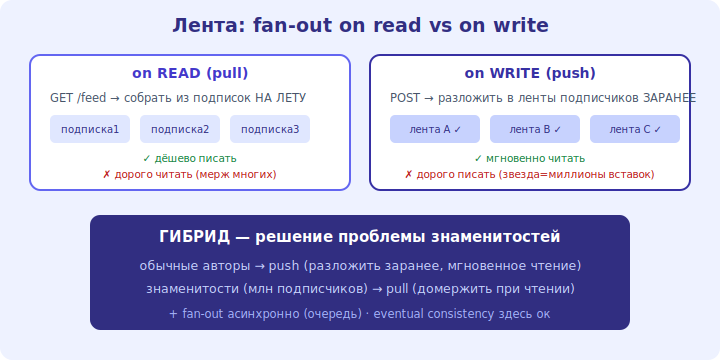

# 19 · Проектируем ленту соцсети (news feed) 🖼️⭐⭐

> 🎯 **Цель блока:** разобрать классику посложнее — ленту постов от подписок. Главная развилка —
> **fan-out on write vs on read** — и почему гибрид решает «проблему знаменитостей».

---

## ① Требования · ② Масштаб

```
   ФУНКЦИОНАЛЬНО: пользователь видит ленту постов от тех, на кого подписан, в (примерно) хронологии;
   может постить; лента подгружается (пагинация).
   НЕФУНКЦИОНАЛЬНО: read-heavy (читают ленту куда чаще, чем постят); низкая задержка ленты; масштаб
   на сотни миллионов; терпима лёгкая несвежесть (eventual ок — это не банк).

   масштаб (прикидка): 300М польз., каждый постит 0.2/день → ~700 постов/сек; чтений ленты в десятки
   раз больше. ВЫВОД: ключевое — быстро СОБИРАТЬ ленту на чтении.
```

---

## ③ API

```
   POST /posts            { "text": "...", "media": ... }
   GET  /feed?cursor=...                       → список постов (пагинация курсором)
   POST /follow/{userId}
```

---

## ④⑤ Ядро: как собрать ленту — fan-out

```
   ВОПРОС: лента = посты всех, на кого подписан. как её быстро отдать?

   ПОДХОД A — FAN-OUT ON READ (pull): собирать ленту В МОМЕНТ запроса.
   • при GET /feed → взять список подписок → собрать их последние посты → смержить по времени.
   • плюс: запись поста дешёвая (просто сохранил). минус: ЧТЕНИЕ дорогое (мерж многих → медленно на масштабе).

   ПОДХОД B — FAN-OUT ON WRITE (push): заранее РАЗЛОЖИТЬ пост по лентам подписчиков.
   • при POST поста → добавить его в предвычисленную ленту КАЖДОГО подписчика (в кэше/Redis).
   • плюс: ЧТЕНИЕ мгновенное (лента уже готова). минус: запись дорогая (у кого 1М подписчиков — 1М вставок!).

   ⚠️ «ПРОБЛЕМА ЗНАМЕНИТОСТЕЙ»: fan-out on write для аккаунта с 50М подписчиков = 50М записей на один пост.
```

🖼️
```
   on READ (pull):   GET feed → собрать из подписок на лету        дёшево писать, дорого читать
   on WRITE (push):  POST → разложить в ленты подписчиков заранее   дорого писать, мгновенно читать
   ГИБРИД: push для обычных + pull для знаменитостей (домержить их посты при чтении) ← решение
```



💡 ⭐⭐ Главное решение ленты — **гибрид fan-out**: для обычных пользователей разложить пост по лентам
заранее (push → мгновенное чтение), а посты **знаменитостей** (миллионы подписчиков) НЕ разкладывать, а
домерживать при чтении (pull). Так избегаешь «50М вставок на один пост звезды», сохраняя быстрое чтение
для большинства. Это типичный паттерн «оптимизируй общий случай, частный обрабатывай отдельно».

---

## ⑥ Масштаб и компромиссы

```
   • предвычисленные ленты — в Redis (быстрое чтение), посты — в БД (источник правды).
   • запись поста и fan-out — АСИНХРОННО через очередь (постнул → ответили сразу → разложили в фоне).
   • eventual consistency ок: пост появится у подписчиков через секунды — терпимо (не банк).
   • пагинация курсором (не offset) — стабильна при новых постах.
   • ранжирование (не чистая хронология, а «интересное») — отдельный сервис ML; усложняет, но это уже про вовлечённость.
   • медиа — в объектном хранилище (S3) + CDN, в ленте только ссылки.
```

💡 ⭐ Лента — отличный пример, где **eventual consistency уместна** (модуль 11): мгновенная
согласованность не нужна, зато push-модель + Redis дают мгновенное чтение. Fan-out делай асинхронно
(очередь) — пользователь не ждёт раскладки.

---

## ⚠️ Ловушки

- ❌ Только fan-out on write без учёта знаменитостей (взрыв записей на популярных аккаунтах).
- ❌ Только fan-out on read на масштабе (медленное чтение — мерж сотен подписок на каждый запрос).
- ❌ Синхронный fan-out в запросе постинга (пользователь ждёт раскладку).
- ❌ Требовать strong consistency для ленты (не нужно; eventual дешевле и быстрее).
- ❌ Пагинация по offset (ломается при новых постах) вместо курсора.
- ❌ Хранить медиа в БД вместо S3+CDN.

---

## ✅ Задачи

1. Объясни fan-out on read vs on write: что дорого в каждом и почему.
2. В чём «проблема знаменитостей» и как её решает гибрид?
3. ⭐ Почему fan-out делают асинхронно и почему eventual consistency здесь ок?
4. ⭐ Спроектируй хранение: где ленты, где посты, где медиа. Почему так?
5. Чем пагинация курсором лучше offset для ленты?

---

## ❓ Проверь себя

1. Чем fan-out on read отличается от on write (плюсы/минусы)?
2. Что такое проблема знаменитостей и решение гибридом?
3. Почему лента — кейс для eventual consistency и асинхронного fan-out?
4. Где хранить ленты/посты/медиа?

---

## ✅ Чек-лист

- [ ] Понимаю fan-out on read vs on write и их компромиссы
- [ ] Решаю проблему знаменитостей гибридом
- [ ] Делаю fan-out асинхронно, принимаю eventual consistency
- [ ] Правильно размещаю ленты (Redis) / посты (БД) / медиа (S3+CDN)

➡️ Следующий: [20 · Чат-мессенджер](20-chat-system.md)
