# 🏗️ Трек · Системный дизайн

> **Как спроектировать систему, которая выдержит миллионы пользователей?** Системный дизайн — это
> искусство собирать большие сервисы из строительных блоков (балансировщики, кэши, БД, очереди) и
> осознанно выбирать компромиссы под нагрузку, надёжность и стоимость. Обязательный навык senior+ и
> сердце технических собеседований в крупных компаниях.

> 🧭 Опирается на [🌐 Сети](../Network/README.md), [🗄️ Базы данных](../Database/README.md),
> [🖥️ ОС](../OS/README.md) и [🧭 Senior-мышление](../Senior/02-decisions/08-tradeoffs.md) — здесь они
> собираются в умение проектировать целые системы.

---

## 🗺️ Дорожная карта

```mermaid
graph TD
    subgraph L0 [🥚 Уровень 0 — Введение]
        A0[00 · Что такое системный дизайн]
        A1[01 · Требования и оценка масштаба]
        A2[02 · Как подходить к задаче]
    end
    subgraph L1 [🐣 Уровень 1 — Строительные блоки]
        B0[03 · Путь запроса: DNS, клиент-сервер]
        B1[04 · Балансировщики нагрузки]
        B2[05 · Кэширование и CDN]
        B3[06 · Базы данных в дизайне]
        B4[07 · Очереди сообщений]
    end
    subgraph L2 [🐥 Уровень 2 — Масштабирование ⭐ ядро]
        C0[08 · Вертикально vs горизонтально ⭐⭐]
        C1[09 · Stateless и сессии ⭐⭐]
        C2[10 · Репликация и шардинг]
        C3[11 · Консистентность и CAP]
        C4[12 · Узкие места]
    end
    subgraph L3 [🦅 Уровень 3 — Данные и связь]
        D0[13 · Дизайн API]
        D1[14 · Синхронно vs асинхронно]
        D2[15 · Микросервисы vs монолит]
        D3[16 · Надёжность и отказоустойчивость]
        D4[17 · Наблюдаемость]
    end
    subgraph L4 [🚀 Уровень 4 — Практика дизайна]
        E0[18 · Сокращатель ссылок]
        E1[19 · Лента соцсети]
        E2[20 · Чат-мессенджер]
        E3[21 · Хранилище медиа / rate limiter]
        E4[22 · Безопасность на масштабе]
        E5[23 · System Design интервью]
    end
    L0 --> L1 --> L2 --> L3 --> L4 --> Done([🏗️ Проектирую системы])
```

---

## 🎯 Ядро трека — Масштабирование и компромиссы

> **Системный дизайн — это всегда trade-offs:** масштаб против сложности, скорость против
> консистентности, стоимость против надёжности. Кто понимает, как масштабировать (горизонтально,
> stateless, реплики, шарды) и какой ценой — тот проектирует системы, а не «рисует квадратики».

Поэтому центр трека (Уровень 2) — масштабирование и осознанный выбор компромиссов под нагрузку.

---

## 📂 Содержание

### 🥚 Уровень 0 — Введение
- [00 · Что такое системный дизайн](00-intro/00-what-is-system-design.md)
- [01 · Требования и оценка масштаба](00-intro/01-requirements-estimation.md)
- [02 · Как подходить к задаче дизайна](00-intro/02-approach-framework.md)

### 🐣 Уровень 1 — Строительные блоки
- [03 · Путь запроса: DNS, клиент-сервер](01-building-blocks/03-request-path.md)
- [04 · Балансировщики нагрузки](01-building-blocks/04-load-balancers.md)
- [05 · Кэширование и CDN](01-building-blocks/05-caching-cdn.md)
- [06 · Базы данных в дизайне](01-building-blocks/06-databases.md)
- [07 · Очереди сообщений](01-building-blocks/07-message-queues.md)
- ✅ [Задачи уровня 1](01-building-blocks/TASKS.md) · 🚀 [Проект](01-building-blocks/PROJECT.md)

### 🐥 Уровень 2 — Масштабирование ⭐ ядро
- [08 · Вертикально vs горизонтально ⭐⭐](02-scaling/08-vertical-horizontal.md)
- [09 · Stateless и сессии ⭐⭐](02-scaling/09-stateless-sessions.md)
- [10 · Репликация и шардинг](02-scaling/10-replication-sharding.md)
- [11 · Консистентность и CAP](02-scaling/11-consistency-cap.md)
- [12 · Узкие места и их устранение](02-scaling/12-bottlenecks.md)
- ✅ [Задачи уровня 2](02-scaling/TASKS.md) · 🚀 [Проект](02-scaling/PROJECT.md)

### 🦅 Уровень 3 — Данные и связь
- [13 · Дизайн API (REST/gRPC/GraphQL)](03-data-comms/13-api-design.md)
- [14 · Синхронно vs асинхронно](03-data-comms/14-sync-async.md)
- [15 · Микросервисы vs монолит](03-data-comms/15-microservices-monolith.md)
- [16 · Надёжность и отказоустойчивость](03-data-comms/16-reliability.md)
- [17 · Наблюдаемость: логи, метрики, трейсинг](03-data-comms/17-observability.md)
- ✅ [Задачи уровня 3](03-data-comms/TASKS.md) · 🚀 [Проект](03-data-comms/PROJECT.md)

### 🚀 Уровень 4 — Практика дизайна
- [18 · Сокращатель ссылок (TinyURL)](04-design-practice/18-url-shortener.md)
- [19 · Лента соцсети (news feed)](04-design-practice/19-news-feed.md)
- [20 · Чат-мессенджер](04-design-practice/20-chat-system.md)
- [21 · Хранилище медиа / rate limiter](04-design-practice/21-media-ratelimiter.md)
- [22 · Безопасность на масштабе](04-design-practice/22-security-at-scale.md)
- [23 · System Design интервью](04-design-practice/23-interview.md)
- ✅ [Задачи уровня 4](04-design-practice/TASKS.md) · 🚀 [Проект](04-design-practice/PROJECT.md)

---

## 🧭 Как проходить

Системный дизайн учат **рисуя и обсуждая**: бери задачу («спроектируй X»), проговаривай требования,
оценивай масштаб, собирай из блоков, называй компромиссы. Рисуй схемы (бумага/Excalidraw). Здесь нет
«единственно верного» ответа — есть обоснованные решения под контекст. Это навык суждения, а не
заучивания.

➡️ Начни с [00 · Что такое системный дизайн](00-intro/00-what-is-system-design.md)
