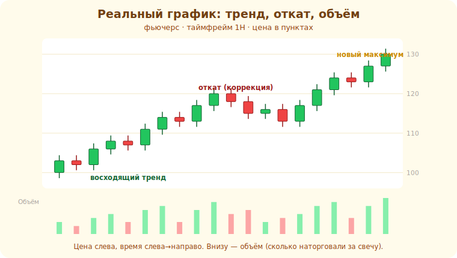

# 03 · Как читать график 🖼️⭐

> 🎯 **Цель блока:** научиться читать ценовой график — оси, таймфреймы, объём — основу всего
> технического анализа.

---

## 📖 График — история цены во времени

График показывает, как менялась **цена** актива со **временем**.

🖼️
```
   цена
    ▲
    │        ╱╲      ← движение цены
    │   ╱╲  ╱  ╲ ╱╲
    │ ╱  ╲╱     ╲╱
    └──────────────────► время
```

```
   ось X (горизонталь) — ВРЕМЯ
   ось Y (вертикаль)   — ЦЕНА
```

А вот как это выглядит на **реальном** свечном графике — с ценой справа, объёмом внизу и фазами движения:



💡 Каждая точка/свеча — это цена в определённый момент. Технический анализ (ядро трека) — это
**чтение этого графика**: где цена была, как двигалась, где разворачивалась.

---

## ⭐ Таймфрейм — масштаб времени

**Таймфрейм** (ТФ) — за какой период показана одна свеча/бар.

```
   M1  — 1 минута  (каждая свеча = минута)   ← быстрая внутридневная торговля
   M5, M15, M30
   H1  — 1 час
   H4  — 4 часа
   D1  — 1 день    (каждая свеча = день)     ← более крупная картина
   W1  — неделя, MN — месяц
```

💡 ⭐ Один и тот же рынок на разных ТФ выглядит **по-разному**: на M1 — хаос мелких колебаний, на
D1 — ясный тренд. **Старший ТФ показывает главное направление, младший — точку входа.** Опытные
смотрят несколько ТФ сразу (мультитаймфрейм, модуль 17). Новичку лучше начинать со **старших** ТФ
(H1, H4, D1) — там меньше «шума» и ложных движений.

---

## ⭐ Объём — сколько торговали

Под графиком цены обычно есть **объём** — сколько контрактов наторговали за период.

```
   большой объём  → много участников, движение «настоящее», есть интерес
   маленький объём → мало участников, движению меньше веры (может быть ложным)
```

💡 Объём — это **подтверждение**. Пробой уровня (модуль 09) на большом объёме надёжнее, чем на
маленьком. Объём — один из немногих «объективных» данных (не индикатор-производная, а факт
сделок). Подробнее об объёмных инструментах — модуль 16.

---

## 📖 Типы графиков

```
   ЛИНЕЙНЫЙ   — линия по ценам закрытия; просто, но мало информации
   БАРЫ (OHLC) — открытие/максимум/минимум/закрытие каждого периода
   СВЕЧИ      — то же, что бары, но нагляднее (модуль 04) ← самый популярный
```

💡 Стандарт трейдинга — **японские свечи** (следующий модуль): они показывают всю информацию
периода (открытие, закрытие, экстремумы) и при этом наглядны. Дальше работаем с ними.

---

## ⚠️ Ловушки

- ❌ Торговать на слишком мелком ТФ (M1) новичком — там много шума и ложных сигналов.
- ❌ Смотреть только один ТФ и не видеть общую картину.
- ❌ Игнорировать объём — движение без объёма часто ложное.
- ❌ Принимать линейный график за полную картину (теряются экстремумы).

---

## 🛠️ Практика

1. Открой график фьючерса и переключай ТФ: M5 → H1 → D1. Заметь, как меняется «картина».
2. Включи отображение объёма. Найди движение на большом объёме и на маленьком — сравни «силу».
3. Переключи тип графика: линия → бары → свечи. Какой нагляднее?

---

## ✅ Задачи

1. **Объясни**, что показывают оси графика.
2. **Объясни** таймфрейм и разницу старших/младших ТФ.
3. **Объясни** роль объёма как подтверждения.
4. **Сравни** типы графиков (линия/бары/свечи).

---

## ❓ Проверь себя

1. Что по осям X и Y на графике?
2. Чем старший ТФ полезнее младшего для новичка?
3. Что говорит большой и маленький объём?
4. Почему свечи популярнее линейного графика?

---

## ✅ Чек-лист

- [ ] Понимаю оси и устройство графика
- [ ] Понимаю таймфреймы и их роль
- [ ] Понимаю объём как подтверждение
- [ ] Знаю типы графиков, выбираю свечи

➡️ Следующий: [04 · Японские свечи](04-candlesticks.md)
