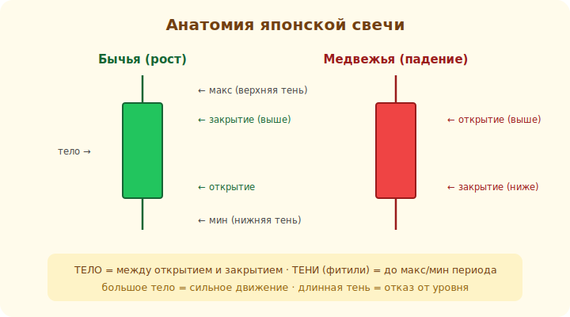

# 04 · Японские свечи 🖼️⭐

> 🎯 **Цель блока:** научиться читать японскую свечу — главный «кирпич» графика, который
> показывает борьбу покупателей и продавцов за период.

---

## ⭐ Анатомия свечи

Одна свеча показывает **четыре** цены за период: открытие, закрытие, максимум, минимум.

🖼️


```
        │ ← тень (макс. цена периода)         бычья (рост):      медвежья (падение):
       ┌┴┐                                    закрытие ВЫШЕ      закрытие НИЖЕ
       │ │ ← ТЕЛО                             открытия          открытия
       │ │   (между открытием                ┌─┐ закрытие       ┌─┐ открытие
       └┬┘    и закрытием)                    │ │               │ │
        │ ← тень (мин. цена периода)          │ │ открытие      │ │ закрытие
                                              └─┘ (зелёная)     └─┘ (красная)
```

```
   ТЕЛО  — расстояние между ценой ОТКРЫТИЯ и ЗАКРЫТИЯ периода
   ТЕНИ (фитили) — до МАКСИМУМА и МИНИМУМА периода
   ЦВЕТ  — зелёная/белая = закрытие выше открытия (рост), красная/чёрная = ниже (падение)
```

💡 ⭐ Свеча — это **рассказ о борьбе** за период: кто победил (цвет), насколько уверенно (размер
тела), куда пытались увести цену, но не смогли (тени). Большое тело = сильное движение; длинные
тени = борьба и отказ от уровня.

---

## ⭐ Что говорят тело и тени

```
   большое тело, мало теней     → сильное направленное движение (одна сторона доминирует)
   маленькое тело, длинные тени → нерешительность, борьба (никто не победил)
   длинная нижняя тень          → продавцы давили вниз, но покупатели вернули цену (отказ от низов)
   длинная верхняя тень         → покупатели тянули вверх, но продавцы вернули (отказ от верхов)
```

💡 ⭐ Тени особенно важны: длинная тень = цена **сходила** туда, но её **отвергли**. Это сигнал,
что на том уровне есть сила против движения. Отсюда растут свечные паттерны (модуль 12) — они
читают именно эту борьбу.

---

## 📖 Несколько базовых одиночных свечей

```
   ДОДЖИ      — тело почти отсутствует (открытие ≈ закрытие) → равновесие, неопределённость
   МАРУБОЗУ   — большое тело без теней → полное доминирование одной стороны
   ПИН-БАР / МОЛОТ — маленькое тело + длинная тень → отказ от уровня (разворотный намёк)
```

💡 Одиночная свеча — лишь намёк, **не сигнал к сделке сама по себе**. Её смысл зависит от
**контекста**: где она появилась (на уровне? в тренде?). Доджи в середине движения — ничто; доджи
на сильном уровне — важный сигнал нерешительности. Контекст решает всё (об этом — весь ТА).

---

## ⚠️ Ловушки

- ❌ Торговать по одной свече без контекста (уровня, тренда).
- ❌ Путать цвет: важнее не «зелёная/красная», а где открытие и закрытие.
- ❌ Игнорировать тени — в них половина смысла свечи.
- ❌ Искать «магические» свечи. Свеча — это вероятность, а не гарантия разворота.

---

## 🛠️ Практика

1. На графике найди: свечу с большим телом, доджи, свечу с длинной нижней тенью. Объясни, что
   происходило в каждом периоде.
2. Найди длинную нижнюю тень на минимуме движения — что это значит про покупателей/продавцов?
3. Сравни одну и ту же свечу в разных местах графика — меняется ли её смысл от контекста?

---

## ✅ Задачи

1. **Опиши** анатомию свечи (тело, тени, цвет).
2. **Объясни**, что говорят большое/маленькое тело и длинные тени.
3. **Назови** доджи, марубозу, пин-бар и их смысл.
4. **Объясни**, почему одна свеча без контекста — не сигнал.

---

## ❓ Проверь себя

1. Какие 4 цены показывает свеча?
2. Что значит маленькое тело с длинными тенями?
3. Что говорит длинная нижняя тень?
4. Почему контекст свечи важнее её самой?

---

## ✅ Чек-лист

- [ ] Читаю анатомию свечи (тело/тени/цвет)
- [ ] Понимаю смысл тела и теней
- [ ] Знаю базовые свечи (доджи, пин-бар…)
- [ ] Учитываю контекст, не торгую по одной свече

➡️ Следующий: [05 · Ордера и стакан](05-orders.md)
