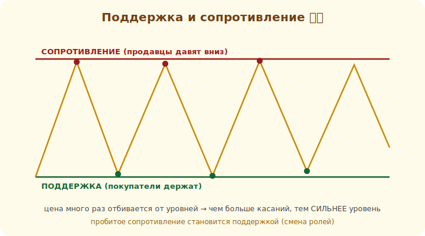

# 09 · Поддержка и сопротивление 🖼️⭐⭐

> 🎯 **Цель блока (ЯДРО трека):** освоить главный инструмент ТА — уровни поддержки и
> сопротивления. Это основа, на которой строится почти всё остальное.

---

## ⭐⭐ Уровни — где цена «отскакивает»

```
   СОПРОТИВЛЕНИЕ — уровень цены, ВЫШЕ которого ей трудно подняться (продавцы давят)
   ПОДДЕРЖКА     — уровень цены, НИЖЕ которого ей трудно опуститься (покупатели держат)
```

🖼️


```
   сопротивление ──●────●────●──── ← цена несколько раз отбилась ВНИЗ
        ╱╲    ╱╲   │
       ╱  ╲  ╱  ╲  │
   поддержка ──●────●────●──────── ← цена несколько раз отбилась ВВЕРХ
```

💡 ⭐⭐ Уровень — это цена, где **много раз** менялся баланс спроса/предложения. Чем больше раз
цена реагировала на уровень, тем он **сильнее**. Почему работает: на круглых/значимых ценах
скапливаются заявки, и многие трейдеры ждут реакции именно там (самосбывающееся ожидание из
модуля 08). Уровни — «память рынка».

---

## ⭐⭐ Как торгуют от уровней

```
   ОТСКОК (range/флэт): цена подошла к поддержке → ждёшь разворота вверх (лонг),
                        стоп — чуть НИЖЕ уровня. У сопротивления — наоборот (шорт).

   ПРОБОЙ (breakout): цена ПРОБИЛА уровень с объёмом → движение в сторону пробоя,
                      бывший уровень становится новым (поддержка → сопротивление)
```

🖼️
```
   до пробоя: сопротивление ───────  отбивало цену вниз
   после пробоя: ────── цена выше    ← теперь это ПОДДЕРЖКА (роли поменялись)
```

💡 ⭐⭐ **Смена ролей** — важнейшая идея: пробитое сопротивление становится поддержкой (и
наоборот). Это даёт сетапы: дождаться пробоя, потом — отката к пробитому уровню (ретест) и входа
по тренду. Стоп всегда **за** уровнем — если цена вернулась за него, сетап не сработал, выходишь
с маленьким убытком.

---

## ⭐ Истинный и ложный пробой

```
   ИСТИННЫЙ пробой  — цена пробила уровень и закрепилась за ним (часто с объёмом)
   ЛОЖНЫЙ пробой    — цена «проткнула» уровень и вернулась обратно (ловушка для входящих)
```

💡 ⚠️ Ложные пробои — частая ловушка новичков: вошёл на пробое, а цена вернулась. Поэтому:
- ждут **закрытия** свечи за уровнем (а не просто «прокола» тенью);
- смотрят **объём** (истинный пробой обычно на повышенном);
- ставят стоп так, чтобы ложный пробой стоил мало.
Никакой фильтр не идеален — отсюда снова важность маленького риска на сделку.

---

## 📖 Где искать уровни

```
   ✅ предыдущие максимумы/минимумы (где цена разворачивалась)
   ✅ круглые/психологические уровни (100, 1000, 50000)
   ✅ зоны, где цена «зависала» (консолидация)
   ✅ уровни со старших ТФ — они сильнее (модуль 17)
```

💡 ⭐ Уровень — это скорее **зона**, чем точная линия. Не жди реакции до тика. И старшие ТФ дают
**более значимые** уровни: уровень с D1 сильнее уровня с M5. Рисуй главные уровни со старшего ТФ,
торгуй на младшем.

---

## ⚠️ Ловушки

- ❌ Входить на «проколе» уровня без закрытия свечи за ним (ложный пробой).
- ❌ Считать уровень точной линией, а не зоной.
- ❌ Ставить стоп вплотную к уровню (выбьет шумом) — ставь чуть дальше, за зону.
- ❌ Рисовать десятки уровней. Оставь 2–3 главных со старшего ТФ.

---

## 🛠️ Практика

1. На графике найди 2–3 сильных уровня (где цена реагировала несколько раз). Отметь их зонами.
2. Найди пример смены ролей: пробитое сопротивление стало поддержкой.
3. Найди ложный пробой и истинный пробой — сравни поведение цены и объём.

---

## ✅ Задачи

1. **Объясни** поддержку и сопротивление и почему они работают.
2. **Опиши** две тактики: отскок и пробой.
3. **Объясни** смену ролей уровня.
4. **Разведи** истинный и ложный пробой и как фильтровать.

---

## ❓ Проверь себя

1. Что такое уровень и от чего его сила?
2. Как торгуют отскок и пробой?
3. Что значит «сопротивление стало поддержкой»?
4. Как отличить ложный пробой от истинного?

---

## ✅ Чек-лист

- [ ] Нахожу и отмечаю уровни зонами
- [ ] Знаю тактики отскока и пробоя
- [ ] Понимаю смену ролей уровня
- [ ] Фильтрую ложные пробои, ставлю стоп за зону

➡️ Следующий (ядро): [10 · Линии тренда и каналы](10-trendlines.md)
