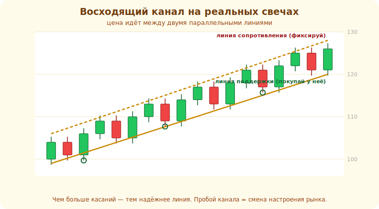

# 10 · Линии тренда и каналы 🖼️⭐

> 🎯 **Цель блока:** научиться рисовать линии тренда и каналы — наклонные «уровни», которые
> показывают направление и дают точки входа по тренду.

---

## ⭐ Линия тренда — наклонная поддержка/сопротивление

**Линия тренда** соединяет последовательные минимумы (в росте) или максимумы (в падении). Это
«движущийся» уровень, идущий вместе с трендом.

🖼️
```
   ВОСХОДЯЩИЙ тренд:                 НИСХОДЯЩИЙ тренд:
        ╱╲    ╱╲                     ╲
       ╱  ╲  ╱  ╲                  ●  ╲╱╲
      ╱    ╲╱    ●                   ╲   ╲╱╲
   ──●──────●──────  ← линия по        ╲────●────  ← линия по
     минимумам (поддержка тренда)        максимумам (сопротивление тренда)
```

💡 ⭐ Линия тренда визуализирует **higher lows** (растущие минимумы) или **lower highs**. Пока
цена держится выше восходящей линии — тренд жив. Касание линии — потенциальная точка **входа по
тренду** (на откате к ней). Пробой линии — сигнал ослабления/смены тренда.

⚠️ Линию строят минимум по **двум** точкам, а подтверждают **третьим** касанием. Не «подгоняй»
линию под желаемое — это частая ошибка (видишь то, что хочешь).

Вот восходящий **канал** на реальных свечах: цена идёт между линией поддержки (сплошная) и
параллельной линией сопротивления (пунктир). Кружками отмечены касания нижней линии — точки входа:



---

## ⭐ Вход на откате (по тренду)

Главная ценность линий тренда — **точки входа по тренду**:

```
   восходящий тренд: цена откатывает к линии тренда / поддержке → вход в ЛОНГ
        стоп — под линией (если пробьёт, тренд под вопросом → выход с малым убытком)

   «покупай на откатах в восходящем тренде, продавай на отскоках в нисходящем»
```

💡 ⭐ Это безопаснее, чем вход «в погоне» (когда цена уже улетела). Откат к линии тренда даёт
**хорошее соотношение риск/прибыль**: стоп близко (под линией), а цель — продолжение тренда
(далеко). Не «лови дно/вершину против тренда» — входи по тренду на откатах.

---

## ⭐ Канал — движение между двумя линиями

**Канал** — две параллельные линии: цена ходит между ними.

🖼️
```
   ───────────────  ← верхняя граница (продавать здесь в восходящем канале)
        ╱╲    ╱╲
       ╱  ╲  ╱  ╲
   ───────────────  ← нижняя граница (покупать здесь)
   восходящий канал (обе линии наклонены вверх)
```

💡 Канал даёт обе границы: в восходящем канале покупают у нижней, фиксируют у верхней. Пробой
канала (вверх или вниз) — сигнал ускорения или разворота. Канал — это «тренд + диапазон»
одновременно.

---

## 📖 Линия тренда vs горизонтальный уровень

```
   ГОРИЗОНТАЛЬНЫЙ уровень (модуль 09) — фиксированная цена, объективнее, сильнее
   ЛИНИЯ ТРЕНДА (наклонная) — субъективнее (зависит от того, как провёл), но показывает динамику
```

💡 ⚠️ Линии тренда более **субъективны**: два трейдера проведут их по-разному. Поэтому
горизонтальные уровни обычно надёжнее. Используй линии тренда как **дополнение** (направление,
откаты), а ключевые решения опирай на горизонтальные уровни + контекст.

---

## ⚠️ Ловушки

- ❌ «Подгонять» линию под желаемое (по 2 точкам можно провести как угодно).
- ❌ Считать линию тренда точной — это зона, и она субъективна.
- ❌ Входить против тренда «на отскок» от верха восходящего канала без подтверждения.
- ❌ Игнорировать пробой линии — он часто предвещает смену движения.

---

## 🛠️ Практика

1. На восходящем тренде проведи линию по минимумам (≥2 точки), дождись третьего касания.
2. Найди точку входа на откате к линии: где был бы вход, стоп, тейк? Посчитай риск/прибыль.
3. Построй канал на каком-нибудь инструменте; отметь, где покупать и продавать внутри него.

---

## ✅ Задачи

1. **Объясни** линию тренда и как её строить (2 точки + подтверждение).
2. **Опиши** вход на откате по тренду и почему он выгоднее «погони».
3. **Объясни** канал и торговлю внутри него.
4. **Сравни** линию тренда и горизонтальный уровень по надёжности.

---

## ❓ Проверь себя

1. По каким точкам строят линию восходящего тренда?
2. Почему вход на откате к линии лучше входа в погоне?
3. Что такое канал и как в нём торгуют?
4. Почему линии тренда субъективнее горизонтальных уровней?

---

## ✅ Чек-лист

- [ ] Строю линии тренда по экстремумам (с подтверждением)
- [ ] Вхожу по тренду на откатах, а не в погоне
- [ ] Понимаю каналы
- [ ] Опираюсь на горизонтальные уровни как более надёжные

➡️ Следующий: [11 · Графические паттерны](11-chart-patterns.md)
