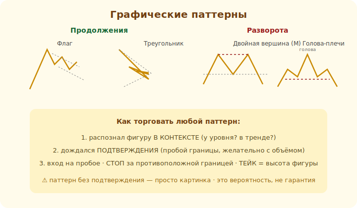

# 11 · Графические паттерны 🖼️⭐

> 🎯 **Цель блока:** распознавать классические фигуры на графике — паттерны продолжения и
> разворота — и понимать, почему они работают (и почему не всегда).

---

## 📖 Паттерн — типовая фигура поведения цены

**Графический паттерн** — узнаваемая форма движения цены, которая часто предшествует
определённому развитию. Делятся на:

```
   ПРОДОЛЖЕНИЯ — тренд берёт паузу и, скорее всего, продолжится (флаги, треугольники)
   РАЗВОРОТА   — тренд, вероятно, меняется (голова-плечи, двойная вершина/дно)
```

🖼️


💡 ⭐ Паттерны работают, потому что отражают **психологию массы**: после сильного движения толпа
фиксирует прибыль (пауза-флаг), у важного уровня сомневается (двойная вершина) и т.д. Многие видят
ту же фигуру и действуют похоже (самосбывающееся ожидание из модуля 08).

---

## ⭐ Паттерны продолжения

```
   ФЛАГ / ВЫМПЕЛ — после сильного рывка цена откатывает в узком диапазоне (пауза),
                   потом продолжает в сторону рывка
   ТРЕУГОЛЬНИК   — цена сужается между сходящимися линиями (сжатие),
                   потом пробивает — часто в сторону тренда
```

💡 Логика: сильное движение → передышка (накопление) → продолжение. Вход — на **пробое** фигуры в
сторону тренда, стоп — за противоположной границей. Это сетапы «по тренду», которые безопаснее
разворотных.

---

## ⭐ Паттерны разворота

```
   ДВОЙНАЯ ВЕРШИНА (M) — цена дважды не смогла пробить уровень вверх → разворот вниз
   ДВОЙНОЕ ДНО (W)     — дважды не пробила вниз → разворот вверх
   ГОЛОВА И ПЛЕЧИ      — три вершины (средняя выше) → разворот тренда вниз
                        (перевёрнутая — разворот вверх)
```

💡 ⚠️ Разворотные паттерны **рискованнее**: ты ставишь против действующего тренда. Жди
**подтверждения** (пробой «линии шеи» у головы-плеч, пробой поддержки между вершинами). Без
подтверждения «вижу двойную вершину» = «вижу то, что хочу». Подтверждённый разворот + стоп за
экстремумом = приемлемый риск.

---

## ⭐ Как торговать паттерн (общий принцип)

```
   1. распознал фигуру В КОНТЕКСТЕ (где она? у уровня? в тренде?)
   2. дождался ПОДТВЕРЖДЕНИЯ (пробой границы фигуры, желательно с объёмом)
   3. вход на пробое/ретесте, СТОП за противоположной границей фигуры
   4. цель (тейк) — часто «высота» фигуры, отложенная от точки пробоя
```

💡 ⭐ Паттерн без подтверждения и контекста — просто картинка. Паттерн на сильном уровне, с
подтверждением и объёмом — рабочий сетап. И снова: даже лучший паттерн проигрывает часть времени,
поэтому риск на сделку — маленький.

---

## ⚠️ Ловушки

- ❌ «Видеть» паттерны везде (подгонка под желаемое). Фигура должна быть очевидной.
- ❌ Входить до подтверждения (пробоя). Многие «паттерны» не срабатывают.
- ❌ Игнорировать контекст (паттерн против сильного тренда — слабее).
- ❌ Считать паттерн гарантией. Это повышенная вероятность, не пророчество.

---

## 🛠️ Практика

1. Найди на истории флаг и треугольник в тренде. Где был бы вход на пробое, стоп, цель?
2. Найди двойную вершину/дно или голову-плечи. Отметь точку подтверждения (пробой).
3. Найди «паттерн», который НЕ сработал (ложный) — убедись, что фигуры не гарантия.

---

## ✅ Задачи

1. **Разведи** паттерны продолжения и разворота.
2. **Опиши** флаг и треугольник и как их торговать.
3. **Опиши** двойную вершину/дно и голову-плечи.
4. **Сформулируй** общий принцип торговли паттерна (контекст → подтверждение → стоп → цель).

---

## ❓ Проверь себя

1. Почему графические паттерны «работают»?
2. Как торгуют паттерн продолжения?
3. Почему разворотные паттерны рискованнее?
4. Зачем ждать подтверждения пробоя?

---

## ✅ Чек-лист

- [ ] Различаю паттерны продолжения и разворота
- [ ] Знаю флаг, треугольник, двойную вершину/дно, голову-плечи
- [ ] Торгую паттерн с подтверждением и в контексте
- [ ] Помню, что паттерн — вероятность, не гарантия

➡️ Следующий: [12 · Свечные паттерны](12-candle-patterns.md)
