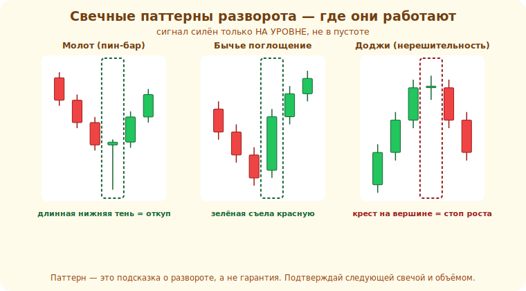

# 12 · Свечные паттерны 🖼️⭐

> 🎯 **Цель блока:** читать комбинации свечей — пин-бар, поглощение, доджи — как сигналы
> разворота или продолжения, всегда в контексте.

---

## 📖 Свечные паттерны — «язык» свечей

Из модуля 04 ты знаешь анатомию свечи. Свечные паттерны — это **одна или несколько свечей**,
показывающих смену настроения участников. Они дают **точку входа** там, где уже есть контекст
(уровень, линия тренда).

💡 ⭐ Главное правило сразу: свечной паттерн = **сигнал к действию на уже найденном уровне**, а не
повод торговать сам по себе. Пин-бар посреди графика — шум; пин-бар **на сильной поддержке** —
сигнал.

Три самых частых паттерна разворота в реальном контексте — молот у поддержки, бычье поглощение и
доджи на вершине:



---

## ⭐ Пин-бар (молот / падающая звезда)

```
   маленькое тело + ДЛИННАЯ тень в одну сторону
   = цена сходила туда, но её ОТВЕРГЛИ

   МОЛОТ (на поддержке): длинная НИЖНЯЯ тень → продавцы давили, покупатели вернули → разворот вверх
   ПАДАЮЩАЯ ЗВЕЗДА (на сопротивлении): длинная ВЕРХНЯЯ тень → отказ от верхов → разворот вниз
```

🖼️
```
        ┌─┐  ← маленькое тело
        │ │
        │ │
        │ │  ← длинная нижняя тень = отказ от низов
        ┴    (молот на поддержке → сигнал к лонгу)
```

💡 ⭐ Пин-бар — самый полезный новичку: длинная тень наглядно показывает **отказ** от уровня. Вход
после закрытия пин-бара, стоп — за его тенью (за уровнем). Сильнее всего работает на уровне/линии
тренда + по направлению старшего тренда.

---

## ⭐ Поглощение (engulfing)

```
   БЫЧЬЕ поглощение: за красной свечой идёт ЗЕЛЁНАЯ, тело которой ПОЛНОСТЬЮ перекрывает красную
        → покупатели резко перехватили инициативу → разворот вверх
   МЕДВЕЖЬЕ поглощение: зелёную «поглощает» большая красная → разворот вниз
```

🖼️
```
   ┌─┐ ┌───┐     красную свечу полностью «съедает» следующая зелёная
   │ │ │   │   → сильная смена настроения
   └─┘ └───┘
```

💡 Поглощение — сильный сигнал смены инициативы, особенно **на уровне**. Большое поглощающее тело
= уверенный перехват. Вход после закрытия поглощающей свечи, стоп за её краем.

---

## 📖 Доджи и звёзды

```
   ДОДЖИ — тело почти отсутствует (открытие≈закрытие) → РАВНОВЕСИЕ, нерешительность
        на сильном уровне после тренда = намёк на разворот (никто больше не давит)
   УТРЕННЯЯ/ВЕЧЕРНЯЯ ЗВЕЗДА — комбинация из 3 свечей с доджи/малым телом в середине → разворот
```

💡 Доджи сам по себе — лишь «пауза». Его сила — в **месте**: доджи после сильного движения на
уровне = сигнал, что движение выдохлось. Контекст, контекст, контекст.

---

## ⭐ Главный принцип: свеча + уровень + тренд

```
   слабый сигнал:  свечной паттерн «в чистом поле»
   сильный сигнал: свечной паттерн НА уровне/линии + ПО направлению старшего тренда
                   + подтверждение объёмом
```

💡 ⭐ Свечные паттерны — последний «спусковой крючок» в связке: сначала контекст (уровень, тренд,
модули 09–11), потом свеча даёт точку входа. Так строится **сетап**: место (уровень) + направление
(тренд) + триггер (свеча) + защита (стоп). Это собирается в стратегию (модуль 18).

---

## ⚠️ Ловушки

- ❌ Торговать свечной паттерн без контекста (вне уровня/тренда).
- ❌ Заучивать десятки экзотических паттернов. Хватит пин-бара и поглощения, понятых глубоко.
- ❌ Входить до закрытия сигнальной свечи (она ещё может измениться).
- ❌ Игнорировать старший тренд (паттерн против него слабее).

---

## 🛠️ Практика

1. Найди пин-бар (молот) на поддержке и падающую звезду на сопротивлении. Отметь вход и стоп.
2. Найди бычье и медвежье поглощение на уровнях.
3. Собери полный сетап: уровень + тренд + свечной триггер. Посчитай риск/прибыль.

---

## ✅ Задачи

1. **Объясни** пин-бар (молот/звезда) и что показывает длинная тень.
2. **Объясни** поглощение и почему это сильный сигнал.
3. **Объясни** роль контекста (уровень + тренд) для свечного сигнала.
4. **Собери** сетап: место + направление + триггер + стоп.

---

## ❓ Проверь себя

1. Что показывает длинная тень пин-бара?
2. Почему поглощение — сигнал смены инициативы?
3. Почему доджи важен только в контексте?
4. Из чего складывается сильный свечной сигнал?

---

## ✅ Чек-лист

- [ ] Читаю пин-бар и поглощение
- [ ] Понимаю доджи и звёзды в контексте
- [ ] Торгую свечу только на уровне + по тренду
- [ ] Собираю полный сетап (место+направление+триггер+стоп)

➡️ Дальше: [Задачи уровня 2](TASKS.md) · затем [Пет-проект уровня 2](PROJECT.md)
