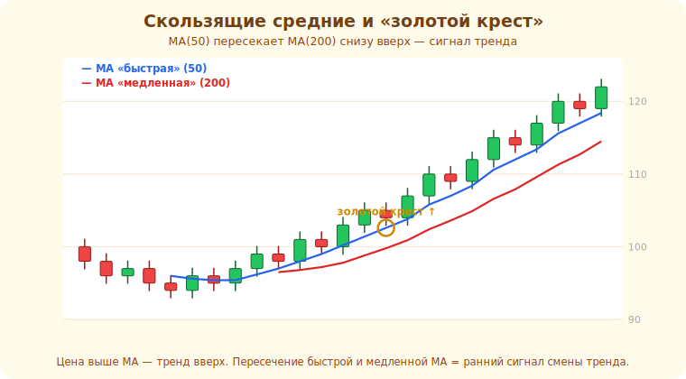

# 14 · Скользящие средние 🖼️⭐

> 🎯 **Цель блока:** освоить скользящие средние (MA/EMA) — самый базовый и полезный индикатор:
> показывает направление и динамический уровень.

---

## ⭐ Скользящая средняя — сглаженная цена

**Скользящая средняя (MA)** — средняя цена за последние N свечей, пересчитываемая на каждой
свече. Сглаживает шум, показывая **направление**.

```
   SMA(20) = среднее цен закрытия за последние 20 свечей
   на каждой новой свече окно «скользит» вперёд → линия движется за ценой
```

🖼️
```
   цена скачет ────╱╲──╱╲─╱╲────
   MA плавно ──────────╱──────── ← сглаженная линия направления
```

```
   SMA (простая)        — равный вес всем свечам
   EMA (экспоненциальная) — больше вес СВЕЖИМ свечам → реагирует быстрее
```

💡 ⭐ MA отвечает на вопрос «куда в среднем идёт цена». Наклон вверх = восходящий тренд, вниз =
нисходящий, плоско = флэт. EMA быстрее реагирует (меньше запаздывает), SMA — глаже. Период (20,
50, 200) задаёт «дальнозоркость»: короткая MA — для быстрых движений, длинная — для глобального
тренда.

---

## ⭐ Как используют MA

```
   1. ОПРЕДЕЛЕНИЕ ТРЕНДА — цена выше растущей MA = тренд вверх (и наоборот)
   2. ДИНАМИЧЕСКИЙ УРОВЕНЬ — цена откатывает К MA и отбивается (вход по тренду на откате)
   3. ФИЛЬТР — торгуй только лонги, если цена выше MA200 (по глобальному тренду)
```

💡 ⭐ Самое полезное новичку — MA как **фильтр направления**: «выше длинной MA торгую только
покупки, ниже — только продажи». Это удерживает от торговли против глобального тренда (частая
ошибка). И откат к MA в тренде — хорошая точка входа (как откат к линии тренда, модуль 10).

---

## 📖 Пересечение скользящих

```
   две MA: быстрая (например, 20) и медленная (50)
   быстрая пересекает медленную ВВЕРХ → сигнал на покупку («золотой крест» для 50/200)
   быстрая пересекает медленную ВНИЗ → сигнал на продажу («крест смерти»)
```

💡 ⚠️ Пересечения **сильно запаздывают** (модуль 13) и дают много **ложных** сигналов во флэте
(MA постоянно пересекаются туда-сюда). Это не «готовая стратегия», а вспомогательный сигнал.
Работает лучше в явном тренде, плохо — в боковике. Не торгуй пересечения вслепую.

Так «золотой крест» выглядит на реальном графике: быстрая MA пересекает медленную снизу вверх
после разворота тренда:



---

## ⭐ Сколько MA и какие периоды

```
   ✅ достаточно 1-2 MA (например, EMA20 + MA200)
   популярные периоды: 20 (краткосрочный), 50 (среднесрочный), 200 (глобальный тренд)
   200 особенно популярна — на неё смотрит «толпа», поэтому она работает как уровень
```

💡 ⚠️ Не вешай 5 скользящих — это перегруз (модуль 13). Одна для направления + при желании одна
для глобального фильтра. MA200 особенно значима **именно потому**, что её все смотрят
(самосбывающееся ожидание).

---

## ⚠️ Ловушки

- ❌ Торговать пересечения MA вслепую (много ложных во флэте, запаздывание).
- ❌ Вешать много MA с разными периодами (каша).
- ❌ Применять MA-сигналы во флэте, где они «пилят».
- ❌ Считать MA точным уровнем — это зона и индикатор запаздывает.

---

## 🛠️ Практика

1. Поставь EMA20 на тренд — заметь, как цена откатывает к ней и отбивается. Где был бы вход?
2. Поставь MA200 — используй как фильтр: выше неё ищи только лонги.
3. Поставь две MA (20 и 50), найди пересечение в тренде и во флэте — сравни, где сигнал полезен.

---

## ✅ Задачи

1. **Объясни** скользящую среднюю и разницу SMA/EMA.
2. **Опиши** три способа использования MA.
3. **Объясни** пересечение MA и его ограничения (запаздывание, ложные).
4. **Объясни**, почему MA200 особенно значима.

---

## ❓ Проверь себя

1. Что показывает скользящая средняя?
2. Чем EMA отличается от SMA?
3. Как использовать MA как фильтр тренда?
4. Почему пересечения MA ненадёжны во флэте?

---

## ✅ Чек-лист

- [ ] Понимаю MA как сглаженное направление
- [ ] Использую MA для тренда/фильтра/откатов
- [ ] Понимаю ограничения пересечений
- [ ] Не перегружаю график скользящими

➡️ Следующий: [15 · Осцилляторы (RSI, MACD)](15-oscillators.md)
