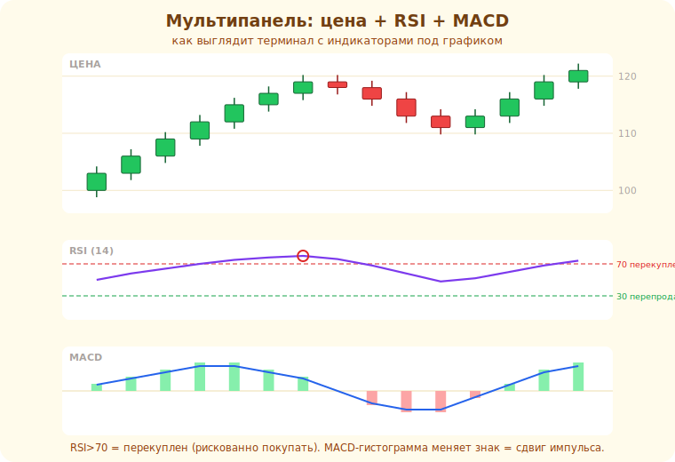

# 15 · Осцилляторы (RSI, MACD) 🖼️⭐

> 🎯 **Цель блока:** освоить осцилляторы — RSI, MACD, стохастик — которые измеряют скорость и
> «перекупленность/перепроданность», и понять их главное ограничение.

---

## 📖 Осциллятор — измеритель «силы и крайностей»

**Осциллятор** колеблется в диапазоне (например, 0–100) и показывает, насколько движение
«растянуто»: перекуплено (зашло слишком высоко) или перепродано (слишком низко).

```
   осциллятор высоко (перекуплен)  → движение вверх «выдыхается» (возможен откат)
   осциллятор низко (перепродан)   → движение вниз «выдыхается» (возможен отскок)
```

💡 ⭐ Осцилляторы хороши во **флэте** (цена колеблется между крайностями) и **опасны в тренде**
(сильный тренд держит осциллятор в «перекупленности» долго, и сигналы «продавай» приводят к
убыткам). Сначала — состояние рынка, потом осциллятор.

Вот как осцилляторы выглядят в настоящем терминале — отдельными панелями **под** ценой. Сверху
свечи, в центре RSI с уровнями 70/30, внизу MACD-гистограмма:



---

## ⭐ RSI (индекс относительной силы)

```
   RSI от 0 до 100:
   > 70  — перекуплен (классически — возможен разворот вниз)
   < 30  — перепродан (возможен отскок вверх)
   ~50   — нейтрально
```

🖼️
```
   100 ┤
    70 ┤━━━━━━ перекупленность ━━━━━━
       │   ╱╲      ╱╲
    50 ┤  ╱  ╲    ╱
       │ ╱    ╲  ╱
    30 ┤━━━━━━ перепроданность ━━━━━━
     0 ┤
```

💡 ⚠️ «RSI > 70 → продавай» **не работает** в сильном тренде (RSI может месяц быть выше 70, пока
цена растёт). Полезнее: RSI как фильтр + **дивергенция** (ниже). Используй RSI **вместе** с
уровнями, а не как самостоятельный сигнал.

---

## ⭐ Дивергенция — расхождение цены и осциллятора

```
   цена делает НОВЫЙ максимум, а RSI — НИЖЕ предыдущего → БЫЧЬЯ СИЛА слабеет (медвежья дивергенция)
   цена делает новый минимум, а RSI выше → нисходящая сила слабеет (бычья дивергенция)
```

🖼️
```
   цена:  ╱╲   ╱╲╱  ← новый максимум выше
   RSI:   ╱╲  ╱╲    ← а пик НИЖЕ → дивергенция → движение выдыхается
```

💡 ⭐ **Дивергенция** — самый ценный сигнал осцилляторов: цена идёт, но «топливо» (сила движения)
кончается. Это намёк на ослабление/разворот. Но и дивергенция — не гарантия (может «затянуться»);
жди подтверждения от цены (уровень, свеча) и ставь стоп.

---

## 📖 MACD и стохастик (коротко)

```
   MACD — две EMA + их разница (гистограмма): показывает импульс и пересечения.
          Скорее трендово-импульсный; сигналы — пересечение линий и нулевой уровень.

   СТОХАСТИК — как RSI (0-100, перекуплен/перепродан), но чувствительнее, больше сигналов и шума.
```

💡 Не нужно знать все осцилляторы — они похожи (измеряют импульс/крайности). Выбери **один**
(чаще RSI), пойми его глубоко, используй с дивергенцией и уровнями. Множить осцилляторы
бессмысленно — они дублируют друг друга.

---

## ⚠️ Ловушки

- ❌ Торговать «перекуплен → продавай» в сильном тренде (главная ошибка с осцилляторами).
- ❌ Использовать осциллятор как самостоятельный сигнал без цены/уровней.
- ❌ Вешать несколько осцилляторов сразу (они дублируют друг друга).
- ❌ Считать дивергенцию гарантией разворота (она может «затянуться»).

---

## 🛠️ Практика

1. Поставь RSI: найди, где «перекуплен» сработал (флэт) и где НЕ сработал (тренд продолжился).
2. Найди дивергенцию: цена — новый максимум, RSI — нет. Что было с ценой дальше?
3. Сравни сигналы RSI во флэте и в тренде — где осциллятор полезен?

---

## ✅ Задачи

1. **Объясни** осциллятор и понятие перекупленности/перепроданности.
2. **Опиши** RSI и его ограничение в тренде.
3. **Объясни** дивергенцию и почему это ценный сигнал.
4. **Сформулируй**, как правильно применять осцилляторы (флэт, дивергенция, + уровни).

---

## ❓ Проверь себя

1. Что измеряет осциллятор?
2. Почему «RSI>70 продавай» опасно в тренде?
3. Что такое дивергенция и о чём она говорит?
4. Зачем достаточно одного осциллятора?

---

## ✅ Чек-лист

- [ ] Понимаю осцилляторы и их уместность во флэте
- [ ] Знаю RSI и его ограничения
- [ ] Понимаю дивергенцию
- [ ] Использую один осциллятор + уровни, без перегруза

➡️ Следующий: [16 · Объём и VWAP](16-volume.md)
