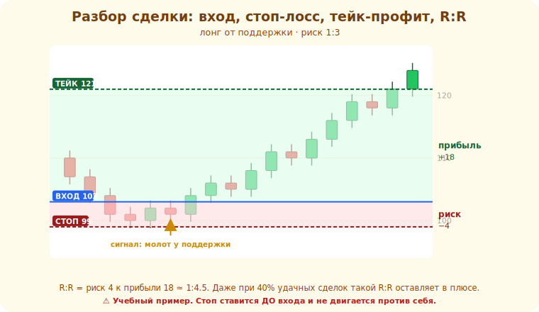

# 18 · Торговая стратегия и бэктест 🖼️⭐⭐

> 🎯 **Цель блока:** собрать всё в **торговую стратегию** с чёткими правилами и проверить её на
> истории (бэктест). Это переход от «смотрю график» к «торгую систему».

---

## ⭐⭐ Стратегия — чёткие правила, а не «чутьё»

**Торговая стратегия** — набор **однозначных** правил: что, когда, как и с каким риском торговать.
Если правило нельзя проверить — это не стратегия, а гадание.

```
   стратегия отвечает на:
   📍 ЧТО торгую        — инструмент, ТФ
   🎯 КОГДА вхожу       — точные условия входа (сетап)
   🚪 ГДЕ выхожу        — стоп-лосс и тейк-профит (правила)
   📏 СКОЛЬКО рискую    — размер позиции (риск на сделку, модуль 19)
   ⏸️ КОГДА НЕ торгую   — фильтры (флэт, новости, неясность)
```

💡 ⭐⭐ Пример простой стратегии: «Торгую фьючерс X. На D1 определяю тренд. На H1 жду отката к
уровню/EMA20 по тренду. Вход — по свечному триггеру (пин-бар/поглощение). Стоп — за уровнем. Тейк
— риск/прибыль ≥ 1:2. Риск на сделку — 1% депозита. Во флэте и перед крупными новостями не
торгую». Это **проверяемо** — значит, это стратегия.

Вот одна такая сделка целиком на реальном графике: сигнал (молот у поддержки), линия входа,
стоп-лосс под уровнем, тейк-профит и закрашенные зоны риска/прибыли с соотношением R:R:



---

## ⭐⭐ Бэктест — проверка на истории

**Бэктест** — прогон стратегии по **прошлым** данным: применяешь правила к истории и смотришь,
прибыльна ли система.

```
   1. возьми чёткие правила стратегии
   2. пройди по истории (много сделок, разные периоды)
   3. для каждой сделки запиши: вход, стоп, тейк, результат — СТРОГО по правилам
   4. посчитай статистику (ниже)
```

💡 ⭐⭐ Бэктест отвечает на вопрос «работает ли вообще мой метод?» — **до** того, как рисковать
деньгами. Без него ты торгуешь вслепую. Но ⚠️ честный бэктест труден: легко обмануть себя,
«видя» сделки задним числом. Правила должны быть настолько чёткими, чтобы другой человек получил
тот же результат.

---

## ⭐ Метрики стратегии

```
   WIN RATE — % прибыльных сделок (НЕ главное! можно быть прибыльным с win rate 40%)
   RISK/REWARD — среднее соотношение прибыль/убыток сделки
   МАТОЖИДАНИЕ — (win% × средняя прибыль) − (loss% × средний убыток) → должно быть > 0
   ПРОСАДКА (drawdown) — максимальное падение депозита подряд (психологически тяжело!)
   количество сделок — мало сделок = ненадёжная статистика
```

💡 ⭐ Ключевое прозрение: **высокий win rate не равно прибыльность**. Можно выигрывать 70% сделок
и терять деньги (если убытки большие), и можно выигрывать 40% и быть в плюсе (если прибыли в 3
раза больше убытков). Главное — **положительное матожидание** + приемлемая просадка. Риск/прибыль
≥ 1:2 позволяет быть прибыльным даже с win rate < 50%.

---

## 📖 Форвард-тест и реальность

```
   БЭКТЕСТ (на истории) → форвард-тест (на ДЕМО в реальном времени) → маленький реал
```

💡 ⚠️ Стратегия, прибыльная на бэктесте, может проваливаться на реале из-за: подгонки под историю
(оверфиттинг), издержек (комиссии/спред/проскальзывание), и **психологии** (на реале трудно
следовать правилам). Поэтому после бэктеста — **форвард-тест на демо** в реальном времени, и лишь
потом маленький реал. И всегда учитывай издержки в расчётах.

---

## ⚠️ Ловушки

- ❌ Торговать без правил («по чутью») — нечего проверять и улучшать.
- ❌ Оверфиттинг: подогнать правила идеально под прошлое (на будущем не сработает).
- ❌ Гнаться за высоким win rate, игнорируя риск/прибыль и матожидание.
- ❌ Бэктест без учёта комиссий/спреда (реальный результат хуже).
- ❌ Сразу на реал после бэктеста, минуя форвард-тест.

---

## 🛠️ Практика

1. Сформулируй **одну** чёткую стратегию (что/когда/где выход/сколько риск/когда не торговать).
2. Сделай бэктест на 30–50 сделках по истории. Запиши каждую строго по правилам.
3. Посчитай: win rate, средний риск/прибыль, матожидание, макс. просадку. Прибыльна ли система с
   учётом издержек?

---

## ✅ Задачи

1. **Сформулируй** стратегию как набор проверяемых правил.
2. **Объясни** бэктест и его цель.
3. **Объясни**, почему win rate не равен прибыльности (роль риск/прибыль и матожидания).
4. **Объясни** оверфиттинг и зачем форвард-тест.

---

## ❓ Проверь себя

1. Чем стратегия отличается от «торговли по чутью»?
2. Что проверяет бэктест?
3. Почему важно матожидание, а не только win rate?
4. Почему после бэктеста нужен форвард-тест на демо?

---

## ✅ Чек-лист

- [ ] Имею стратегию из чётких проверяемых правил
- [ ] Умею делать бэктест и считать метрики
- [ ] Понимаю, что важно матожидание, а не win rate
- [ ] Знаю про оверфиттинг и форвард-тест

➡️ Дальше: [Задачи уровня 3](TASKS.md) · затем [Пет-проект уровня 3](PROJECT.md)
