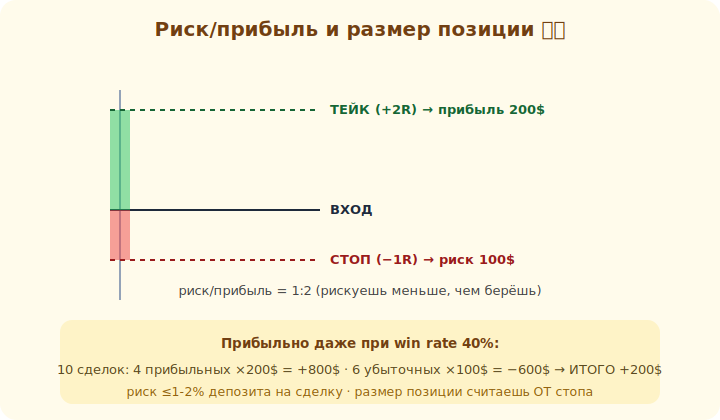

# 19 · Риск-менеджмент 🖼️⭐⭐

> 🎯 **Цель блока (САМЫЙ ВАЖНЫЙ в треке):** освоить управление риском. Это **главный** навык
> трейдера: не «как угадать», а «как не разориться». Без него любой анализ бесполезен.

> ⚠️ Если из всего трека ты усвоишь только этот модуль — ты уже впереди большинства новичков.

---

## ⭐⭐ Главная мысль: выживание важнее прибыли

```
   трейдинг — это игра на ВЫЖИВАНИЕ:
   пока ты в игре (не потерял депозит), у тебя есть шанс
   потерял депозит — игра окончена, неважно, какой ты «аналитик»
```

💡 ⭐⭐ Новички думают «как больше заработать». Профи думают «как не потерять много». Парадокс: тот,
кто **бережёт капитал**, в итоге зарабатывает, а тот, кто гонится за прибылью без контроля риска,
теряет всё. Риск-менеджмент — это не «осторожность», это **условие существования** трейдера.

---

## ⭐⭐ Правило риска на сделку (1-2%)

```
   ЗОЛОТОЕ ПРАВИЛО: рискуй на ОДНУ сделку не больше 1-2% депозита

   депозит 10 000$, риск 1% = 100$ максимальный убыток на сделку
   → размер позиции подбираешь так, чтобы при срабатывании СТОПА потерять ровно ~100$
```

🖼️


💡 ⭐⭐ Почему 1-2%, а не больше: при 1% даже **20 убыточных сделок подряд** заберут лишь ~18%
депозита — ты выживешь и продолжишь. При риске 20% на сделку **5 неудач подряд = почти всё**. А
неудачные серии **будут** (ТА — вероятности, модуль 08). Маленький риск на сделку даёт пережить
любую полосу неудач. Это математика выживания, а не трусость.

```
   размер позиции = (депозит × риск%) ÷ (стоп в тиках × стоимость тика)
   → сначала стоп, потом размер. НИКОГДА не наоборот.
```

---

## ⭐⭐ Соотношение риск/прибыль (R:R)

```
   на КАЖДОЙ сделке: сколько рискую (до стопа) vs сколько хочу взять (до тейка)

   риск/прибыль 1:2 → рискую 100$, цель 200$
   при таком R:R можно быть прибыльным даже с win rate 40%:
      из 10 сделок: 4 прибыльных ×200 = +800,  6 убыточных ×100 = −600  →  ИТОГО +200
```

💡 ⭐⭐ Это переворачивает всё: тебе **не нужно** угадывать большинство сделок. С R:R ≥ 1:2 и win
rate всего 40% ты в плюсе. Поэтому профи ищут сделки, где **потенциальная прибыль больше риска**, и
спокойно принимают, что часть сделок убыточна. «Режь убытки коротко, дай прибыли расти».

⚠️ Не бери сделки с плохим R:R (рискую 100, цель 50) — даже при высоком win rate это путь в минус.

---

## ⭐ R как единица измерения

```
   измеряй результат в R (риск одной сделки = 1R):
   стоп сработал = −1R,  тейк на R:R 1:2 = +2R
   → думаешь не в деньгах, а в R → эмоций меньше, дисциплины больше
```

💡 Мышление в **R** (а не в рублях) убирает «жадность/страх денег»: +2R это +2R хоть на 100$, хоть
на 100 000$ депозита. Оценивай месяц: «+8R» или «−3R». Это профессиональный язык риска.

---

## 📖 Чего НИКОГДА не делать

```
   ❌ торговать без стоп-лосса (один ход против = катастрофа)
   ❌ двигать стоп против себя («дам ещё шанс») — превращает −1R в −5R
   ❌ усреднять убыток (доливать в минусующую позицию) — увеличивает риск в худший момент
   ❌ отыгрываться после убытка увеличенным объёмом (tilt) — путь к сливу
   ❌ рисковать большим % депозита ради «быстрого разгона»
```

💡 ⭐⭐ Эти ошибки убили больше депозитов, чем любой «неправильный анализ». Особенно **усреднение
убытка** и **отыгрыш** — они чувствуются «логично» в моменте, но математически разрушительны.
Дисциплина риска важнее любого сетапа.

---

## ⚠️ Ловушки

- ❌ Считать риск-менеджмент «скучным» и пропускать его ради «стратегий».
- ❌ Рисковать больше 1-2% «потому что уверен в сделке» (уверенность ≠ гарантия).
- ❌ Брать сделки с плохим риск/прибылью ради высокого win rate.
- ❌ Любое из «никогда не делать» выше.

---

## 🛠️ Практика

1. Посчитай размер позиции для риска 1% при разных стопах (10/30/50 тиков) на своём инструменте.
2. Смоделируй: 10 сделок с win rate 40% и R:R 1:2 — какой итог? А с R:R 1:1? А с R:R 1:0.5?
3. На демо проведи серию сделок, **никогда** не превышая 1% риска и не двигая стоп против себя.

---

## ✅ Задачи

1. **Объясни**, почему выживание важнее прибыли.
2. **Объясни** правило 1-2% и посчитай размер позиции от стопа.
3. **Покажи** расчётом, как R:R 1:2 даёт прибыль при win rate 40%.
4. **Перечисли**, чего НИКОГДА не делать, и почему.

---

## ❓ Проверь себя

1. Почему риск-менеджмент — главный навык трейдера?
2. Зачем рисковать только 1-2% на сделку?
3. Как R:R позволяет быть прибыльным с win rate < 50%?
4. Почему усреднение убытка и отыгрыш так опасны?

---

## ✅ Чек-лист (важнейший)

- [ ] Рискую не больше 1-2% депозита на сделку
- [ ] Размер позиции считаю от стопа, всегда со стоп-лоссом
- [ ] Беру сделки с риск/прибылью ≥ 1:2, думаю в R
- [ ] Никогда не двигаю стоп против себя, не усредняю убыток, не отыгрываюсь

➡️ Следующий: [20 · Психология трейдинга](20-psychology.md)
