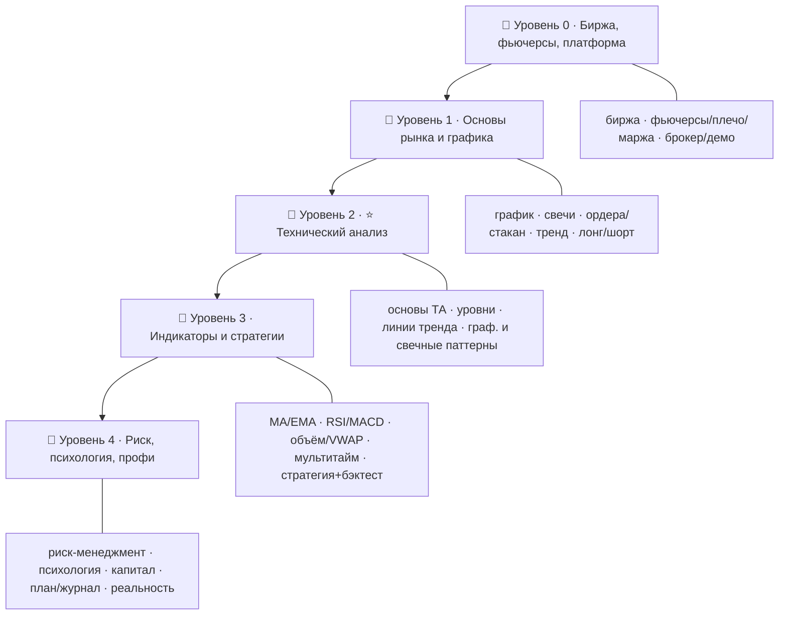

# 📈 Дорожная карта: Трейдинг и технический анализ — от новичка до уверенного трейдера

> ⚠️ **ВАЖНО, прочитай первым.** Это **образовательный** материал, а **не** индивидуальная
> инвестиционная рекомендация и не призыв к сделкам. **Трейдинг фьючерсами — с кредитным
> плечом и высоким риском**: можно потерять весь депозит и больше. **Большинство розничных
> трейдеров теряют деньги.** Никогда не рискуй средствами, которые не готов полностью потерять.
> Цель курса — научить **думать о рынке и риске**, а не обещать заработок. Гарантированной
> прибыли в трейдинге не существует.

> 🎯 **Цель трека:** освоить **технический анализ** и грамотную торговлю фьючерсами — от чтения
> графика до построения стратегии — и, главное, **управлять риском**, потому что именно это (а
> не «волшебный индикатор») определяет, выживет трейдер или нет.

---

## 🗺️ Карта трека

| Уровень | Папка | О чём |
|--------|-------|-------|
| 🥚 0 · Знакомство | `00-setup` | Что такое биржа и трейдинг, фьючерсы (плечо, маржа), брокер и **демо-счёт**. |
| 🐣 1 · Основы | `01-basics` | Как читать график, японские свечи, ордера и стакан, тренд/флэт, лонг/шорт. |
| 🐥 2 · ⭐ Технический анализ | `02-technical` | **Основы ТА, уровни поддержки/сопротивления, линии тренда, графические и свечные паттерны.** |
| 🦅 3 · Индикаторы и стратегии | `03-indicators` | Скользящие, осцилляторы (RSI/MACD), объём/VWAP, мультитаймфрейм, стратегия и бэктест. |
| 🚀 4 · Профи | `04-advanced` | **Риск-менеджмент**, психология, управление капиталом, торговый план и журнал, реальность рынка. |

---

## 🎯 Чему ты научишься

- Понимать, как устроены **биржа и фьючерсы** (плечо, маржа, контракты) и их риски.
- **Читать график**: свечи, объём, таймфреймы, ордера и стакан.
- Владеть **техническим анализом** — ядром трека: уровни, тренды, паттерны.
- Разбираться в **индикаторах** (MA, RSI, MACD, объём) и не попадать в их ловушки.
- Строить и **тестировать стратегию** (бэктест), а не торговать наугад.
- Главное — **управлять риском**: стоп-лосс, размер позиции, соотношение риск/прибыль.
- Понимать **психологию** трейдинга и почему дисциплина важнее прогнозов.

---

## 🧠 Сквозная нить трека: РИСК

В программных треках сквозная тема — память. Здесь — **риск**. На каждом шаге вопрос не «куда
пойдёт цена» (этого не знает никто), а «**сколько я теряю, если ошибся**». Технический анализ
даёт **вероятности и точки входа/выхода**, но выживание определяет управление риском. Поэтому
риск-менеджмент (уровень 4) — не «в конце», а то, ради чего всё остальное.

---

## 🧩 Как устроен каждый модуль

1. **📖 Теория** — простым языком, со схемами графиков.
2. **🖼️ Схема** — как это выглядит на графике.
3. **🛠️ Практика** — на **демо-счёте** (без реальных денег!).
4. **⚠️ Ловушки** — типичные ошибки, на которых теряют.
5. **✅ Задачи** и **❓ Проверка себя**.
6. **Чек-лист** «готов идти дальше».

➡️ Начать: [00 · Что такое трейдинг и биржа](00-setup/00-what-is-trading.md)

> 💡 Вся практика трека — **только на демо-счёте**. Переходить на реальные деньги стоит лишь
> после стабильных результатов на демо, с маленькими суммами и строгим риск-менеджментом.
